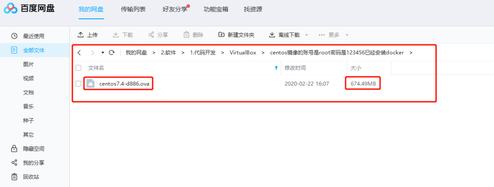
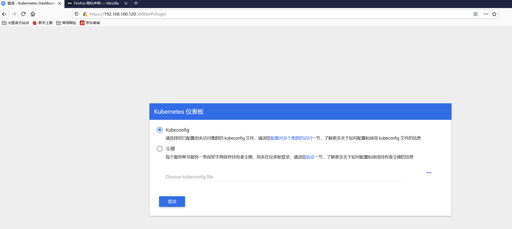

# 第10章 Kubeadm实现多节点k8s集群安装

本节参考了如下两篇博客，均在当前目录保存下来了一份markdown版本~原始文章链接如下

+ [k8s集群安装](https://www.jianshu.com/p/67a3bf4458e8)
+ [搭建k8s集群完整篇](https://www.jianshu.com/p/f4ac7f4555d3)

## 1.准备3台虚拟机
> 使用VirtualBox基于centos的ova镜像创建3台虚拟机

ova镜像在我的百度网盘里，实际是拿地[廖师兄的SpringBoot实战微信点餐系统](https://coding.imooc.com/down/117.html)的[课程资料里提供的镜像](https://git.imooc.com/coding-117/coding-117/src/develop/doc/虚拟机说明文档.md)，百度网盘的路径如下，直接从"管理"-->"导入虚拟电脑"即可，导入创建好把3台虚拟机的`/etc/hostname`分别改成master、node1、node2，然后重启3台虚拟机


最终得到的3台虚拟机信息如下：

| 虚拟机IP        | 用户名 | 密码   | 主机名 | 作用            |
| --------------- | ------ | ------ | ------ | --------------- |
| 192.168.100.120 | root   | 123456 | k8s-master | k8s的master节点 |
| 192.168.100.121 | root   | 123456 | k8s-node01  | k8s的node节点1  |
| 192.168.100.122 | root   | 123456 | k8s-node02  | k8s的node节点2  |

## 安装docker以及k8s均可以使用[阿里云的镜像源](https://developer.aliyun.com/mirror/)

## 2.安装docker

> 参考教程：https://developer.aliyun.com/mirror/docker-ce

### 2.1 Ubuntu 14.04/16.04（使用 apt-get 进行安装）
```shell
# step 1: 安装必要的一些系统工具
sudo apt-get update
sudo apt-get -y install apt-transport-https ca-certificates curl software-properties-common
# step 2: 安装GPG证书
curl -fsSL https://mirrors.aliyun.com/docker-ce/linux/ubuntu/gpg | sudo apt-key add -
# Step 3: 写入软件源信息
sudo add-apt-repository "deb [arch=amd64] https://mirrors.aliyun.com/docker-ce/linux/ubuntu $(lsb_release -cs) stable"
# Step 4: 更新并安装Docker-CE
sudo apt-get -y update
sudo apt-get -y install docker-ce

# 安装指定版本的Docker-CE:
# Step 1: 查找Docker-CE的版本:
# apt-cache madison docker-ce
#   docker-ce | 17.03.1~ce-0~ubuntu-xenial | https://mirrors.aliyun.com/docker-ce/linux/ubuntu xenial/stable amd64 Packages
#   docker-ce | 17.03.0~ce-0~ubuntu-xenial | https://mirrors.aliyun.com/docker-ce/linux/ubuntu xenial/stable amd64 Packages
# Step 2: 安装指定版本的Docker-CE: (VERSION例如上面的17.03.1~ce-0~ubuntu-xenial)
# sudo apt-get -y install docker-ce=[VERSION]
```
### 2.2 CentOS 7（使用 yum 进行安装）
```shell
# step 1: 安装必要的一些系统工具
sudo yum install -y yum-utils device-mapper-persistent-data lvm2
# Step 2: 添加软件源信息
sudo yum-config-manager --add-repo https://mirrors.aliyun.com/docker-ce/linux/centos/docker-ce.repo
# Step 3: 更新并安装Docker-CE
sudo yum makecache fast
sudo yum -y install docker-ce
# Step 4: 开启Docker服务
sudo service docker start

# 注意：
# 官方软件源默认启用了最新的软件，您可以通过编辑软件源的方式获取各个版本的软件包。例如官方并没有将测试版本的软件源置为可用，您可以通过以下方式开启。同理可以开启各种测试版本等。
# vim /etc/yum.repos.d/docker-ee.repo
#   将[docker-ce-test]下方的enabled=0修改为enabled=1
#
# 安装指定版本的Docker-CE:
# Step 1: 查找Docker-CE的版本:
# yum list docker-ce.x86_64 --showduplicates | sort -r
#   Loading mirror speeds from cached hostfile
#   Loaded plugins: branch, fastestmirror, langpacks
#   docker-ce.x86_64            17.03.1.ce-1.el7.centos            docker-ce-stable
#   docker-ce.x86_64            17.03.1.ce-1.el7.centos            @docker-ce-stable
#   docker-ce.x86_64            17.03.0.ce-1.el7.centos            docker-ce-stable
#   Available Packages
# Step2: 安装指定版本的Docker-CE: (VERSION例如上面的17.03.0.ce.1-1.el7.centos)
# sudo yum -y install docker-ce-[VERSION]
```

## 3.安装k8s需要的软件
> 参考教程：https://developer.aliyun.com/mirror/kubernetes
### 3.1 Debian / Ubuntu
```shell
apt-get update && apt-get install -y apt-transport-https
curl https://mirrors.aliyun.com/kubernetes/apt/doc/apt-key.gpg | apt-key add - 
cat <<EOF >/etc/apt/sources.list.d/kubernetes.list
deb https://mirrors.aliyun.com/kubernetes/apt/ kubernetes-xenial main
EOF  
apt-get update
apt-get install -y kubelet kubeadm kubectl
```

### 3.2 CentOS / RHEL / Fedora
```shell
cat <<EOF > /etc/yum.repos.d/kubernetes.repo
[kubernetes]
name=Kubernetes
baseurl=https://mirrors.aliyun.com/kubernetes/yum/repos/kubernetes-el7-x86_64/
enabled=1
gpgcheck=1
repo_gpgcheck=1
gpgkey=https://mirrors.aliyun.com/kubernetes/yum/doc/yum-key.gpg https://mirrors.aliyun.com/kubernetes/yum/doc/rpm-package-key.gpg
EOF
setenforce 0
yum install -y kubelet kubeadm kubectl
systemctl enable kubelet && systemctl start kubelet
```
### 3.3 查看安装清单

> 三个节点都执行`rpm -ql kubelet`，返回如下内容表示成功
```shell
/etc/kubernetes/manifests #清单目录
/etc/sysconfig/kubelet #配置文件
/etc/systemd/system/kubelet.service
/usr/bin/kubelet #主程序
```

## 4.初始化环境
> 本节所有步骤在三个节点上都执行，配置完了把3台机器都重启下~

### 4.1 修改主机命名【可操作】
```shell
vim /etc/hosts
# 加入如下内容
192.168.100.120 k8s-master
192.168.100.121 k8s-node01
192.168.100.122 k8s-node02
```

### 4.2 关闭并禁用防火墙
```shell
systemctl stop firewalld
systemctl disable firewalld
```

### 4.3 网络桥接设置
```shell
echo 'net.bridge.bridge-nf-call-iptables = 1'>>/etc/sysctl.conf
echo 'net.bridge.bridge-nf-call-ip6tables = 1'>>/etc/sysctl.conf
sysctl -p
# 返回如下内容表示设置成功
# net.bridge.bridge-nf-call-iptables = 1
# net.bridge.bridge-nf-call-ip6tables = 1
```

### 4.4 关闭selinux
```shell
sed -i 's/enforcing/disabled/' /etc/selinux/config 
setenforce 0
```

### 4.5 关闭swap
+ (1)临时关闭swap分区, 重启失效：`swapoff  -a`
+ (2)永久关闭swap分区：`sed -ri 's/.*swap.*/#&/' /etc/fstab`

## 5.配置master
> 192.168.100.120上进行

### 5.1 初始下载镜像

```shell
# 初始化master,指定阿里云的registry很重要
$ kubeadm init \
  --apiserver-advertise-address=192.168.100.120 \
  --image-repository registry.aliyuncs.com/google_containers \
  --kubernetes-version v1.17.3 \
  --service-cidr=10.1.0.0/16 \
  --pod-network-cidr=10.244.0.0/16

# kubeadm 以后将会在 /etc/kubernetes/ 路径下生成配置文件和证书文件
[root@k8s-master ~]# cd /etc
[root@k8s-master etc]# tree kubernetes/
kubernetes/
├── admin.conf
├── controller-manager.conf
├── kubelet.conf
├── manifests
│   ├── etcd.yaml
│   ├── kube-apiserver.yaml
│   ├── kube-controller-manager.yaml
│   └── kube-scheduler.yaml
├── pki
│   ├── apiserver.crt
│   ├── apiserver-etcd-client.crt
│   ├── apiserver-etcd-client.key
│   ├── apiserver.key
│   ├── apiserver-kubelet-client.crt
│   ├── apiserver-kubelet-client.key
│   ├── ca.crt
│   ├── ca.key
│   ├── etcd
│   │   ├── ca.crt
│   │   ├── ca.key
│   │   ├── healthcheck-client.crt
│   │   ├── healthcheck-client.key
│   │   ├── peer.crt
│   │   ├── peer.key
│   │   ├── server.crt
│   │   └── server.key
│   ├── front-proxy-ca.crt
│   ├── front-proxy-ca.key
│   ├── front-proxy-client.crt
│   ├── front-proxy-client.key
│   ├── sa.key
│   └── sa.pub
└── scheduler.conf
```

#### 5.2 上一步的完整的回显如下：

```shell
# 这里是执行的命令
[root@k8s-master ~]# kubeadm init \
>   --apiserver-advertise-address=192.168.100.120 \
>   --image-repository registry.aliyuncs.com/google_containers \
>   --kubernetes-version v1.17.3 \
>   --service-cidr=10.1.0.0/16 \
>   --pod-network-cidr=10.244.0.0/16
# 下面是执行后的回显
W0222 19:55:58.204992   10912 validation.go:28] Cannot validate kube-proxy config - no validator is available
W0222 19:55:58.205038   10912 validation.go:28] Cannot validate kubelet config - no validator is available
[init] Using Kubernetes version: v1.17.3
[preflight] Running pre-flight checks
[preflight] Pulling images required for setting up a Kubernetes cluster
[preflight] This might take a minute or two, depending on the speed of your internet connection
[preflight] You can also perform this action in beforehand using 'kubeadm config images pull'
[kubelet-start] Writing kubelet environment file with flags to file "/var/lib/kubelet/kubeadm-flags.env"
[kubelet-start] Writing kubelet configuration to file "/var/lib/kubelet/config.yaml"
[kubelet-start] Starting the kubelet
[certs] Using certificateDir folder "/etc/kubernetes/pki"
[certs] Generating "ca" certificate and key
[certs] Generating "apiserver" certificate and key
[certs] apiserver serving cert is signed for DNS names [k8s-master kubernetes kubernetes.default kubernetes.default.svc kubernetes.default.svc.cluster.local] and IPs [10.1.0.1 192.168.100.120]
[certs] Generating "apiserver-kubelet-client" certificate and key
[certs] Generating "front-proxy-ca" certificate and key
[certs] Generating "front-proxy-client" certificate and key
[certs] Generating "etcd/ca" certificate and key
[certs] Generating "etcd/server" certificate and key
[certs] etcd/server serving cert is signed for DNS names [k8s-master localhost] and IPs [192.168.100.120 127.0.0.1 ::1]
[certs] Generating "etcd/peer" certificate and key
[certs] etcd/peer serving cert is signed for DNS names [k8s-master localhost] and IPs [192.168.100.120 127.0.0.1 ::1]
[certs] Generating "etcd/healthcheck-client" certificate and key
[certs] Generating "apiserver-etcd-client" certificate and key
[certs] Generating "sa" key and public key
[kubeconfig] Using kubeconfig folder "/etc/kubernetes"
[kubeconfig] Writing "admin.conf" kubeconfig file
[kubeconfig] Writing "kubelet.conf" kubeconfig file
[kubeconfig] Writing "controller-manager.conf" kubeconfig file
[kubeconfig] Writing "scheduler.conf" kubeconfig file
[control-plane] Using manifest folder "/etc/kubernetes/manifests"
[control-plane] Creating static Pod manifest for "kube-apiserver"
[control-plane] Creating static Pod manifest for "kube-controller-manager"
W0222 19:58:05.955422   10912 manifests.go:214] the default kube-apiserver authorization-mode is "Node,RBAC"; using "Node,RBAC"
[control-plane] Creating static Pod manifest for "kube-scheduler"
W0222 19:58:05.955949   10912 manifests.go:214] the default kube-apiserver authorization-mode is "Node,RBAC"; using "Node,RBAC"
[etcd] Creating static Pod manifest for local etcd in "/etc/kubernetes/manifests"
[wait-control-plane] Waiting for the kubelet to boot up the control plane as static Pods from directory "/etc/kubernetes/manifests". This can take up to 4m0s
[apiclient] All control plane components are healthy after 34.502294 seconds
[upload-config] Storing the configuration used in ConfigMap "kubeadm-config" in the "kube-system" Namespace
[kubelet] Creating a ConfigMap "kubelet-config-1.17" in namespace kube-system with the configuration for the kubelets in the cluster
[upload-certs] Skipping phase. Please see --upload-certs
[mark-control-plane] Marking the node k8s-master as control-plane by adding the label "node-role.kubernetes.io/master=''"
[mark-control-plane] Marking the node k8s-master as control-plane by adding the taints [node-role.kubernetes.io/master:NoSchedule]
[bootstrap-token] Using token: k548mt.yribhfsi0wpm2oj7
[bootstrap-token] Configuring bootstrap tokens, cluster-info ConfigMap, RBAC Roles
[bootstrap-token] configured RBAC rules to allow Node Bootstrap tokens to post CSRs in order for nodes to get long term certificate credentials
[bootstrap-token] configured RBAC rules to allow the csrapprover controller automatically approve CSRs from a Node Bootstrap Token
[bootstrap-token] configured RBAC rules to allow certificate rotation for all node client certificates in the cluster
[bootstrap-token] Creating the "cluster-info" ConfigMap in the "kube-public" namespace
[kubelet-finalize] Updating "/etc/kubernetes/kubelet.conf" to point to a rotatable kubelet client certificate and key
[addons] Applied essential addon: CoreDNS
[addons] Applied essential addon: kube-proxy

Your Kubernetes control-plane has initialized successfully!

# 这块是master上还需要执行的命令
To start using your cluster, you need to run the following as a regular user:

  mkdir -p $HOME/.kube
  sudo cp -i /etc/kubernetes/admin.conf $HOME/.kube/config
  sudo chown $(id -u):$(id -g) $HOME/.kube/config

You should now deploy a pod network to the cluster.
Run "kubectl apply -f [podnetwork].yaml" with one of the options listed at:
  https://kubernetes.io/docs/concepts/cluster-administration/addons/

# 这块是把node节点加入进来的命令
Then you can join any number of worker nodes by running the following on each as root:

kubeadm join 192.168.100.120:6443 --token k548mt.yribhfsi0wpm2oj7 \
    --discovery-token-ca-cert-hash sha256:a8547093f50009de5b6849973c90218e0e816cfa1c32a21b7712f15665b2d30e
```

### 5.3 按照上一步的回显执行配置初始化，并查询初始化状态
```shell
# 下面3行时上面的回显倒数第二处需要注意的地方
[root@k8s-master kubernetes]# mkdir -p $HOME/.kube
[root@k8s-master kubernetes]# sudo cp -i /etc/kubernetes/admin.conf $HOME/.kube/config
[root@k8s-master kubernetes]# sudo chown $(id -u):$(id -g) $HOME/.kube/config
[root@k8s-master kubernetes]# kubectl get nodes // 查看k8s节点信息，说明：状态为NotReady，是因为还缺flannel组件，没有这个组件是没法设置网络的。
NAME         STATUS     ROLES    AGE     VERSION
k8s-master   NotReady   master   5m58s   v1.17.3
[root@k8s-master kubernetes]# kubectl get cs // 查看组件信息，
NAME                 STATUS    MESSAGE             ERROR
scheduler            Healthy   ok
controller-manager   Healthy   ok
etcd-0               Healthy   {"health":"true"}
```

### 5.4 安装flannel网络组件(master上执行)
> 下载地址：https://github.com/coreos/flannel

此步可能会执行地非常慢因为要从`quay.io`上拉取多个镜像，最好把`quay.io`改成`quay.azk8s.cn`下载**自己平台**上对应的`coreos/flannel`镜像，一共有以下5个平台s390x、ppc64le、arm64、arm、amd64，我们最常用地就是amd64了
```shell
quay.azk8s.cn/coreos/flannel                                      v0.11.0-s390x       c5963b81ce28        12 months ago       58.2 MB
quay.azk8s.cn/coreos/flannel                                      v0.11.0-ppc64le     c96a2f3abc08        12 months ago       69.6 MB
quay.azk8s.cn/coreos/flannel                                      v0.11.0-arm64       32ffa9fadfd7        12 months ago       53.5 MB
quay.azk8s.cn/coreos/flannel                                      v0.11.0-arm         ef3b5d63729b        12 months ago       48.9 MB
quay.azk8s.cn/coreos/flannel                                      v0.11.0-amd64       ff281650a721        12 months ago       52.6 MB
```

以amd64平台为例，在`kubectl apply -f`之前先在master和所有node节点上先下载好flannel镜像，可以防止网络问题导致后面的一系列坑：

```shell
docker pull quay.azk8s.cn/coreos/flannel:v0.11.0-amd64
docker tag quay.azk8s.cn/coreos/flannel:v0.11.0-amd64 quay.io/coreos/flannel:v0.11.0-amd64
```

然后`kubectl apply -f`即可

```shell
[root@k8s-master ~]# kubectl apply -f https://raw.githubusercontent.com/coreos/flannel/master/Documentation/kube-flannel.yml
podsecuritypolicy.policy/psp.flannel.unprivileged created
clusterrole.rbac.authorization.k8s.io/flannel created
clusterrolebinding.rbac.authorization.k8s.io/flannel created
serviceaccount/flannel created
configmap/kube-flannel-cfg created
daemonset.apps/kube-flannel-ds-amd64 created
daemonset.apps/kube-flannel-ds-arm64 created
daemonset.apps/kube-flannel-ds-arm created
daemonset.apps/kube-flannel-ds-ppc64le created
daemonset.apps/kube-flannel-ds-s390x created
```

比如`docker pull quay.io/coreos/flannel:v0.11.0-amd64`

可以改成

`docker pull quay.azk8s.cn/coreos/flannel:v0.11.0-amd64 && docker tag quay.azk8s.cn/coreos/flannel:v0.11.0-amd64 quay.io/coreos/flannel:v0.11.0-amd64`

然后再执行 `kubectl apply -f https://raw.githubusercontent.com/coreos/flannel/master/Documentation/kube-flannel.yml`即可

查看当前master节点上kube-system名称空间里运行的所有pod状态，都变成`1/1`表示启动成功了：
```shell
[root@k8s-master ~]# kubectl  get pods -n kube-system
NAME                                 READY   STATUS    RESTARTS   AGE
coredns-9d85f5447-lmqbg              1/1     Running   0          58m
coredns-9d85f5447-nwk25              1/1     Running   0          58m
etcd-k8s-master                      1/1     Running   0          58m
kube-apiserver-k8s-master            1/1     Running   0          58m
kube-controller-manager-k8s-master   1/1     Running   0          58m
kube-flannel-ds-amd64-nd7ng          1/1     Running   0          43m
kube-proxy-4jnzs                     1/1     Running   0          58m
kube-scheduler-k8s-master            1/1     Running   0          58m
```

再查看节点信息，看到master的status这回变成ready状态，确认master节点已经可用了

```shell
[root@k8s-master ~]# kubectl get nodes
NAME         STATUS   ROLES    AGE   VERSION
k8s-master   Ready    master   59m   v1.17.3
```

## 6.加入node节点
> 在k8s-node节点上执行5.2回显中最后给地加入master节点的命令，本例是192.168.100.121和192.168.100.122

```shell
kubeadm join 192.168.100.120:6443 --token k548mt.yribhfsi0wpm2oj7 \
    --discovery-token-ca-cert-hash sha256:a8547093f50009de5b6849973c90218e0e816cfa1c32a21b7712f15665b2d30e
```

### 具体执行过程
> node1上：
```shell
[root@k8s-node01 ~]# kubeadm join 192.168.100.120:6443 --token k548mt.yribhfsi0wpm2oj7 \
>     --discovery-token-ca-cert-hash sha256:a8547093f50009de5b6849973c90218e0e816cfa1c32a21b7712f15665b2d30e
W0222 21:03:13.981379   14151 join.go:346] [preflight] WARNING: JoinControlPane.controlPlane settings will be ignored when control-plane flag is not set.
[preflight] Running pre-flight checks
[preflight] Reading configuration from the cluster...
[preflight] FYI: You can look at this config file with 'kubectl -n kube-system get cm kubeadm-config -oyaml'
[kubelet-start] Downloading configuration for the kubelet from the "kubelet-config-1.17" ConfigMap in the kube-system namespace
[kubelet-start] Writing kubelet configuration to file "/var/lib/kubelet/config.yaml"
[kubelet-start] Writing kubelet environment file with flags to file "/var/lib/kubelet/kubeadm-flags.env"
[kubelet-start] Starting the kubelet
[kubelet-start] Waiting for the kubelet to perform the TLS Bootstrap...

This node has joined the cluster:
* Certificate signing request was sent to apiserver and a response was received.
* The Kubelet was informed of the new secure connection details.

Run 'kubectl get nodes' on the control-plane to see this node join the cluster.
```

> node2上
```shell
[root@k8s-node02 ~]# kubeadm join 192.168.100.120:6443 --token k548mt.yribhfsi0wpm2oj7 \
>     --discovery-token-ca-cert-hash sha256:a8547093f50009de5b6849973c90218e0e816cfa1c32a21b7712f15665b2d30e
W0222 21:03:27.207064   14187 join.go:346] [preflight] WARNING: JoinControlPane.controlPlane settings will be ignored when control-plane flag is not set.
[preflight] Running pre-flight checks
[preflight] Reading configuration from the cluster...
[preflight] FYI: You can look at this config file with 'kubectl -n kube-system get cm kubeadm-config -oyaml'
[kubelet-start] Downloading configuration for the kubelet from the "kubelet-config-1.17" ConfigMap in the kube-system namespace
[kubelet-start] Writing kubelet configuration to file "/var/lib/kubelet/config.yaml"
[kubelet-start] Writing kubelet environment file with flags to file "/var/lib/kubelet/kubeadm-flags.env"
[kubelet-start] Starting the kubelet
[kubelet-start] Waiting for the kubelet to perform the TLS Bootstrap...

This node has joined the cluster:
* Certificate signing request was sent to apiserver and a response was received.
* The Kubelet was informed of the new secure connection details.

Run 'kubectl get nodes' on the control-plane to see this node join the cluster.
```

### 上面node节点加入成功后，在master节点查看节点信息
> 等到node节点全部ready后，整个k8s集群就真正可用了~~
```shell
[root@k8s-master ~]# kubectl get nodes
NAME         STATUS     ROLES    AGE     VERSION
k8s-master   Ready      master   67m     v1.17.3
k8s-node01   NotReady   <none>   2m42s   v1.17.3
k8s-node02   NotReady   <none>   2m28s   v1.17.3
```

上面两个node节点都是NotReady一般是需要手动在对应的node节点pull镜像`quay.io/coreos/flannel:v0.11.0-amd64`，`quay.io`在国外，非常慢，因此从国内镜像源下载并修改一下Tag就行，这一步最好放到`kubectl apply -f`之前，可以避免很多麻烦，命令如下：

本例中即在`192.168.100.121(k8s-node1)`和`192.168.100.122(k8s-node2)`上都执行如下命令(随着k8s版本变化，这个镜像的版本可能也会变，后面部署时注意下~)
```shell
docker pull quay.azk8s.cn/coreos/flannel:v0.11.0-amd64
docker tag quay.azk8s.cn/coreos/flannel:v0.11.0-amd64 quay.io/coreos/flannel:v0.11.0-amd64
```

然后再在master上查看节点状态，可以看到节点都ready了

```shell
[root@k8s-master etc]# kubectl get nodes
NAME         STATUS   ROLES    AGE    VERSION
k8s-master   Ready    master   128m   v1.17.3
k8s-node01   Ready    <none>   63m    v1.17.3
k8s-node02   Ready    <none>   63m    v1.17.3
```

## 7.部署kubernetes Dashboard
### 7.1 修改配置文件的镜像源和访问方式
这里部署dashboard v1.10.1版本。官方的2.0版本还没出Release版本
从 https://raw.githubusercontent.com/kubernetes/dashboard/v1.10.1/src/deploy/recommended/kubernetes-dashboard.yaml 把配置文件下载下来，如果发现该链接失效，请访问https://github.com/kubernetes/dashboard，然后查找最新的链接。

由于yaml配置文件中指定镜像从google拉取，先下载yaml文件到本地，修改配置从阿里云仓库拉取镜像。即把`k8s.gcr.io`改成`registry.cn-hangzhou.aliyuncs.com/google_containers`

```yaml
[centos@k8s-master ~]$ vim kubernetes-dashboard.yaml
......
 containers:
      - name: kubernetes-dashboard
        #image: k8s.gcr.io/kubernetes-dashboard-amd64:v1.10.1
        image: registry.cn-hangzhou.aliyuncs.com/google_containers/kubernetes-dashboard-amd64:v1.10.1
        ports:
......
```

默认Dashboard只能集群内部访问，修改Service为NodePort类型，暴露到外部：不修改的话外部不能访问。
```yaml
kind: Service
apiVersion: v1
metadata:
  labels:
    k8s-app: kubernetes-dashboard
  name: kubernetes-dashboard
  namespace: kube-system
# 在kubernetes-dashboard.yaml的最下方几行该下面两个地方
spec:
  type: NodePort # 修改1
  ports:
    - port: 443
      targetPort: 8443
      nodePort: 30000 # 修改2
  selector:
    k8s-app: kubernetes-dashboard
```

### 7.2 启动DashBoard并查看检查是否正常
启动dashboard

```shell
[root@k8s-master ~]# kubectl apply -f kubernetes-dashboard.yaml
secret/kubernetes-dashboard-certs created
serviceaccount/kubernetes-dashboard created
role.rbac.authorization.k8s.io/kubernetes-dashboard-minimal created
rolebinding.rbac.authorization.k8s.io/kubernetes-dashboard-minimal created
deployment.apps/kubernetes-dashboard created
service/kubernetes-dashboard created
```
查看dashboard是否正常

```shell
[root@k8s-master ~]# kubectl get pods,svc -n kube-system
NAME                                        READY   STATUS    RESTARTS   AGE
pod/coredns-9d85f5447-lmqbg                 1/1     Running   0          173m
pod/coredns-9d85f5447-nwk25                 1/1     Running   0          173m
pod/etcd-k8s-master                         1/1     Running   0          173m
pod/kube-apiserver-k8s-master               1/1     Running   0          173m
pod/kube-controller-manager-k8s-master      1/1     Running   0          173m
pod/kube-flannel-ds-amd64-25hrp             1/1     Running   0          108m
pod/kube-flannel-ds-amd64-lx7n5             1/1     Running   0          109m
pod/kube-flannel-ds-amd64-nd7ng             1/1     Running   0          158m
pod/kube-proxy-4jnzs                        1/1     Running   0          173m
pod/kube-proxy-kfhdn                        1/1     Running   0          108m
pod/kube-proxy-trghs                        1/1     Running   1          109m
pod/kube-scheduler-k8s-master               1/1     Running   0          173m
pod/kubernetes-dashboard-68798cb565-pfzx8   1/1     Running   0          45s  # 这里READY是1/1说明kubernetes-dashboard启动成功了

NAME                           TYPE        CLUSTER-IP     EXTERNAL-IP   PORT(S)                  AGE
service/kube-dns               ClusterIP   10.1.0.10      <none>        53/UDP,53/TCP,9153/TCP   173m
service/kubernetes-dashboard   NodePort    10.1.232.133   <none>        443:30000 # 这里可以看到端口映射出来了
```


然后访问地址，必须在**火狐浏览器**中用**https**打开：https://NodeIP:30001 ，如下图


不能用Chrome是因为Chrome的安全策略限制，后续也可以自己添加ssl就可以用Chrome访问了，安全方面后续再说。

### 7.3 添加用户并使用令牌登录

```shell
kubectl create serviceaccount dashboard-admin -n kube-system
kubectl create clusterrolebinding dashboard-admin --clusterrole=cluster-admin --serviceaccount=kube-system:dashboard-admin
kubectl describe secrets -n kube-system $(kubectl -n kube-system get secret | awk '/dashboard-admin/{print $1}')
```

详细如下：

```shell
[root@k8s-master ~]# kubectl create serviceaccount dashboard-admin -n kube-system
serviceaccount/dashboard-admin created
[root@k8s-master ~]# kubectl create clusterrolebinding dashboard-admin --clusterrole=cluster-admin --serviceaccount=kube-system:dashboard-admin
clusterrolebinding.rbac.authorization.k8s.io/dashboard-admin created
[root@k8s-master ~]# kubectl describe secrets -n kube-system $(kubectl -n kube-system get secret | awk '/dashboard-admin/{print $1}')
Name:         dashboard-admin-token-j4gkx
Namespace:    kube-system
Labels:       <none>
Annotations:  kubernetes.io/service-account.name: dashboard-admin
              kubernetes.io/service-account.uid: b3997ab1-3803-4a25-81eb-8ebfd24dd6c5

Type:  kubernetes.io/service-account-token

Data
====
token:      eyJhbGciOiJSUzI1NiIsImtpZCI6ImNyd2tjQ09pOEVOczRiM2N6QUg0LWc2RjZ6TllYX1hvcXBYbGNwX2pjbDgifQ.eyJpc3MiOiJrdWJlcm5ldGVzL3NlcnZpY2VhY2NvdW50Iiwia3ViZXJuZXRlcy5pby9zZXJ2aWNlYWNjb3VudC9uYW1lc3BhY2UiOiJrdWJlLXN5c3RlbSIsImt1YmVybmV0ZXMuaW8vc2VydmljZWFjY291bnQvc2VjcmV0Lm5hbWUiOiJkYXNoYm9hcmQtYWRtaW4tdG9rZW4tajRna3giLCJrdWJlcm5ldGVzLmlvL3NlcnZpY2VhY2NvdW50L3NlcnZpY2UtYWNjb3VudC5uYW1lIjoiZGFzaGJvYXJkLWFkbWluIiwia3ViZXJuZXRlcy5pby9zZXJ2aWNlYWNjb3VudC9zZXJ2aWNlLWFjY291bnQudWlkIjoiYjM5OTdhYjEtMzgwMy00YTI1LTgxZWItOGViZmQyNGRkNmM1Iiwic3ViIjoic3lzdGVtOnNlcnZpY2VhY2NvdW50Omt1YmUtc3lzdGVtOmRhc2hib2FyZC1hZG1pbiJ9.hnsyKb75GETb0Q3m_D2rY5b1B2X9Qr6RqCF8Y1wyyzVK6ZCaFtaUpq3pUTX48eM2tlLuT4QvLAo1CcerjLKCxxXen3bD2vSrC3OJBu9zM_EFlR5eFCN0Qk7kpbyNyDODa-2EGMm3ZLskIiIFf-w3Xe8FTyzZ_Xm_repgYiy5k4TXoGU4reBc7b9iRuLuoHm9QELF9kmsWdYsoFnkWIh0w--e5-r_aFkT_Iz6CKkePGMWo0gG8B9SOt_kp1yi0A-3FTMEuRS_G6LlB193VB2L4F0XmovvvZ45z4G652uFScqZ7vFEaLDj0RcA6SIo2_XUIRmn0Mzi9uX2sq3vbnJRrA
ca.crt:     1025 bytes
namespace:  11 bytes
```