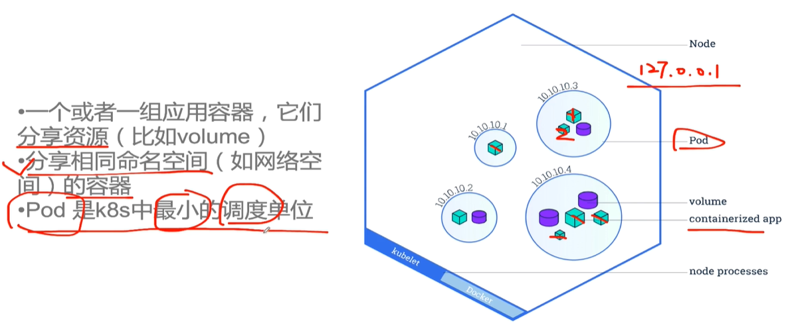
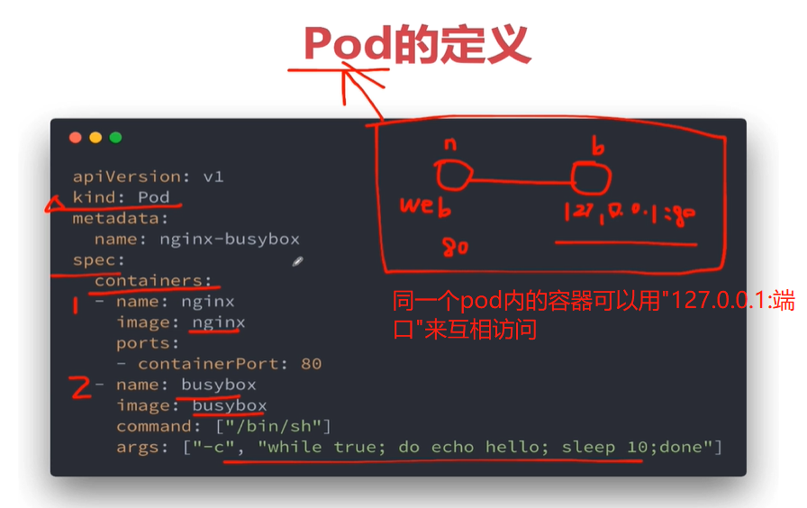

# 第11章 k8s的基本概念与操作

## 11.1 kubectl的基本使用
### kubectl命令自动补全功能
我们在管理k8s集群的时候，避免不了使用kubectl命令工具，但是该命令还是挺复杂的，使用中也记不住那么多的api选项，故这里介绍一下kubectl命令补全工具的安装。

1：安装bash-completion：
```shell
# yum install -y bash-completion 
# source /usr/share/bash-completion/bash_completion
```
2：应用kubectl的completion到系统环境：
```shell
# source <(kubectl completion bash)
# echo "source <(kubectl completion bash)" >> ~/.bashrc
```
3.效果演示,打入首字母就会自动显示可能的命令
```shell
[root@k8s-master ~]# kubectl get p
persistentvolumeclaims             poddisruptionbudgets.policy        podsecuritypolicies.policy         priorityclasses.scheduling.k8s.io
persistentvolumes                  pods                               podtemplates
```

### kubectl的配置
> 在`~/.kube`目录下，只有在master节点上有这个文件，所以只有master上才能用Kubectl。其他安装了kubectl的节点想访问可以把本文件的contexts节点内容拷贝到同名文件中

```shell
[root@k8s-master .kube]# pwd
/root/.kube
[root@k8s-master .kube]# tree -L 1
.
├── cache
├── config
└── http-cache

2 directories, 1 file
[root@k8s-master .kube]# cat config
apiVersion: v1
clusters:
- cluster:
    certificate-authority-data: LS0tLS1CRUdJTiBDRVJUSUZJQ0FURS0tLS0tCk1JSUN5RENDQWJDZ0F3SUJBZ0lCQURBTkJna3Foa2lHOXcwQkFRc0ZBREFWTVJNd0VRWURWUVFERXdwcmRXSmwKY201bGRHVnpNQjRYRFRJd01ESXlNakV4TlRnd00xb1hEVE13TURJeE9URXhOVGd3TTFvd0ZURVRNQkVHQTFVRQpBeE1LYTNWaVpYSnVaWFJsY3pDQ0FTSXdEUVlKS29aSWh2Y05BUUVCQlFBRGdnRVBBRENDQVFvQ2dnRUJBSmJmCm1rN0pEZ1ZVUXhHZlVZMUwyWDZ5SFVFTGNGRndOY2xvQWJSai9HLzVUclBTa0k4YUNOT1ZYODNCWUZpd3RvcFMKSWU4ZTNYdUVsZ3Y0OVFDc0ZPQWx4WW5KbDhJSk9ybTdNV2dkWFRoVUNqVzFhZFVsQ0JZeVp1TlY2aUw2emc5ZApaaGdDbkJPbkJiTHZWSDBqUmJLUkExNDg3Z2dGc1JuM3FjQ2RDbUhzZERsTSsvNTVDb3poUFZRMmVvUlA4QUxmCjlIMzI5OU5sUmZvY0xjV25hY2JvcDRkTktUbGY0SVp4bDlXa3VycUlzWXdwKzVYRm90cHNpZ1EyTVNXU3ZLbloKRk41NlV6TXNBa3JvUWxJSGhMcXllVEZrUTZuQW1uOU9zTW5iV3o4ZWNqMDJUY2JOaFhlNHNBWW1wUlFOUUpXMQpsL1RvRXlzMFZpSnY1ckRlWFBVQ0F3RUFBYU1qTUNFd0RnWURWUjBQQVFIL0JBUURBZ0trTUE4R0ExVWRFd0VCCi93UUZNQU1CQWY4d0RRWUpLb1pJaHZjTkFRRUxCUUFEZ2dFQkFGR2hVSWx3b3RveHU2OWJBbjl5N1lDZWZERWsKOEVHTE1PTmpEWklMc3JvTlJxdFZXVFZhemRzcFJ0VzY4SmRldlMxQmV6L2t3bWd4R2tsckVRSjZYaTNXN0NTZApnRlBVNHo3bm1GY1ZVdFpRbXkydnFZbyt3eHVKcnBXME5BSUVSRWdPcHhUYzEzZ0g2RGd1T282K3FxRkM4bTd5CllrK1ROSnQ2S01maml6TnNLNm10S3gvMmd4d0hiSlpaYTVUVklOOXNaRG9BVzlWcnNqUmVISnR1OUVYRE1VVEUKNTZkRGFGM3hDbTFlVUtWZEQrOStFYXlYMnR1QURialZiSG94Nmxob1d4Yit5Zm5aaGM4c0JscSs1aHRDMEpzLwp5MWNlQzkyUWQybkpsbXdabk9yUk5HVzdkTkVTdVcyTDUzajBPTWliUitBOHhxWGtOeFpETVlzQ2tYQT0KLS0tLS1FTkQgQ0VSVElGSUNBVEUtLS0tLQo=
    server: https://192.168.100.120:6443 # 集群的server地址，
  name: kubernetes # 集群名
contexts: # 集群内容(复数表示多个集群)
- context:
    cluster: kubernetes # 集群名
    user: kubernetes-admin # 集群的用户名
  name: kubernetes-admin@kubernetes
current-context: kubernetes-admin@kubernetes
kind: Config
preferences: {}
users:
- name: kubernetes-admin
  user:
    client-certificate-data: LS0tLS1CRUdJTiBDRVJUSUZJQ0FURS0tLS0tCk1JSUM4akNDQWRxZ0F3SUJBZ0lJWVBKNlF2RG9sbzR3RFFZSktvWklodmNOQVFFTEJRQXdGVEVUTUJFR0ExVUUKQXhNS2EzVmlaWEp1WlhSbGN6QWVGdzB5TURBeU1qSXhNVFU0TUROYUZ3MHlNVEF5TWpFeE1UVTRNRFZhTURReApGekFWQmdOVkJBb1REbk41YzNSbGJUcHRZWE4wWlhKek1Sa3dGd1lEVlFRREV4QnJkV0psY201bGRHVnpMV0ZrCmJXbHVNSUlCSWpBTkJna3Foa2lHOXcwQkFRRUZBQU9DQVE4QU1JSUJDZ0tDQVFFQXZnRXFKWnEyZ3UvUm5TdHkKWmUzaEdtdVVLeVRjbmRzczhMQ3hFZnFKamVicUkvT0gyM0g5b3ZBclhjYkYrYStScWdSWTV5ekpYYVBXN3RzRgorU0VmRC9QRW9XcW9mQmZ4TVZVaWtXN3M2WU5yTnZuT0FHdEZtUm5Vd2ZUSDBuNWlISWZGNlVNdjByZFRLOGpQCkM4UDZYN0lZQmthS3hOWjl2dDFWajd5M1BKOFdxWllpU3JWYi85Y2RWUmlKTXZFUUJLZXpwOVNTS0d0bDNWYlUKSDlGNEpOdTRCQWgvMlRKU1BwNzI5ZC8yYUFxNzVnOWRBRmpwTFNYN2Q1NXZNeFNkZTQxUjN1OW5TaTM5ZmxJWQpOdkJPZk1VTm5RZ2hvZDRkWGY1bi8zZElmTithcEZ6TTlWQXBnS1o3QVYwQmNBQUJBTjNQbkpjZlNZSjRtQU9FCk54elVCUUlEQVFBQm95Y3dKVEFPQmdOVkhROEJBZjhFQkFNQ0JhQXdFd1lEVlIwbEJBd3dDZ1lJS3dZQkJRVUgKQXdJd0RRWUpLb1pJaHZjTkFRRUxCUUFEZ2dFQkFDVGhJbm51bXY5MC8wNnY4R2JFMzNNSGdWZk95V2NnUU5tYgpoR1pxbjV1a1JBT1RCK3VmdTlWbDlTTEwxeUhiV3JHU2RETWVwam9HbjJmaGI2VXY3ck9LMW80YkNoSVZoYVBKCk9uN0RRU2R5UzJCazdyaUdxWEJKdEFEdXZBK0FxTk9OcksvMXluNWNKS05Db1ROZ1lhRzdrUSsvbDZZa3Zoak8KSVNhTXdVUkN6eEVBUW52dmg1eGExeFlieWZZNHRRVTgvSkZnMGRnZnhQd2I0ak1HMU9JS3gxK3FoOW9qd0g0UApJSExoYUJFT1h6bm9Qbm1VNkNFcjVSeUlXTGZKSlRnMzNZd3BZenFsdkdPRXpOQ0NKN3Rra29BRzlhUTJWS1JICnkzOEZBc3ptWTlneWtpUlo3dDlCTkJNWnBTbFZqK1IxdlBhT1hzRjlFMWxHQ05GMkpzQT0KLS0tLS1FTkQgQ0VSVElGSUNBVEUtLS0tLQo=
    client-key-data: LS0tLS1CRUdJTiBSU0EgUFJJVkFURSBLRVktLS0tLQpNSUlFcFFJQkFBS0NBUUVBdmdFcUpacTJndS9SblN0eVplM2hHbXVVS3lUY25kc3M4TEN4RWZxSmplYnFJL09ICjIzSDlvdkFyWGNiRithK1JxZ1JZNXl6SlhhUFc3dHNGK1NFZkQvUEVvV3FvZkJmeE1WVWlrVzdzNllOck52bk8KQUd0Rm1SblV3ZlRIMG41aUhJZkY2VU12MHJkVEs4alBDOFA2WDdJWUJrYUt4Tlo5dnQxVmo3eTNQSjhXcVpZaQpTclZiLzljZFZSaUpNdkVRQktlenA5U1NLR3RsM1ZiVUg5RjRKTnU0QkFoLzJUSlNQcDcyOWQvMmFBcTc1ZzlkCkFGanBMU1g3ZDU1dk14U2RlNDFSM3U5blNpMzlmbElZTnZCT2ZNVU5uUWdob2Q0ZFhmNW4vM2RJZk4rYXBGek0KOVZBcGdLWjdBVjBCY0FBQkFOM1BuSmNmU1lKNG1BT0VOeHpVQlFJREFRQUJBb0lCQVFDTHROZUVwdW1rQlNvZgpZcDdQQzhZRVl5MmpPNHRzRm9oSXdlS3cwWUxxNytzaFhDTjgyNmdmY25Dd2wwTmlnQkdlN1d0aEw3RXdSUlA0CnROc0RmN01UUzY0ODhldklzdUlKNEF0MjNCVWU3aDZiWWJweTNHMWtVWFg2MXoxR0xOOS9FdVlXeWV3VUIvQUQKdGJkbmMwWlpydDJ6WDVNUmdKVWREaW1uY3A5WTFteC9MaVBQZ2NLUHNZYUNQMDFtUXdLak02TGFiMjJSNFNaRQpvTnllOHlmUXJ1ejExdzdrR0dRdHBIWXBVNHZtY21xMXBkRUIva29URFhWUFl4WCtaOEpLK0RFUnlUQWVlalIvCnNIN0U3STlKS21BZFZ1bFlzbHRMRHp0c3dkdXBrV1diak9YTFZIVy9PSjdIWW50OE5vMnh3Qjg3alAwaGFkb0IKM2JWV2RVOEJBb0dCQU5QY2VPMFZKYkVzVWRpeUFHOExHdlJRWXZPenV4cFUrVUF2d082YS91Wk1nbFZTeUtiOQpMUjJyWnloUnZMeUYrQTVjdHRaM0lqTzE2Um80d0NReW0yOEpDdGFTUm1FU0lYVXg4M3dhR3l1dStOZlZyakY5ClRFSm9oQk94SEQwN1lVTGR1RFoxbDRjSGRWN09HZDRzNENxTHZiN2hPbWRvRmttRzRONHdlNVIxQW9HQkFPV1cKK2QvUlMzeG9ocDNOd1RaZUVIK3NsYzdjTGxYczAwZld1dmlxaXV2QlVodjN6TFhOSUxrSmsrS0xBc3E4QmVFUgpVb3BHNnNnb290dHdsMnFpcFJTWHVnZDUwM05jZXdSampGTzB1MXZFS1o1ay9XRXNtcGJTMDZiTWpaM3l4d3M2CllRRml2dEFPZTRSMEJwK2FmblJOT3FwTzRSVGhKdGtNU3JXUEVBOVJBb0dCQUlIaThoUlAyYnJrZEExSkcvRDQKT3Y4NzVWNkpleFVxc1dFRHBlSGpEcEU4cU04TW9NMlgvRGZyWktRWWNJQ1lGYnNnWmt2WDRCVVoycDVqMnBDVwpvaXFSdlo1Tk1XN0R3ZFZxMlY3bFZuRVNwYWNWYnVVU2IxVnJaRVg2V0ZqRjlkd2J1SnRTdnFKZkZUc1pXa3lXCjhKdkU3b0IrN3VLRXN0MURIc3U1cDVvZEFvR0FRZFFyS3pDUWkwaFJLTmdCQ1R5cFVHSkV4ZjQ5enVkTG9US0IKZzZFcW1mUmhQYUdzY1lneVZMdlpTa0IvZVcrMTQ5V2FyQWt2Y2xxc2IyejJEVjQ3SlE5b0NKSzJ2VUlNQjdNZgpYalRZNzdQc0Z2MXY1VGZyejBqOTVMcUw5SGpTOTNZeXNEb0c2aExzK1lwbkI4WTljYzFlLzh3RUgzOTdLd3FxCk5TcWkrVEVDZ1lFQXM5Q05keDFLODZYc0dWNU5TdXR3dVpDVzhHZzFIZzFVczB0L3lqcnNBYjlrenoxWENIZFUKUlgvOUJsY0RyOTJYRzA4RU1GSjd6Z0s2N3ZxTGxkL2JUVkFnaUVXSVJwS1Y5ZUthTWZyVXZ0QTlwanRzU2hWegpVWHR0WDBORFE1T29iVjlDQTZ2WmZ4cGtjVWhtbE92RzRJQ0pmZEgxbEVqWWY1MzlRWEl6YVBNPQotLS0tLUVORCBSU0EgUFJJVkFURSBLRVktLS0tLQo=
```

## 11.2 k8s的节点(node)、标签(label)、角色(role)
### 节点node操作
```shell
[root@k8s-master .kube]# kubectl get n // 补全
namespaces                         networkpolicies.networking.k8s.io  nodes
[root@k8s-master .kube]# kubectl get nodes // 查看所有节点
NAME         STATUS   ROLES    AGE   VERSION
k8s-master   Ready    master   14h   v1.17.3
k8s-node01   Ready    <none>   13h   v1.17.3
k8s-node02   Ready    <none>   13h   v1.17.3
[root@k8s-master .kube]# kubectl get nodes k8s-master // 只看master节点的详细信息
NAME         STATUS   ROLES    AGE   VERSION
k8s-master   Ready    master   14h   v1.17.3
[root@k8s-master .kube]# kubectl describe nodes k8s-master // 查看节点的详细信息
[root@k8s-master .kube]# kubectl get nodes -o wide // 显示节点的更多信息
NAME         STATUS   ROLES    AGE   VERSION   INTERNAL-IP       EXTERNAL-IP   OS-IMAGE                KERNEL-VERSION          CONTAINER-RUNTIME
k8s-master   Ready    master   14h   v1.17.3   192.168.100.120   <none>        CentOS Linux 7 (Core)   3.10.0-693.el7.x86_64   docker://1.13.1
k8s-node01   Ready    <none>   13h   v1.17.3   192.168.100.121   <none>        CentOS Linux 7 (Core)   3.10.0-693.el7.x86_64   docker://1.13.1
k8s-node02   Ready    <none>   13h   v1.17.3   192.168.100.122   <none>        CentOS Linux 7 (Core)   3.10.0-693.el7.x86_64   docker://1.13.1
[root@k8s-master .kube]# kubectl get nodes -o yaml // yaml格式显示节点信息
......
[root@k8s-master .kube]# kubectl get nodes -o json // json格式显示节点信息
......
```
### 标签label操作
```shell
[root@k8s-master ~]# kubectl get nodes --show-labels // 显示所有节点的标签
NAME         STATUS   ROLES    AGE   VERSION   LABELS
k8s-master   Ready    master   14h   v1.17.3   beta.kubernetes.io/arch=amd64,beta.kubernetes.io/os=linux,kubernetes.io/arch=amd64,kubernetes.io/hostname=k8s-master,kubernetes.io/os=linux,node-role.kubernetes.io/master=
k8s-node01   Ready    <none>   13h   v1.17.3   beta.kubernetes.io/arch=amd64,beta.kubernetes.io/os=linux,kubernetes.io/arch=amd64,kubernetes.io/hostname=k8s-node01,kubernetes.io/os=linux
k8s-node02   Ready    <none>   13h   v1.17.3   beta.kubernetes.io/arch=amd64,beta.kubernetes.io/os=linux,kubernetes.io/arch=amd64,kubernetes.io/hostname=k8s-node02,kubernetes.io/os=linux
[root@k8s-master ~]# kubectl label nodes k8s-master env=test // 给master节点设置标签
node/k8s-master labeled
[root@k8s-master ~]# kubectl get nodes --show-labels
NAME         STATUS   ROLES    AGE   VERSION   LABELS
k8s-master   Ready    master   14h   v1.17.3   beta.kubernetes.io/arch=amd64,beta.kubernetes.io/os=linux,env=test,kubernetes.io/arch=amd64,kubernetes.io/hostname=k8s-master,kubernetes.io/os=linux,node-role.kubernetes.io/master=
k8s-node01   Ready    <none>   13h   v1.17.3   beta.kubernetes.io/arch=amd64,beta.kubernetes.io/os=linux,kubernetes.io/arch=amd64,kubernetes.io/hostname=k8s-node01,kubernetes.io/os=linux
k8s-node02   Ready    <none>   13h   v1.17.3   beta.kubernetes.io/arch=amd64,beta.kubernetes.io/os=linux,kubernetes.io/arch=amd64,kubernetes.io/hostname=k8s-node02,kubernetes.io/os=linux
[root@k8s-master ~]# kubectl label nodes k8s-master env- // 删除master的env标签
node/k8s-master labeled
[root@k8s-master ~]# kubectl get nodes --show-labels
NAME         STATUS   ROLES    AGE   VERSION   LABELS
k8s-master   Ready    master   14h   v1.17.3   beta.kubernetes.io/arch=amd64,beta.kubernetes.io/os=linux,kubernetes.io/arch=amd64,kubernetes.io/hostname=k8s-master,kubernetes.io/os=linux,node-role.kubernetes.io/master=
k8s-node01   Ready    <none>   13h   v1.17.3   beta.kubernetes.io/arch=amd64,beta.kubernetes.io/os=linux,kubernetes.io/arch=amd64,kubernetes.io/hostname=k8s-node01,kubernetes.io/os=linux
k8s-node02   Ready    <none>   13h   v1.17.3   beta.kubernetes.io/arch=amd64,beta.kubernetes.io/os=linux,kubernetes.io/arch=amd64,kubernetes.io/hostname=k8s-node02,kubernetes.io/os=linux
```
### 角色操作
```shell
[root@k8s-master ~]# kubectl get nodes // 显示所有的节点，可以看到两个非master节点并没有角色(ROLES)
NAME         STATUS   ROLES    AGE   VERSION
k8s-master   Ready    master   14h   v1.17.3
k8s-node01   Ready    <none>   13h   v1.17.3
k8s-node02   Ready    <none>   13h   v1.17.3
[root@k8s-master ~]# kubectl label nodes k8s-node01 node-role.kubernetes.io/worker= // node01设置为wroker角色
node/k8s-node01 labeled
[root@k8s-master ~]# kubectl get nodes // 查看角色可以看到设置成功了
NAME         STATUS   ROLES    AGE   VERSION
k8s-master   Ready    master   14h   v1.17.3
k8s-node01   Ready    worker   13h   v1.17.3
k8s-node02   Ready    <none>   13h   v1.17.3
[root@k8s-master ~]# kubectl label nodes k8s-node02 node-role.kubernetes.io/worker= // node01设置为wroker角色
node/k8s-node02 labeled
[root@k8s-master ~]# kubectl get nodes // 查看角色可以看到设置成功了
NAME         STATUS   ROLES    AGE   VERSION
k8s-master   Ready    master   14h   v1.17.3
k8s-node01   Ready    worker   13h   v1.17.3
k8s-node02   Ready    worker   13h   v1.17.3
```

## 11.3~11.4 k8s的最小调度单位pod
### 基本概念
+ 一个或者一组应用容器，他们分享资源(比如volume)
+ 分享相同的命名空间(比如网络空间)的容器群
+ pod是k8s中的最小调度单位


### 一个pod内如何定义多个容器以及容器间的互相访问


### pod的yml配置文件详解
```yaml
apiVersion: v1        　　          #必选，版本号，例如v1,版本号必须可以用 kubectl api-versions 查询到 .
kind: Pod       　　　　　　         #必选，Pod
metadata:       　　　　　　         #必选，元数据
  name: string        　　          #必选，Pod名称
  namespace: string     　　        #必选，Pod所属的命名空间,默认为"default"
  labels:       　　　　　　          #自定义标签
    - name: string      　          #自定义标签名字
  annotations:        　　                 #自定义注释列表
    - name: string
spec:         　　　　　　　            #必选，Pod中容器的详细定义
  containers:       　　　　            #必选，Pod中容器列表
  - name: string      　　                #必选，容器名称,需符合RFC 1035规范
    image: string     　　                #必选，容器的镜像名称
    imagePullPolicy: [ Always|Never|IfNotPresent ]  #获取镜像的策略 Alawys表示下载镜像 IfnotPresent表示优先使用本地镜像,否则下载镜像，Nerver表示仅使用本地镜像
    command: [string]     　　        #容器的启动命令列表，如不指定，使用打包时使用的启动命令
    args: [string]      　　             #容器的启动命令参数列表
    workingDir: string                     #容器的工作目录
    volumeMounts:     　　　　        #挂载到容器内部的存储卷配置
    - name: string      　　　        #引用pod定义的共享存储卷的名称，需用volumes[]部分定义的的卷名
      mountPath: string                 #存储卷在容器内mount的绝对路径，应少于512字符
      readOnly: boolean                 #是否为只读模式
    ports:        　　　　　　        #需要暴露的端口库号列表
    - name: string      　　　        #端口的名称
      containerPort: int                #容器需要监听的端口号
      hostPort: int     　　             #容器所在主机需要监听的端口号，默认与Container相同
      protocol: string                  #端口协议，支持TCP和UDP，默认TCP
    env:        　　　　　　            #容器运行前需设置的环境变量列表
    - name: string      　　            #环境变量名称
      value: string     　　            #环境变量的值
    resources:        　　                #资源限制和请求的设置
      limits:       　　　　            #资源限制的设置
        cpu: string     　　            #Cpu的限制，单位为core数，将用于docker run --cpu-shares参数
        memory: string                  #内存限制，单位可以为Mib/Gib，将用于docker run --memory参数
      requests:       　　                #资源请求的设置
        cpu: string     　　            #Cpu请求，容器启动的初始可用数量
        memory: string                    #内存请求,容器启动的初始可用数量
    livenessProbe:      　　            #对Pod内各容器健康检查的设置，当探测无响应几次后将自动重启该容器，检查方法有exec、httpGet和tcpSocket，对一个容器只需设置其中一种方法即可
      exec:       　　　　　　        #对Pod容器内检查方式设置为exec方式
        command: [string]               #exec方式需要制定的命令或脚本
      httpGet:        　　　　        #对Pod内个容器健康检查方法设置为HttpGet，需要制定Path、port
        path: string
        port: number
        host: string
        scheme: string
        HttpHeaders:
        - name: string
          value: string
      tcpSocket:      　　　　　　#对Pod内个容器健康检查方式设置为tcpSocket方式
         port: number
       initialDelaySeconds: 0       #容器启动完成后首次探测的时间，单位为秒
       timeoutSeconds: 0    　　    #对容器健康检查探测等待响应的超时时间，单位秒，默认1秒
       periodSeconds: 0     　　    #对容器监控检查的定期探测时间设置，单位秒，默认10秒一次
       successThreshold: 0
       failureThreshold: 0
       securityContext:
         privileged: false
    restartPolicy: [Always | Never | OnFailure] #Pod的重启策略，Always表示一旦不管以何种方式终止运行，kubelet都将重启，OnFailure表示只有Pod以非0退出码退出才重启，Nerver表示不再重启该Pod
    nodeSelector: obeject   　　    #设置NodeSelector表示将该Pod调度到包含这个label的node上，以key：value的格式指定
    imagePullSecrets:     　　　　#Pull镜像时使用的secret名称，以key：secretkey格式指定
    - name: string
    hostNetwork: false      　　    #是否使用主机网络模式，默认为false，如果设置为true，表示使用宿主机网络
    volumes:        　　　　　　    #在该pod上定义共享存储卷列表
    - name: string     　　 　　    #共享存储卷名称 （volumes类型有很多种）
      emptyDir: {}      　　　　    #类型为emtyDir的存储卷，与Pod同生命周期的一个临时目录。为空值
      hostPath: string      　　    #类型为hostPath的存储卷，表示挂载Pod所在宿主机的目录
        path: string      　　        #Pod所在宿主机的目录，将被用于同期中mount的目录
      secret:       　　　　　　    #类型为secret的存储卷，挂载集群与定义的secre对象到容器内部
        scretname: string  
        items:     
        - key: string
          path: string
      configMap:      　　　　            #类型为configMap的存储卷，挂载预定义的configMap对象到容器内部
        name: string
        items:
        - key: string
          path: string
```

### 举例pod的配置文件
> nginx_busybox.yml
```yml
apiVersion: v1
kind: Pod
metadata:
  name: nginx-busybox
spec:
  containers:
  - name: nginx
    image: nginx
    ports:
    - containerPort: 80
  - name: busybox
    image: busybox
    command: ["/bin/sh"]
    args: ["-c", "while true; do echo hello; sleep 10;done"]
```

### pod常用命令
+ 通过yml文件创建pod
  > create或者apply都行~apply可以用于从yml文件更新pod 
    ```bash
    $ kubectl create -f nginx_busybox.yml
    pod "nginx-busybox" created
    ```

+ 查看pod列表
    ```bash
    $ kubectl get pods
    NAME            READY     STATUS    RESTARTS   AGE
    nginx-busybox   2/2       Running   0          57s
    ```

+ 查看pod详情
    > `-o`(`-o wide`、`-o json`, `-o yaml`)和`describe`是常用的查看pod详情的两种方式
    ```bash
    $ kubectl describe pod nginx-busybox
    ```

    ```bash
    $ kubectl get pods nginx-busybox -o wide
    NAME            READY     STATUS    RESTARTS   AGE       IP           NODE
    nginx-busybox   2/2       Running   0          3m        172.17.0.4   minikube
    ```

+ 进入pod内的容器
    ```bash
    $ kubectl exec nginx-busybox -it sh
    Defaulting container name to nginx.
    Use 'kubectl describe pod/nginx-busybox -n default' to see all of the containers in this pod.
    ```

+ 删除pod
    ```bash
    $ kubectl delete -f nginx_busybox.yml
    pod "nginx-busybox" deleted
    ```

### 实战创建及操作pod
> 下面开始操作pod
```shell
[root@k8s-master ~]# cd pod/
[root@k8s-master pod]# ls
nginx_busybox.yml
[root@k8s-master pod]# kubectl create -f nginx_busybox.yml // 从配置文件创建pod，create可以改成apply
pod/nginx-busybox created
[root@k8s-master pod]# kubectl get pod // 查看pod信息，可以看到还没READY
NAME            READY   STATUS              RESTARTS   AGE
nginx-busybox   0/2     ContainerCreating   0          7s
NAME            READY   STATUS              RESTARTS   AGE
nginx-busybox   0/2     ContainerCreating   0          21s
[root@k8s-master pod]# kubectl get pod // 等到拉取好镜像就READY了
NAME            READY   STATUS    RESTARTS   AGE
nginx-busybox   2/2     Running   0          89s
[root@k8s-master pod]# kubectl get pod -o wide // 查看pod的完整信息
NAME            READY   STATUS    RESTARTS   AGE    IP           NODE         NOMINATED NODE   READINESS GATES
nginx-busybox   2/2     Running   0          100s   10.244.2.3   k8s-node02   <none>           <none>
[root@k8s-master pod]# kubectl describe pod nginx-busybox // 查看更详细的指定的pod的信息
....
[root@k8s-master ~]# kubectl exec nginx-busybox date // 查看pod内容器的创建时间，pod内多个容器默认访问第一个
Defaulting container name to nginx.
Use 'kubectl describe pod/nginx-busybox -n default' to see all of the containers in this pod.
Sun Feb 23 03:13:07 UTC 2020
[root@k8s-master ~]# kubectl exec nginx-busybox -c nginx date // 查看pod内容器的创建时间，通过-c指定访问那个容器
Sun Feb 23 03:30:42 UTC 2020
[root@k8s-master ~]# kubectl exec nginx-busybox -c busybox date // 和上面那个-c指定的容器不同，所以看到的date也不同
Sun Feb 23 03:30:57 UTC 2020
[root@k8s-master ~]# kubectl exec nginx-busybox -c nginx hostname // 除了date还可以查询其他信息
nginx-busybox
[root@k8s-master ~]# kubectl exec nginx-busybox -c busybox hostname
nginx-busybox
[root@k8s-master ~]# kubectl exec nginx-busybox -it sh // 进入交互式命令行，默认进入pod内第一个定义地容器
Defaulting container name to nginx.
Use 'kubectl describe pod/nginx-busybox -n default' to see all of the containers in this pod.
# exit
[root@k8s-master ~]# kubectl exec nginx-busybox -c busybox -it sh // 同样可以通过-c指定容器
/ # ip a // 可以查看pod的ip信息(或者namespace信息)
1: lo: <LOOPBACK,UP,LOWER_UP> mtu 65536 qdisc noqueue qlen 1
    link/loopback 00:00:00:00:00:00 brd 00:00:00:00:00:00
    inet 127.0.0.1/8 scope host lo
       valid_lft forever preferred_lft forever
    inet6 ::1/128 scope host
       valid_lft forever preferred_lft forever
3: eth0@if8: <BROADCAST,MULTICAST,UP,LOWER_UP,M-DOWN> mtu 1450 qdisc noqueue
    link/ether ee:e4:c4:67:42:c2 brd ff:ff:ff:ff:ff:ff
    inet 10.244.2.3/24 scope global eth0
       valid_lft forever preferred_lft forever
    inet6 fe80::ece4:c4ff:fe67:42c2/64 scope link tentative dadfailed
       valid_lft forever preferred_lft forever
/ # wget 127.0.0.1:80 // 同一个pod内的容器共享命名空间namespace(这里可以认为就是ip)，所以在busybox里可以访问到nginx在80端口提供的index.html
Connecting to 127.0.0.1:80 (127.0.0.1:80)
saving to 'index.html'
index.html           100% |******************************************************************************************************************************************************************************************|   612  0:00:00 ETA
'index.html' saved
/ # cat index.html
<!DOCTYPE html>
<html>
<head>
<title>Welcome to nginx!</title>
<style>
    body {
        width: 35em;
        margin: 0 auto;
        font-family: Tahoma, Verdana, Arial, sans-serif;
    }
</style>
</head>
<body>
<h1>Welcome to nginx!</h1>
<p>If you see this page, the nginx web server is successfully installed and
working. Further configuration is required.</p>

<p>For online documentation and support please refer to
<a href="http://nginx.org/">nginx.org</a>.<br/>
Commercial support is available at
<a href="http://nginx.com/">nginx.com</a>.</p>

<p><em>Thank you for using nginx.</em></p>
</body>
</html>
/ # exit
[root@k8s-master ~]# kubectl exec nginx-busybox -c nginx -it sh // 通过-c指定进入的容器nginx
# nginx --help
nginx: invalid option: "-"
# nginx -v // 可以看到确实进入了nginx容器
nginx version: nginx/1.17.8
# exit
[root@k8s-master ~]# kubectl get pod
NAME            READY   STATUS    RESTARTS   AGE
nginx-busybox   2/2     Running   0          27m
[root@k8s-master ~]# cd pod/
[root@k8s-master pod]# ls
nginx_busybox.yml
[root@k8s-master pod]# kubectl delete -f nginx_busybox.yml // 删除创建的pod
pod "nginx-busybox" deleted

[root@k8s-master pod]#
[root@k8s-master pod]# kubectl get pod // 此时再看就找不到pod了
No resources found in default namespace.
```