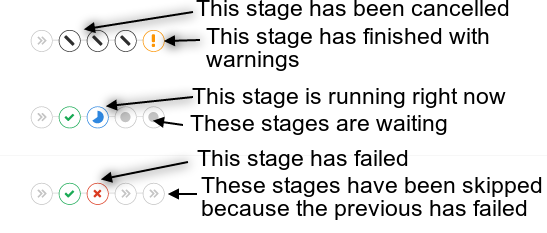
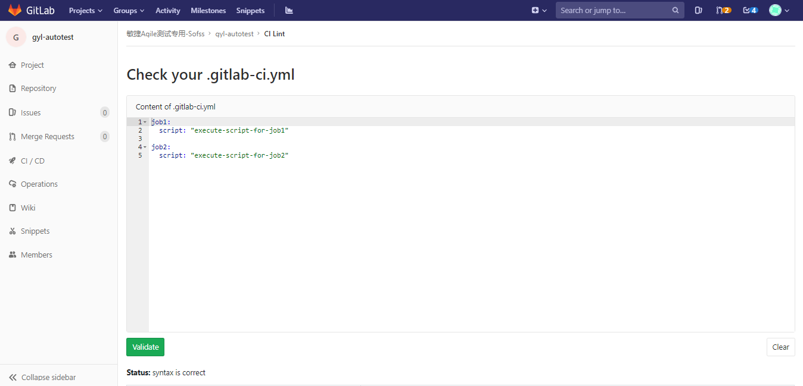

# [GitLab CI介绍——入门篇](https://blog.csdn.net/Choerodon/article/details/97751754)

本文将会对Gitlab CI进行简要介绍，包括Gitlab Runner，Gitlab CI中的相关概念以及.gitlab-ci.yml的常用配置。

那么，GitLab CI 是什么？

GitLab CI 是GitLab内置的进行持续集成的工具，只需要在仓库根目录下创建.gitlab-ci.yml 文件，并配置GitLab Runner；每次提交的时候，gitlab将自动识别到.gitlab-ci.yml文件，并且使用Gitlab Runner执行该脚本。

# Gitlab Runner

## 简介

GitLab-Runner就是一个用来执行.gitlab-ci.yml 脚本的工具。可以理解成，Runner就像认真工作的工人，GitLab-CI就是管理工人的中心，所有工人都要在GitLab-CI里面注册，并且表明自己是为哪个项目服务。当相应的项目发生变化时，GitLab-CI就会通知相应的工人执行对应的脚本。

## Runner类型

GitLab-Runner可以分类两种类型：Shared Runner（共享型）和Specific Runner（指定型）。

- Shared Runner：所有工程都能够用的，且只有系统管理员能够创建。
- Specific Runner：只有特定的项目可以使用。

## Runner搭建

### ▍1. Runner 安装

以Linux为例：

```shell
# For Debian/Ubuntu 
curl -L https://packages.gitlab.com/install/repositories/runner/gitlab-ci-multi-runner/script.deb.sh | sudo bash 

# For RHEL/CentOS 
curl -L https://packages.gitlab.com/install/repositories/runner/gitlab-ci-multi-runner/script.rpm.sh | sudo bash
```

其他系统请参考官网文档:https://docs.gitlab.com/runner/install/

### ▍2. 获取Runner注册Token

安装好Runner之后，需要向Gitlab进行注册，注册Runner需要GitLab-CI的url和token。可根据需求注册选择所需类型Runner。

获取Shared Runner注册Token：
使用管理员用户登录，进入Admin Area->OverView->Runners界面。


获取Specific Runner注册Token：
进行项目仓库->settings->CI/CD界面


### ▍3. 注册Runner

执行gitlab-ci-multi-runner register命令进行Runner注册，期间会用到前期获取的url及token；注册完成之后，GitLab-CI就会多出一条Runner记录：


更多系统注册，请参考阅读官方文档：https://docs.gitlab.com/runner/register/

# 相关概念

### ▍管道（pipeline）

每个推送到 Gitlab 的提交都会产生一个与该提交关联的管道(pipeline)，若一次推送包含了多个提交，则管道与最后那个提交相关联，管道(pipeline)就是一个分成不同阶段(stage)的作业(job)的集合。

### ▍阶段（Stage）

阶段是对批量的作业的一个逻辑上的划分，每个 GitLab CI/CD 都必须包含至少一个 Stage。多个 Stage 是按照顺序执行的，如果其中任何一个 Stage 失败，则后续的 Stage 不会被执行，整个 CI 过程被认为失败。


以图中所示为例，整个 CI 环节包含三个 Stage：build、test 和deploy。

- build 被首先执行。如果发生错误，本次 CI 立刻失败；
- test 在 build 成功执行完毕后执行。如果发生错误，本次 CI 立刻失败；
- deploy 在 test 成功执行完毕后执行。如果发生错误，本次 CI 失败。

下图是Gitlab对阶段和阶段状态的展示：




### ▍作业（Job）

作业就是运行器(Runner)要执行的指令集合，Job 可以被关联到一个 Stage。当一个 Stage 执行的时候，与其关联的所有 Job 都会被执行。在有足够运行器的前提下,同一阶段的所有作业会并发执行。作业状态与阶段状态是一样的，实际上，阶段的状态就是继承自作业的。

作业必须包含script（由Runner执行的shell脚本），随着项目越来越大，Job 越来越多，Job 中包含的重复逻辑可能会让配置文件臃肿不堪。.gitlab-ci.yml 中提供了 before_script 和 after_script 两个全局配置项。这两个配置项在所有 Job 的 script 执行前和执行后调用。

Job 的执行过程中往往会产生一些数据，默认情况下 GitLab Runner 会保存 Job 生成的这些数据，然后在下一个 Job 执行之前（甚至不局限于当次 CI/CD）将这些数据恢复。这样即便是不同的 Job 运行在不同的 Runner 上，它也能看到彼此生成的数据。

在了解了 Job 配置的 script、before_script、after_script 和 cache 以后，可以将整个Job的执行流程用一张图概括：


# 创建.gitlab-ci.yml 文件

## 什么是.gitlab-ci.yml文件

从7.12版本开始，GitLab CI使用YAML文件(.gitlab-ci.yml)来管理项目配置。该文件存放于项目仓库的根目录，并且包含了你的项目如何被编译的描述语句。YAML文件使用一系列约束叙述定义了Job启动时所要做的事情。

## Job

Job是.gitlab-ci.yml文件中最基本的元素，由一系列参数定义了任务启动时所要做的事情，用户可以创建任意个任务；每个任务必须有一个独一无二的名字，但有一些保留keywords不能用于Job名称，image，services，stages，types，before_script，after_script，variables，cache。

Job被定义为顶级元素，并且至少包括一条script语句，如果一个 Job 没有显式地关联某个 Stage，则会被默认关联到 test Stage。

示例：

```yml
job1:
# 关联到bulid阶段
stage: build
# 所需执行的脚本
script:
- execute-script-for-job1
```

## 参数详情

下面是关于配置CI/CD管道的常用参数详细说明。

### ▍stages

用于定义所有作业(job)可以使用的全局阶段，gitlab-ci.yml允许灵活定义多个阶段，stages元素的顺序定义了作业执行的顺序。Job关联的stage名相同时，该多个Job将并行执行（在拥有足够Runner情况下）。下一个阶段的job将会在前一个阶段的job都完成的情况下执行。

如果文件中没有定义 stages，那么则默认包含 build、test 和 deploy 三个 stage。Stage 中并不能直接配置任何具体的执行逻辑，具体的执行逻辑应该在 Job 中配置。

示例：

```yml
stages:
  - build
  - test
  - deploy
```

### ▍stage

阶段是根据每个Job定义的，并且依赖于全局定义的阶段。它允许将作业(Job)分组到不同的阶段。

示例：

```yml
stages:
  - build
  - test
  - deploy

job 1:
  stage: build
  script: make build dependencies

job 2:
  stage: build
  script: make build artifacts

job 3:
  stage: test
  script: make test

job 4:
  stage: deploy
  script: make deploy
```

### ▍script

script是一段由Runner执行的shell脚本。

示例：

```yml
job:
  script: "bundle exec rspec"
```

这个参数也可以使用数组包涵好几条命令：

```yml
job:
  script:
    - uname -a
    - bundle exec rspec
```

有些时候，script命令需要被单引号或者双引号所包裹。举个例子，命令中包涵冒号的时候，该命令需要被引号所包裹，这样YAML解析器才知道该命令语句不是“key: value”语法的一部分。当命令中包涵以下字符时需要注意打引号:: { } [ ] , & * #? | - < > = ! % @ `

### ▍image and services

这两个选项允许开发者指定任务运行时所需的自定义的docker镜像和服务。

示例：

```yml
#为每个作业定义不同的映像和服务
test:2.1:
  image: ruby:2.1
  services:
  - postgres:9.3
  script:
  - bundle exec rake spec

test:2.2:
  image: ruby:2.2
  services:
  - postgres:9.4
  script:
  - bundle exec rake spec
```

### ▍before_script和after_script

before_script是用于定义一些在所有任务执行前所需执行的命令, 包括部署工作，可以接受一个数组或者多行字符串。after_script用于定义所有job执行过后需要执行的命令，可以接受一个数组或者多行字符串。

示例：

```yml
#定义全局 before_script:
default:
  before_script:
    - global before script
#覆盖全局before_script
job:
  before_script:
    - execute this instead of global before script
  script:
    - my command
  after_script:
    - execute this after my script
```

### ▍only and except

- only和except两个参数说明了job什么时候将会被创建：
- only定义了job需要执行的所在分支或者标签
- except定义了job不会执行的所在分支或者标签

以下是这两个参数的几条用法规则：

- only和except如果都存在在一个job声明中，则所需引用将会被only和except所定义的分支过滤
- only和except允许使用正则
- only和except允许使用指定仓库地址，但是不forks仓库

此外，only和except允许使用以下一些特殊关键字：

| 值        | 描述                                                         |
| --------- | ------------------------------------------------------------ |
| branches  | 当一个分支被push上来                                         |
| tags      | 当一个打了tag的分支被push上来                                |
| api       | 当一个pipline被piplines api所触发调起，详见piplines api（https://docs.gitlab.com/ce/api/pipelines.html） |
| external  | 当使用了GitLab以外的CI服务                                   |
| pipelines | 针对多项目触发器而言，当使用CI_JOB_TOKEN并使用gitlab所提供的api创建多个pipelines的时候 |
| pushes    | 当pipeline被用户的git push操作所触发的时候                   |
| schedules | 针对预定好的pipline而言（每日构建一类~，具体请看https://docs.gitlab.com/ce/user/project/pipelines/schedules.html） |
| triggers  | 用token创建piplines的时候                                    |
| web       | 在GitLab页面上Pipelines标签页下，你按了run pipline的时候     |

下面的例子，job将会只在issue-开头的refs下执行，反之则其他所有分支被跳过：

```yml
job:
  # use regexp
  only:
    - /^issue-.*$/
  # use special keyword
  except:
    - branches
```

更多配置详情，请参考官网文档：
https://docs.gitlab.com/ee/ci/yaml/README.html#parameter-details

## 验证.gitlab-ci.yml

GitLab CI的每个实例都有一个名为Lint的嵌入式调试工具，它可以验证.gitlab-ci.yml文件的内容，进入项目仓库->CI/CD->CI Lint，示例如下：



参考文档：

- https://segmentfault.com/a/1190000011890710
- https://docs.gitlab.com/ce/ci/
- https://www.jianshu.com/p/306cf4c6789a
- https://linux.cn/article-9214-1.html