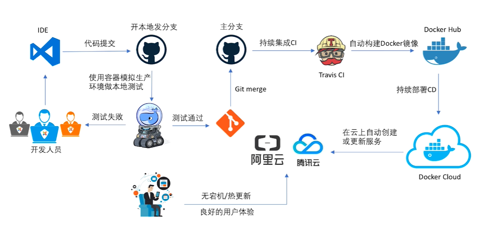
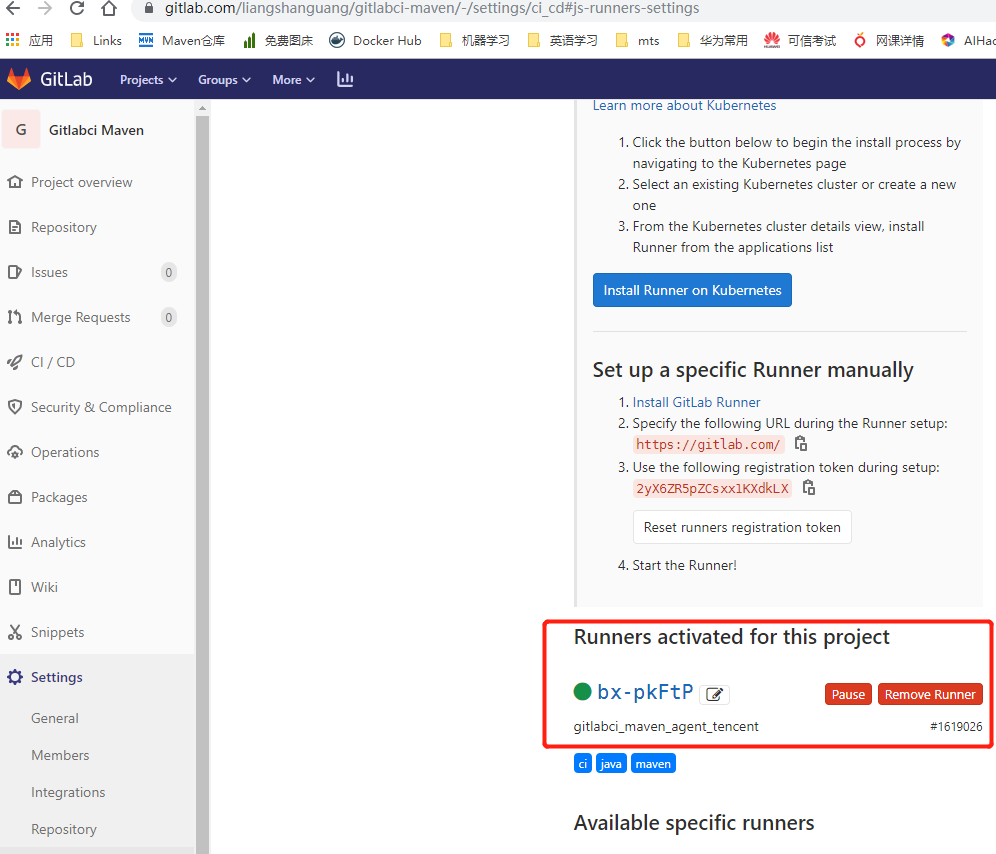
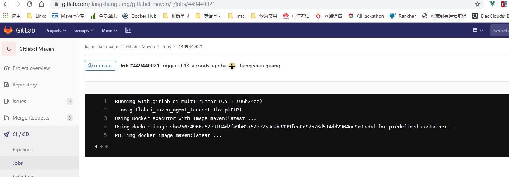
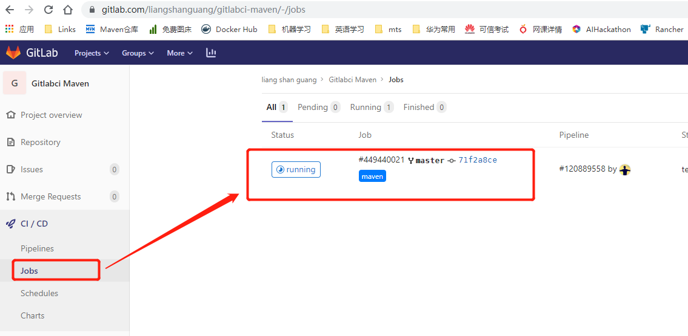
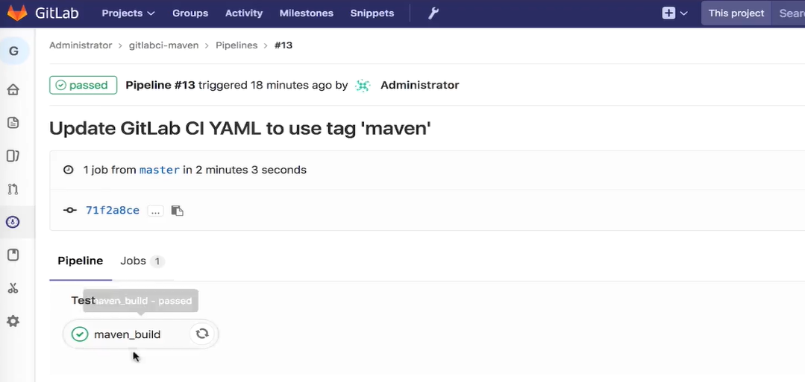

# 第13章 Docker+DevOps实战--过程和工具
> 本章的目标如下：


## 13.1 本章简介
完全采用免费的工具实现上面的基于k8s的devops
+ gitlab代替github
+ GitlabCI代替Jenkins或者TravisCI
+ 私有registry代替dockerhub

## 13.2 搭建gitlab
> 直接用共有的吧~公司内部也有

本地搭建参考[gitlab-server搭建](环境搭建脚本/labs/gitlab-server.md)

## 13.3 搭建GitlabCI服务器和Pipeline

+ 1.[gitlab-ci实战](环境搭建脚本/labs/gitlab-ci.md)
+ 2.[gitlab-ci总结](GitLabCI介绍.md)

## 13.4 基于真实Python项目的CI演示
> 以[docker-cloud-flask-demo](https://github.com/imooc-course/docker-cloud-flask-demo.git)为例，导入到[gitlab](https://gitlab.com/liangshanguang/docker-cloud-flask-demo)中

## 13.5 基于Java项目的CI演示
> [代码地址](https://gitlab.com/liangshanguang/gitlabci-maven)


```shell
[root@VM_0_15_centos python_docker_ci_demo]# gitlab-ci-multi-runner register
Running in system-mode.

Please enter the gitlab-ci coordinator URL (e.g. https://gitlab.com/):
https://gitlab.com/
Please enter the gitlab-ci token for this runner:
2yX6ZR5pZCsxx1KXdkLX
Please enter the gitlab-ci description for this runner:
[VM_0_15_centos]: gitlabci_maven_agent_tencent
Please enter the gitlab-ci tags for this runner (comma separated):
maven,java,ci
Whether to run untagged builds [true/false]:
[false]:
Whether to lock Runner to current project [true/false]:
[false]:
Registering runner... succeeded                     runner=2yX6ZR5p
Please enter the executor: ssh, virtualbox, docker+machine, docker-ssh+machine, parallels, shell, kubernetes, docker, docker-ssh:
docker
Please enter the default Docker image (e.g. ruby:2.1):
maven:latest
Runner registered successfully. Feel free to start it, but if it's running already the config should be automatically reloaded!
```

gitlabci的agent注册结果如下：




.gitlab-ci.yml的内容

```yml
# These are the default stages. You don't need to explicitly define them. But you could define any stages you need.
stages:
  - build
  - test
  - deploy

# This is the name of the job. You can choose it freely.
maven_build:
  # A job is always executed within a stage. If no stage is set, it defaults to 'test'
  stage: test
  # Since we require Maven for this job, we can restrict the job to runners with a certain tag. Of course, we need to configure a runner with the tag maven with a maven installation
  tags:
    - maven
  # Here you can execute arbitrate terminal commands.
  # If any of the commands returns a non zero exit code the job fails
  script:
    - echo "Building project with maven"
    - mvn verify
```

运行过程如下：




## 13.6 使用Python项目延时CI/CD流程
> 在13.4的基础上加了部署deploy环节

```yml
variables:
  GIT_SSL_NO_VERIFY: "1"

# 定义CI的阶段
stages:
  - test
  - build
  - deploy

# 依赖安装
pep8:
  stage: test
  image: python:2.7
  script:
    - pip install tox
    - tox -e pep8
  tags:
    - python27

# 单元测试1
unittest-py27:
  stage: test
  image: python:2.7
  script:
    - pip install tox
    - tox -e py27
  tags:
    - python27

# 单元测试2
unittest-py34:
  stage: test
  image: python:3.4
  script:
    - pip install tox
    - tox -e py34
  tags:
    - python34

# 单元测试3
sphnix:
  stage: test
  image: python:2.7
  script:
    - pip install tox
    - tox -e docs
  tags:
    - python27

# 构建
build:
  stage: build
  tags:
    - shell
  script:
    - docker build -t skeleton .
  only:
    - master

# 部署
deploy:
  stage: deploy
  tags:
    - shell
  script:
    - scripts/deploy.sh
    - export
  only:
    - master
```

deploy.sh内容如下

```shell
#!/usr/bin/env bash

docker ps -a | grep penxiao_skeleton | awk '{print$1}' | xargs docker stop
docker ps -a | grep penxiao_skeleton | awk '{print$1}' | xargs docker rm
docker run -d -p 80:5000 --name penxiao_skeleton skeleton
```

## 13.7 CI实现版本自动发布
> 自动把build后的镜像推送到自己搭建的docker registry中

下面是参考地`.gitlab-ci.yml`

```yml
default:
  image: python:3.6

# 定义阶段
stages:
  - lint
  - test
  - build

# 检查
lint:
  stage: lint
  script:
    - python3 -m venv venv
    - . venv/bin/activate
    - pip install -r test-requirements.txt
    - flake8 --exclude venv

# 测试
test:
  stage: test
  script:
    - python3 -m venv venv
    - . venv/bin/activate
    - pip install -r test-requirements.txt
    - python -m pytest

# 构建、发布到dockerhub和部署
build_and_deploy:
  image: docker:latest
  services:
    - docker:dind
  stage: build
  script:
    - docker login -u $DOCKER_USER -p $DOCKER_PASS paultest123.azurecr.io
    - docker build -t paultest123.azurecr.io/flask-demo .
    - docker push paultest123.azurecr.io/flask-demo
```