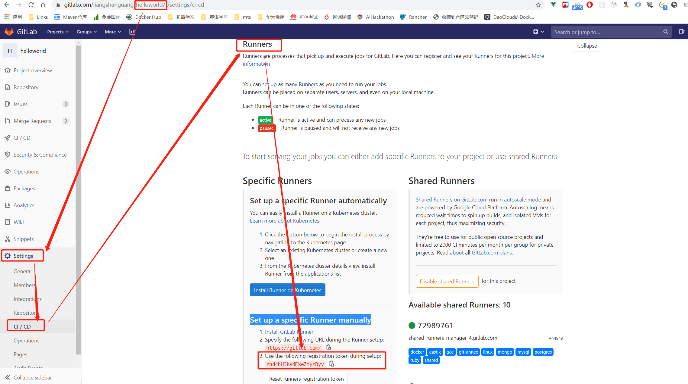
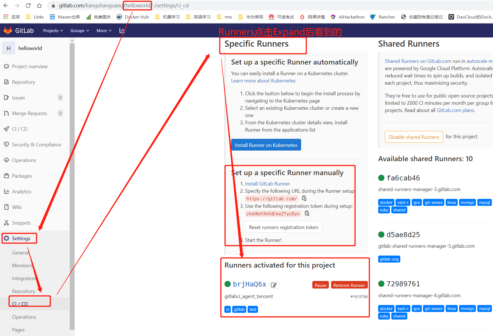
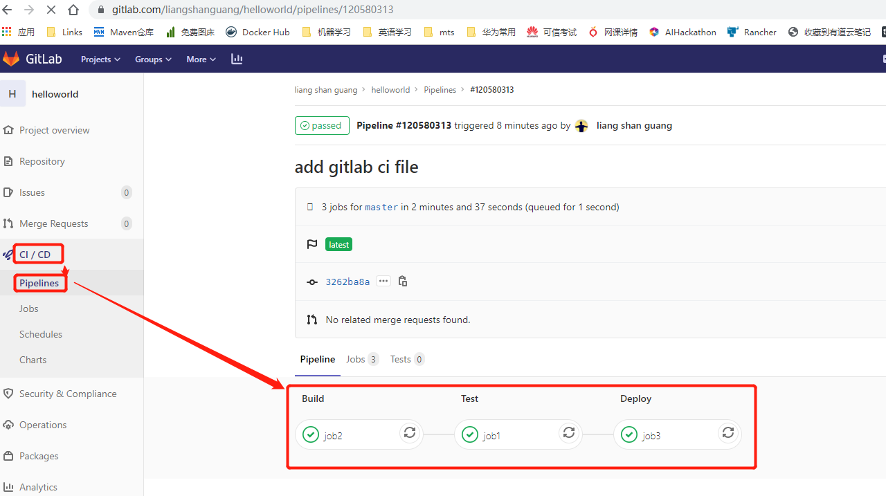
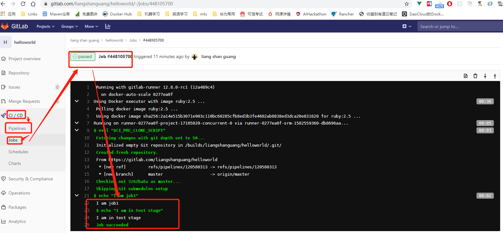

# GitLab CI 服务器的搭建

GitLab CI服务器最好是单独与gitlab服务器的一台Linux机器。

## 1. 安装Docker


```shell
[root@VM_0_15_centos ~]# curl -sSL https://get.docker.com/ | sh
```

## 2. 安装gitlab ci runner

```shell
[root@VM_0_15_centos ~]# curl -L https://packages.gitlab.com/install/repositories/runner/gitlab-ci-multi-runner/script.rpm.sh | sudo bash
[root@VM_0_15_centos ~]# sudo yum install gitlab-ci-multi-runner -y
```

查看是否运行正常

```shell
[root@VM_0_15_centos ~]# sudo gitlab-ci-multi-runner status
gitlab-runner: Service is running!
```

## 3. 设置Docker权限

为了能让gitlab-runner能正确的执行docker命令，需要把gitlab-runner用户添加到docker group里, 然后重启docker和gitlab ci runner

```shell
[root@VM_0_15_centos ~]# sudo usermod -aG docker gitlab-runner
[root@VM_0_15_centos ~]# sudo service docker restart
Redirecting to /bin/systemctl restart docker.service
[root@VM_0_15_centos ~]# sudo gitlab-ci-multi-runner restart
```

## 4.注册runner
```shell
[root@VM_0_15_centos ~]# gitlab-ci-multi-runner register
Running in system-mode.

Please enter the gitlab-ci coordinator URL (e.g. https://gitlab.com/):
https://gitlab.com # gitlab服务器的地址
Please enter the gitlab-ci token for this runner:
zhd4bH3kVdEkeZYyzByv # 要绑定gitlab ci的项目的token，在项目的Settings-->CI/CD-->Runners(点击Expand)--->Set up a specific Runner manually--》第3步即我们要的token
Please enter the gitlab-ci description for this runner:
[VM_0_15_centos]: gitlabci_agent_tencent # 给ci runner起个别名       
Please enter the gitlab-ci tags for this runner (comma separated):
test,gitlab,ci # 设定runner的标签，方便筛选    
Whether to run untagged builds [true/false]:
[false]:
Whether to lock Runner to current project [true/false]:
[false]:
Registering runner... succeeded                     runner=zhd4bH3k
Please enter the executor: kubernetes, parallels, shell, ssh, virtualbox, docker, docker-ssh, docker+machine, docker-ssh+machine:
shell # runner的出发方式
Runner registered successfully. Feel free to start it, but if it's running already the config should be automatically reloaded! 
```


查看下runner列表，可以看到我们已经注册成功
```shell
[root@VM_0_15_centos ~]# gitlab-ci-multi-runner list
Listing configured runners                          ConfigFile=/etc/gitlab-runner/config.toml
gitlabci_agent_tencent                              Executor=shell Token=brjHaQ6x7nnHeCmxjR3s URL=https://gitlab.com
```


## 5.测试Runner
> [官方教程](https://gitlab.com/help/ci/quick_start/README)来学习gitlabci的配置文件`.gitlab-ci.yml`怎么写

```yml
stages:
  - build
  - test
  - deploy

job1:
  stage: test
  script:
    - echo "I am job1"
    - echo "I am in test stage"

job2:
  stage: build
  script:
    - echo "I am job2"
    - echo "I am in build stage"

job3:
  stage: deploy
  script:
    - echo "I am job3"
    - echo "I am in deploy stage"
```

在项目左侧菜单的`CI/CD`-->`Pipelines`可以看到执行结果，点击`Success`或`Failed`进入Pipeline详情

可以看到Pipline就是按照我们定义地build-->test-->deploy的顺序执行地

点击每个Pipeline的job，可以看到在我们的runner agent上执行地命令正是我们在`.gitlab-ci.yml`里定义地

