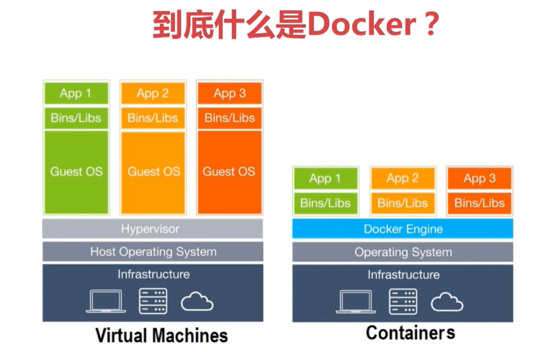
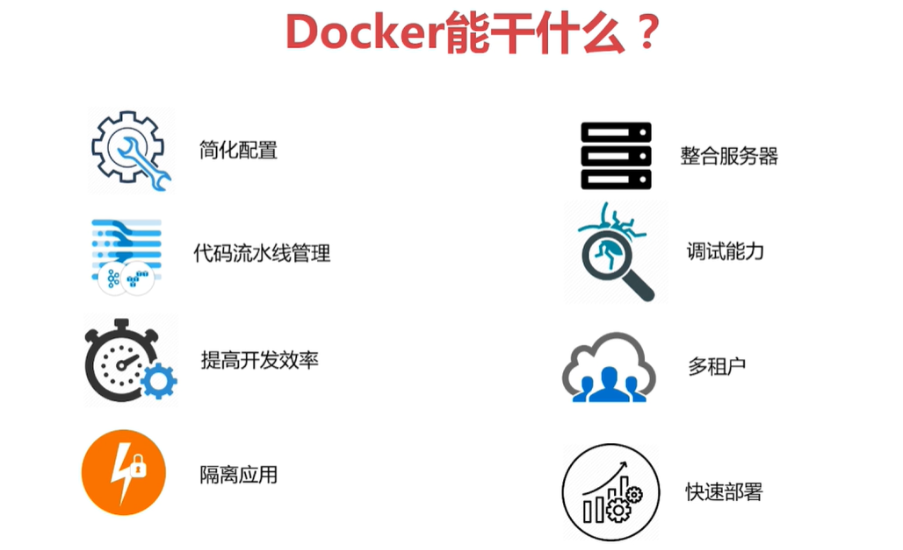
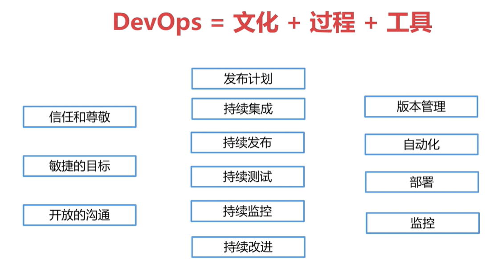
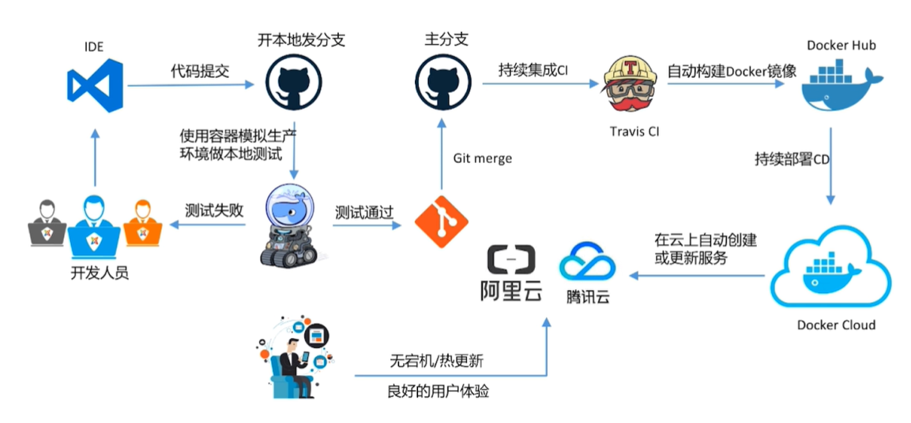
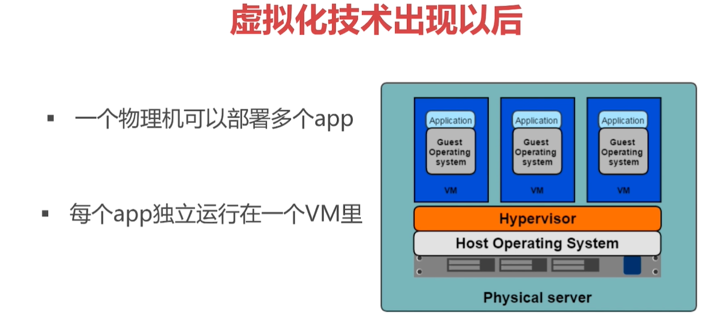
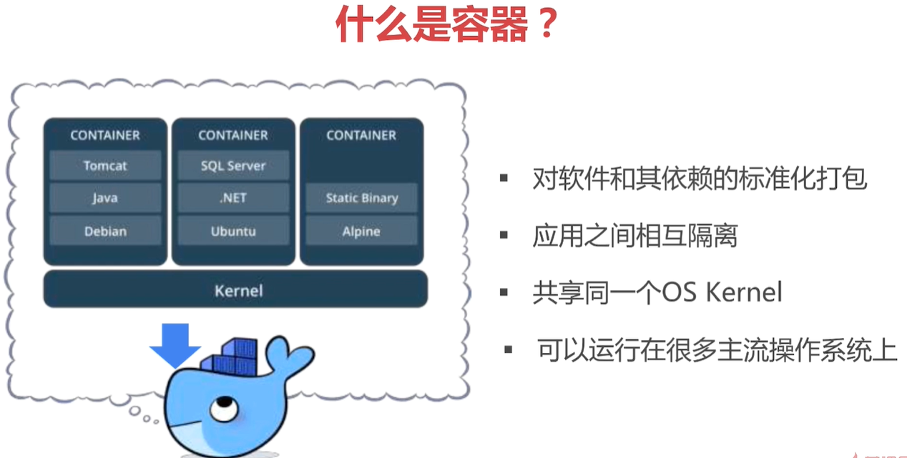
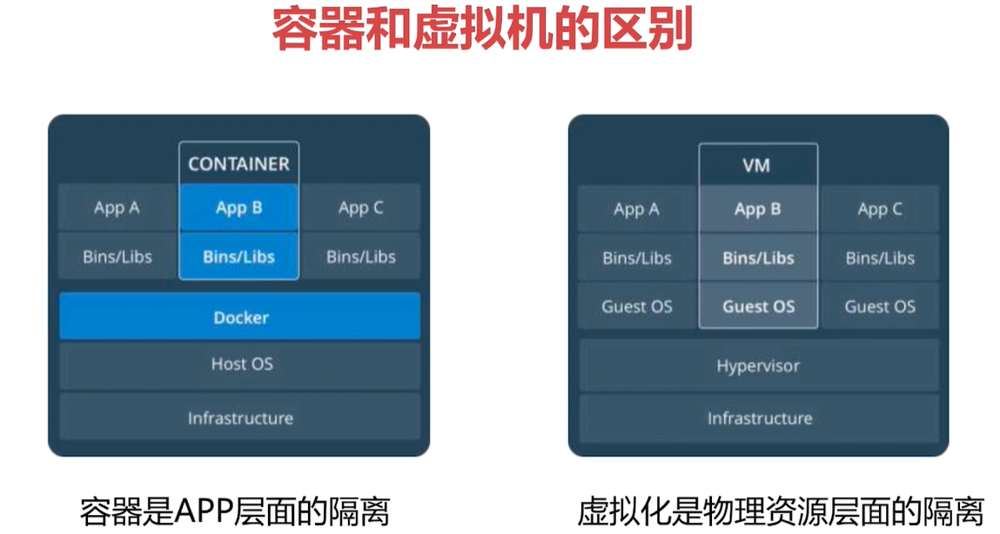
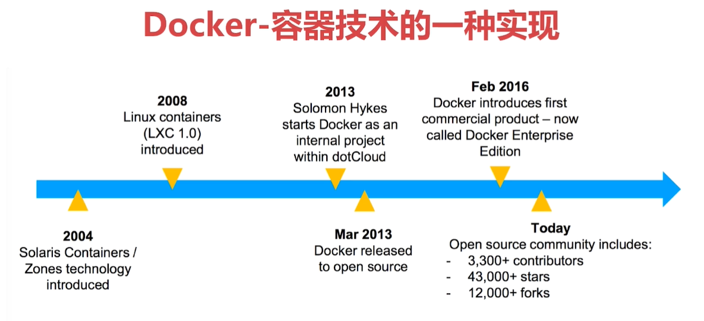

# 第1章_容器技术与Docker简介

## 01.Docker导学
### Docker与虚拟机的区别

### Docker能干什么

### DevOps = 文化 + 过程 + 工具

### DevOps实践

## 02.容器技术概述
### 传统技术的缺点
+ 部署非常慢
+ 成本非常高
+ 资源浪费
+ 难于迁移和扩展
+ 可能会被限定硬件厂商

### 虚拟化技术
+ 一个物理机可以部署多个app
+ 每个app独立运行在一个VM里

+ 优点
  + 资源池：一个物理机的资源分配到了不同的虚拟机里
  + 很容易扩展：加物理机器或者加虚拟机
  + 很容易云化：亚马逊AWS、阿里云等
+ 局限性
  + 每一个虚拟机都是一个完整的操作系统，要给其分配资源，当虚拟机数量增多时，操作系统本身消耗的资源势必增多

### 容器解决了什么问题
+ 解决了开发和运维之间的矛盾
+ 在开发和运维之间搭建了一个桥梁，是实现devops的最佳解决方案

### 什么是容器
+ 对软件和其依赖的标准化打包
+ 应用之间相互隔离
+ 共享一个OS Kernel
+ 可以运行在很多主流操作系统上

### 容器与虚拟机的区别

### 最常见的方案：虚拟机里装容器

### 容器技术的发展历程
