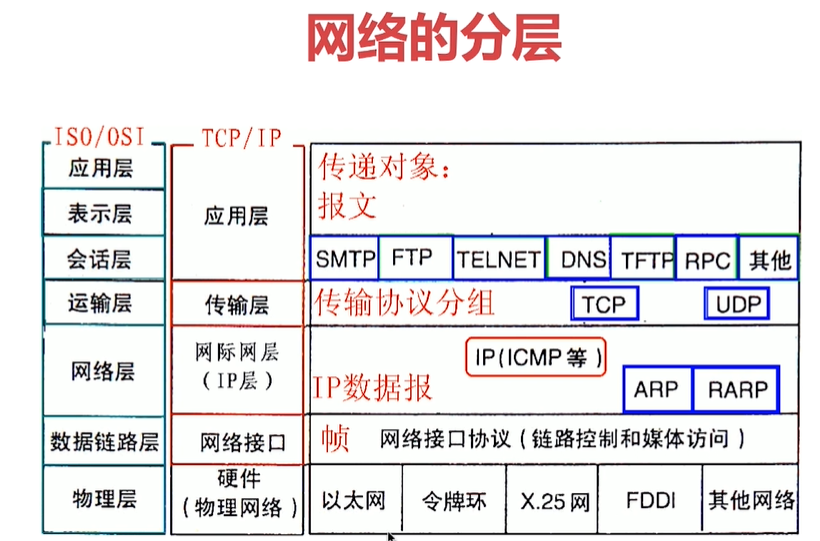
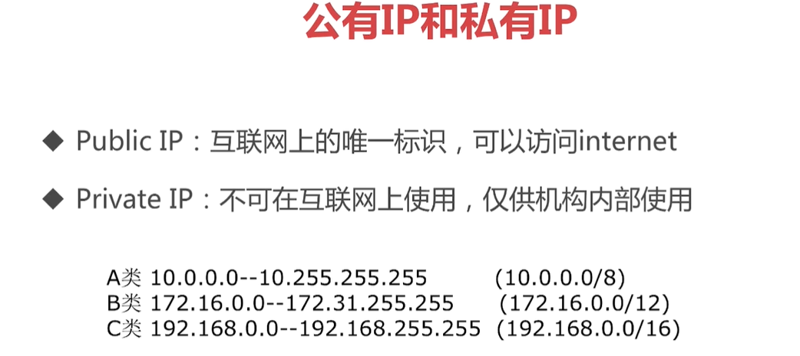
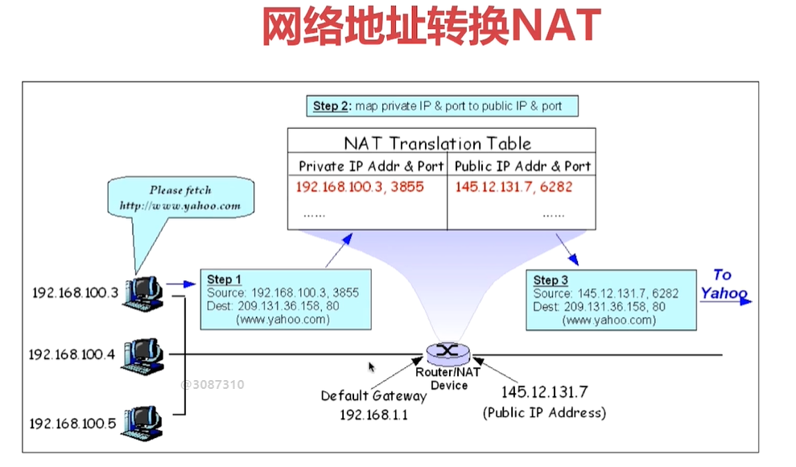
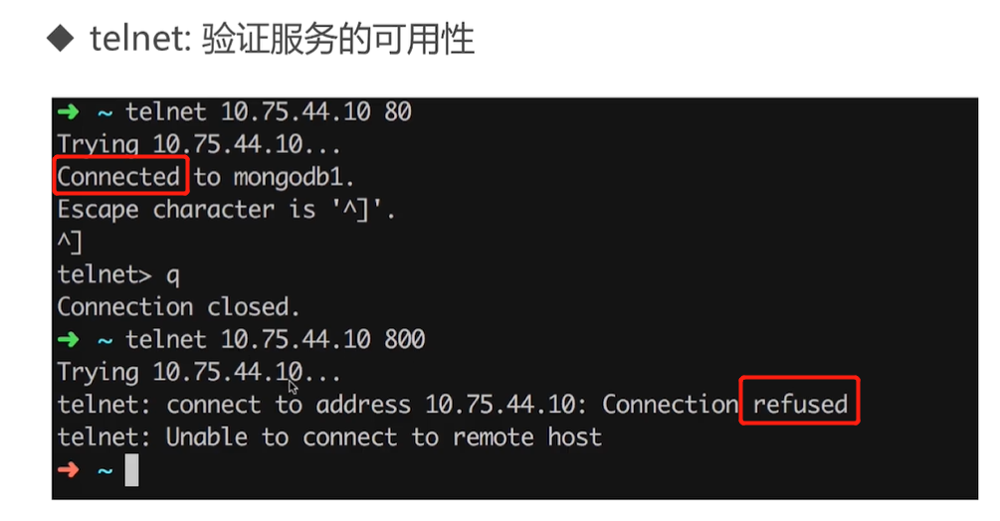
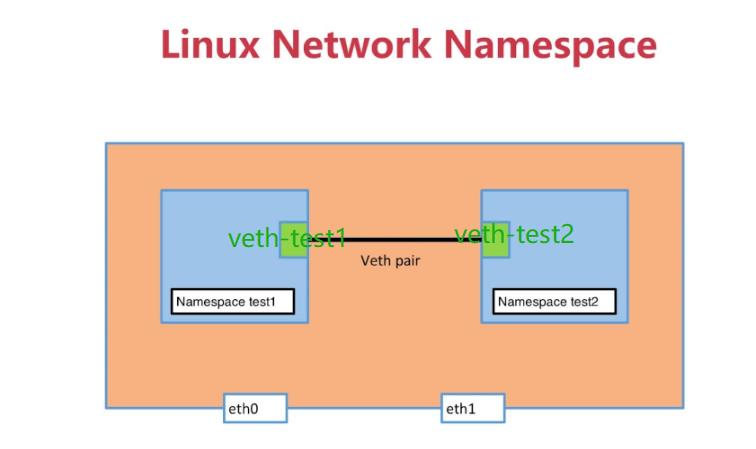
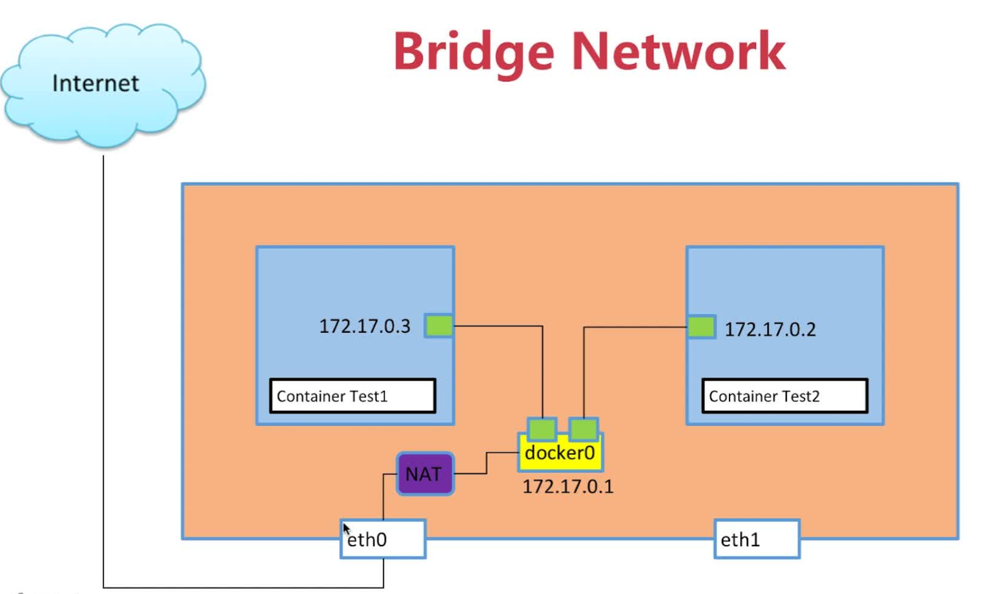
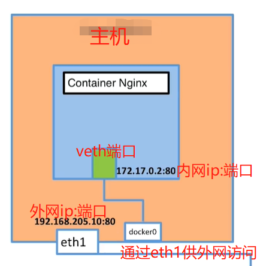

# Docker之间的网络

## 4-1 本章概述和实验环境介绍
+ 单机通信
  + Bridge NetWork
  + Host NetWork
  + None NetWork
+ 多机通信
  + Overlay NetWork

## 4-2 网络基础

### 网络的分层


### 共有IP和私有IP


### 内网私有地址访问公网的方式NAT


### ping和telenet

+ ping:验证IP的可达性
+ telnet:验证服务的可用性，`telnet ip port`返回connected表示服务可用，返回refused表示服务挂了
  > 


## 4-3 Linux命名空间

### Docker所用的基础Linux网络namespace 

+ `sudo ip netns list` 列出当前机器的namespace
+ `sudo ip netns add sir1` 向本地机器添加一个名字叫sir1的namespace
+ `sudo ip netns del sir1`  在本地机器上删除一个名字叫sir1的namespace
+ `sudo ip netns exec sir1 ip a` 查看名字叫做sir1的namespace的本地接口
+ `sudo ip netns exec sir1 link` 查看名字叫做sir1的namespace的本地链路情况

### 容器网络相关命令

+ 查看当前容器的内部网络：`docker exec -it 容器id ip a`
+ 查看当前容器的内部链路情况：`docker exec -it 容器id ip link`

### 查看不同容器的网络和命名空间
```powershell
[root@localhost ~]# docker run -d --name test1 busybox /bin/sh -c "while true;do sleep 3600;done"
[root@localhost ~]# docker ps
CONTAINER ID        IMAGE               COMMAND                  CREATED             STATUS              PORTS               NAMES
6025307db564        busybox             "/bin/sh -c 'while..."   54 seconds ago      Up 53 seconds                           test1
[root@localhost ~]# docker exec -it 6025307db564 /bin/sh
/ # ip a
....
回显即为命名空间
....
/ # exit
[root@localhost ~]# ip a
......
主机的命名空间
......
[root@localhost ~]# docker run -d --name test2 busybox /bin/sh -c "while true;do sleep 3600;done"
[root@localhost ~]# docker ps
CONTAINER ID        IMAGE               COMMAND                  CREATED             STATUS              PORTS               NAMES
2da2eb5316cb        busybox             "/bin/sh -c 'while..."   46 seconds ago      Up 45 seconds                           test2
6025307db564        busybox             "/bin/sh -c 'while..."   5 minutes ago       Up 5 minutes                            test1
[root@localhost ~]# docker exec 6025307db564 ip a
......
返回地容器test2的命名空间
......
[root@localhost ~]# docker exec -it 6025307db564 /bin/sh
/ # ping 172.17.0.1
// 下面的回显表明可以在容器test2中ping通test1
PING 172.17.0.1 (172.17.0.1): 56 data bytes
64 bytes from 172.17.0.1: seq=0 ttl=64 time=0.049 ms
64 bytes from 172.17.0.1: seq=1 ttl=64 time=0.037 ms
64 bytes from 172.17.0.1: seq=2 ttl=64 time=0.035 ms
```

### 命名空间查看与操作

+ `ip a` 表示ip address (show)，相当于显示IP地址信息，偏向于上层。
+ `ip link`表示 `ip link(show)`， 表示链路层的信息，更底层，偏向于物理层，如你可以设置网卡的up down，那么就是 ip link set down ethX, ip link set up ethX

```powershell
# Linux network namespace(简称ns,netns就是network namespace的意思)
ip netns list # 查看命名空间列表
ip netns add test1 # 添加指定名称的命名空间
ip netns delete test1 # 删除指定名称的命名空间
ip netns exec test1 ip a # 查看命名空间test1内的IP地址信息
ip netns exec test1 ip link # 查看命名空间test1的所有链路信息
ip link add veth-test1 type veth peer name veth-test2 # 设置两个互连的veth网络，为后面test1和test2网络连接做准备
ip netns exec test1 ip addr add 192.168.1.1/24 dev veth-test1 # 给veth端口绑定ip，然后才能和其他的veth端口互连
ip netns exec test2 ip link set dev veth-test2 up
```

### 命名空间实战
```powershell
[root@localhost ~]# ip netns list
[root@localhost ~]# ip netns add test1
[root@localhost ~]# ip netns list
test1
[root@localhost ~]# ip netns add test2
[root@localhost ~]# ip netns list
test2
test1
[root@localhost ~]# ip netns exec test1 ip a
1: lo: <LOOPBACK> mtu 65536 qdisc noop state DOWN qlen 1 # DOWN表示当前端口没有用起来
    link/loopback 00:00:00:00:00:00 brd 00:00:00:00:00:00
[root@localhost ~]# ip link // 查看主机的链路信息
1: lo: <LOOPBACK,UP,LOWER_UP> mtu 65536 qdisc noqueue state UNKNOWN mode DEFAULT qlen 1
    link/loopback 00:00:00:00:00:00 brd 00:00:00:00:00:00
2: enp0s3: <BROADCAST,MULTICAST,UP,LOWER_UP> mtu 1500 qdisc pfifo_fast state UP mode DEFAULT qlen 1000
    link/ether 08:00:27:54:8e:3b brd ff:ff:ff:ff:ff:ff
3: docker0: <NO-CARRIER,BROADCAST,MULTICAST,UP> mtu 1500 qdisc noqueue state DOWN mode DEFAULT
    link/ether 02:42:7b:c9:a0:59 brd ff:ff:ff:ff:ff:ff
[root@localhost ~]# ip netns exec test1 ip link // 查看自定义命令空间的链路信息
1: lo（链路名称，重点关注，下面有用）: <LOOPBACK> mtu 65536 qdisc noop state DOWN mode DEFAULT qlen 1
    link/loopback 00:00:00:00:00:00 brd 00:00:00:00:00:00
[root@localhost ~]# ip netns exec test1 ip link set dev lo up // 把lo端口up起来，会成为UnKnown，因为想up必须是两个端口相连
[root@localhost ~]# ip netns exec test1 ip link
1: lo: <LOOPBACK,UP,LOWER_UP> mtu 65536 qdisc noqueue state UNKNOWN（从Down变成UnKnown了，要想变成up必须是两个端口相连） mode DEFAULT qlen 1
    link/loopback 00:00:00:00:00:00 brd 00:00:00:00:00:00
```
需要用两个Veth端口把两个命名空间连接起来，这样两个命名空间的链路才能都up起来，否则就会是Down或UnKnown。如下图


接上面继续执行命令
```powershell
[root@localhost ~]# ip link add veth-test1 type veth peer name veth-test2 # 现在本地创建两个veth链路，为连接命名空间test1和test2做准备
[root@localhost ~]# ip link # 查看此时主机的链路情况，可以看到刚加的veth-test1和veth-test2
1: lo: <LOOPBACK,UP,LOWER_UP> mtu 65536 qdisc noqueue state UNKNOWN mode DEFAULT qlen 1
    link/loopback 00:00:00:00:00:00 brd 00:00:00:00:00:00
2: enp0s3: <BROADCAST,MULTICAST,UP,LOWER_UP> mtu 1500 qdisc pfifo_fast state UP mode DEFAULT qlen 1000
    link/ether 08:00:27:54:8e:3b brd ff:ff:ff:ff:ff:ff
3: docker0: <NO-CARRIER,BROADCAST,MULTICAST,UP> mtu 1500 qdisc noqueue state DOWN mode DEFAULT
    link/ether 02:42:7b:c9:a0:59 brd ff:ff:ff:ff:ff:ff
12: veth-test2@veth-test1（新加的veth网络）: <BROADCAST,MULTICAST,M-DOWN> mtu 1500 qdisc noop state DOWN mode DEFAULT qlen 1000
    link/ether 22:97:d2:6f:61:13 brd ff:ff:ff:ff:ff:ff
13: veth-test1@veth-test2（新加的veth网络）: <BROADCAST,MULTICAST,M-DOWN> mtu 1500 qdisc noop state DOWN mode DEFAULT qlen 1000
    link/ether 92:08:f0:a6:24:47 brd ff:ff:ff:ff:ff:ff
[root@localhost ~]# ip netns exec test1 ip link // 可以看到此时test1内的链路情况还没变，下面把veth-test1添加到命名空间test1后就会变化了
1: lo: <LOOPBACK,UP,LOWER_UP> mtu 65536 qdisc noqueue state UNKNOWN mode DEFAULT qlen 1
    link/loopback 00:00:00:00:00:00 brd 00:00:00:00:00:00
[root@localhost ~]# ip link set veth-test1 netns test1 //把veth-test1添加到命名空间test1
[root@localhost ~]# ip netns exec test1 ip link // 再看命名空间test1内的链路就变了
1: lo: <LOOPBACK,UP,LOWER_UP> mtu 65536 qdisc noqueue state UNKNOWN mode DEFAULT qlen 1
    link/loopback 00:00:00:00:00:00 brd 00:00:00:00:00:00
13: veth-test1@if12: <BROADCAST,MULTICAST> mtu 1500 qdisc noop state DOWN mode DEFAULT qlen 1000
    link/ether 92:08:f0:a6:24:47 brd ff:ff:ff:ff:ff:ff link-netnsid 0
[root@localhost ~]# ip link // 起初创建于本机网络的veth-test1被添加到test1后就不存在与主机上了
1: lo: <LOOPBACK,UP,LOWER_UP> mtu 65536 qdisc noqueue state UNKNOWN mode DEFAULT qlen 1
    link/loopback 00:00:00:00:00:00 brd 00:00:00:00:00:00
2: enp0s3: <BROADCAST,MULTICAST,UP,LOWER_UP> mtu 1500 qdisc pfifo_fast state UP mode DEFAULT qlen 1000
    link/ether 08:00:27:54:8e:3b brd ff:ff:ff:ff:ff:ff
3: docker0: <NO-CARRIER,BROADCAST,MULTICAST,UP> mtu 1500 qdisc noqueue state DOWN mode DEFAULT
    link/ether 02:42:7b:c9:a0:59 brd ff:ff:ff:ff:ff:ff
12: veth-test2@if13（只有veth-test2了，veth-test1已经被添加到命名空间test1了）: <BROADCAST,MULTICAST> mtu 1500 qdisc noop state DOWN mode DEFAULT qlen 1000
    link/ether 22:97:d2:6f:61:13 brd ff:ff:ff:ff:ff:ff link-netnsid 0
[root@localhost ~]# ip netns exec test2 ip link // 可以看到此时test2内的链路情况还没变，下面把veth-test2添加到命名空间test2后就会变化了
1: lo: <LOOPBACK> mtu 65536 qdisc noop state DOWN mode DEFAULT qlen 1
    link/loopback 00:00:00:00:00:00 brd 00:00:00:00:00:00
[root@localhost ~]# ip link set veth-test2 netns test2 //把veth-test2添加到命名空间test2
[root@localhost ~]# ip netns exec test2 ip link // 再看命名空间test2内的链路就变了
1: lo: <LOOPBACK> mtu 65536 qdisc noop state DOWN mode DEFAULT qlen 1
    link/loopback 00:00:00:00:00:00 brd 00:00:00:00:00:00
12: veth-test2@if13: <BROADCAST,MULTICAST> mtu 1500 qdisc noop state DOWN mode DEFAULT qlen 1000
    link/ether 22:97:d2:6f:61:13 brd ff:ff:ff:ff:ff:ff link-netnsid 0
[root@localhost ~]# ip link // 主机网络里veth-test1和veth-test2都不见了
1: lo: <LOOPBACK,UP,LOWER_UP> mtu 65536 qdisc noqueue state UNKNOWN mode DEFAULT qlen 1
    link/loopback 00:00:00:00:00:00 brd 00:00:00:00:00:00
2: enp0s3: <BROADCAST,MULTICAST,UP,LOWER_UP> mtu 1500 qdisc pfifo_fast state UP mode DEFAULT qlen 1000
    link/ether 08:00:27:54:8e:3b brd ff:ff:ff:ff:ff:ff
3: docker0: <NO-CARRIER,BROADCAST,MULTICAST,UP> mtu 1500 qdisc noqueue state DOWN mode DEFAULT
    link/ether 02:42:7b:c9:a0:59 brd ff:ff:ff:ff:ff:ff
[root@localhost ~]# ip netns exec test1 ip addr add 192.168.1.1/24 dev veth-test1 // 给veth端口绑定ip，然后才能和其他的veth端口互连
[root@localhost ~]# ip netns exec test2 ip addr add 192.168.1.2/24 dev veth-test2 // 给veth端口绑定ip，然后才能和其他的veth端口互连
[root@localhost ~]# ip netns exec test1 ip link // 绑定了ip，对应的veth端口还没UP起来，仍然是Down地
1: lo: <LOOPBACK,UP,LOWER_UP> mtu 65536 qdisc noqueue state UNKNOWN mode DEFAULT qlen 1
    link/loopback 00:00:00:00:00:00 brd 00:00:00:00:00:00
13: veth-test1@if12（veth端口）: <BROADCAST,MULTICAST> mtu 1500 qdisc noop state DOWN（仍然是Down地） mode DEFAULT qlen 1000
    link/ether 92:08:f0:a6:24:47 brd ff:ff:ff:ff:ff:ff link-netnsid 1
[root@localhost ~]# ip netns exec test2 ip link // 绑定了ip，对应的veth端口还没UP起来，仍然是Down地
1: lo: <LOOPBACK> mtu 65536 qdisc noop state DOWN mode DEFAULT qlen 1
    link/loopback 00:00:00:00:00:00 brd 00:00:00:00:00:00
12: veth-test2@if13（veth端口）: <BROADCAST,MULTICAST> mtu 1500 qdisc noop state DOWN（仍然是Down地） mode DEFAULT qlen 1000
    link/ether 22:97:d2:6f:61:13 brd ff:ff:ff:ff:ff:ff link-netnsid 0
[root@localhost ~]# ip netns exec test1 ip link set dev veth-test1 up // veth端口UP起来了
[root@localhost ~]# ip netns exec test2 ip link set dev veth-test2 up // veth端口UP起来了
[root@localhost ~]# ip netns exec test1 ip link // 确认链路信息
1: lo: <LOOPBACK,UP,LOWER_UP> mtu 65536 qdisc noqueue state UNKNOWN mode DEFAULT qlen 1
    link/loopback 00:00:00:00:00:00 brd 00:00:00:00:00:00
13: veth-test1@if12（veth端口）: <BROADCAST,MULTICAST,UP,LOWER_UP> mtu 1500 qdisc noqueue state UP（veth端口UP起来了） mode DEFAULT qlen 1000
    link/ether 92:08:f0:a6:24:47 brd ff:ff:ff:ff:ff:ff link-netnsid 1
[root@localhost ~]# ip netns exec test2 ip link // 确认链路信息
1: lo: <LOOPBACK> mtu 65536 qdisc noop state DOWN mode DEFAULT qlen 1
    link/loopback 00:00:00:00:00:00 brd 00:00:00:00:00:00
12: veth-test2@if13（veth端口）: <BROADCAST,MULTICAST,UP,LOWER_UP> mtu 1500 qdisc noqueue state UP（veth端口UP起来了） mode DEFAULT qlen 1000
    link/ether 22:97:d2:6f:61:13 brd ff:ff:ff:ff:ff:ff link-netnsid 0
[root@localhost ~]# ip netns exec test1 ip a // 查看命名空间1，可以看到我们自己创建的veth-test1已经分配好ip 192.168.1.1/24了
1: lo: <LOOPBACK,UP,LOWER_UP> mtu 65536 qdisc noqueue state UNKNOWN qlen 1
    link/loopback 00:00:00:00:00:00 brd 00:00:00:00:00:00
    inet 127.0.0.1/8 scope host lo
       valid_lft forever preferred_lft forever
    inet6 ::1/128 scope host
       valid_lft forever preferred_lft forever
13: veth-test1@if12（veth端口）: <BROADCAST,MULTICAST,UP,LOWER_UP> mtu 1500 qdisc noqueue state UP qlen 1000
    link/ether 92:08:f0:a6:24:47 brd ff:ff:ff:ff:ff:ff link-netnsid 1
    inet 192.168.1.1/24（已经分配好ip了） scope global veth-test1
       valid_lft forever preferred_lft forever
    inet6 fe80::9008:f0ff:fea6:2447/64 scope link
       valid_lft forever preferred_lft forever
[root@localhost ~]# ip netns exec test2 ip a
1: lo: <LOOPBACK> mtu 65536 qdisc noop state DOWN qlen 1
    link/loopback 00:00:00:00:00:00 brd 00:00:00:00:00:00
12: veth-test2@if13（veth端口）: <BROADCAST,MULTICAST,UP,LOWER_UP> mtu 1500 qdisc noqueue state UP qlen 1000
    link/ether 22:97:d2:6f:61:13 brd ff:ff:ff:ff:ff:ff link-netnsid 0
    inet 192.168.1.2/24（已经分配好ip了） scope global veth-test2
       valid_lft forever preferred_lft forever
    inet6 fe80::2097:d2ff:fe6f:6113/64 scope link
       valid_lft forever preferred_lft forever
[root@localhost ~]# ip netns exec test1 ping 192.168.1.2 // 在命名空间test1中ping命名空间test2的veth-test2的ip地址192.168.1.2能ping通，表明我们把两个命名空间连接起来了，可以理解为把两个互相隔离的容器联通了(因为每个容器实际就是用不同的命名空间区分和隔离的)~~
PING 192.168.1.2 (192.168.1.2) 56(84) bytes of data.
64 bytes from 192.168.1.2: icmp_seq=1 ttl=64 time=0.033 ms
64 bytes from 192.168.1.2: icmp_seq=2 ttl=64 time=0.023 ms
64 bytes from 192.168.1.2: icmp_seq=3 ttl=64 time=0.023 ms
64 bytes from 192.168.1.2: icmp_seq=4 ttl=64 time=0.023 ms
64 bytes from 192.168.1.2: icmp_seq=5 ttl=64 time=0.024 ms
[root@localhost ~]# ip netns exec test2 ping 192.168.1.1 // 同上，在命名空间test2中ping命名空间test1的veth-test1的ip地址192.168.1.1也是能ping通，两个命名空间是双向联通的
PING 192.168.1.1 (192.168.1.1) 56(84) bytes of data.
64 bytes from 192.168.1.1: icmp_seq=1 ttl=64 time=0.022 ms
64 bytes from 192.168.1.1: icmp_seq=2 ttl=64 time=0.041 ms
64 bytes from 192.168.1.1: icmp_seq=3 ttl=64 time=0.024 ms
64 bytes from 192.168.1.1: icmp_seq=4 ttl=64 time=0.024 ms
```

Linux的命名空间以及Veth的讲解的很好的博客[Linux 虚拟网络设备 veth-pair 详解，看这一篇就够了](https://www.cnblogs.com/bakari/p/10613710.html)

重要知识点：Veth端口必须成对配置并连接起来才能是UP的

## 4-4 Docker bridge0详解

### docker的网络查看以及bridge0网络的作用

+ `docker network ls`:查看本地docker宿主机网络情况
+ `sudo docker network inspect XXXX(NETWORK_ID)`:查看某个网桥的详细信息
+ `brctl show`:查看宿主机上的网桥连接情况

### 容器的互通以及和公网的互通的原理

+ 所有的容器的网络连接都是连接到宿主机的docker0上。然后宿主机上会起一个veth连接到docker0上。然后容器上的veth和宿主机上的veth是一对。这样就实现了容器互通。
+ docker0是宿主机上的网桥，docker0又是连接internet的，所以就实现了容器访问互联网。

图示如下：


### 容器的互通以及和公网的互通--实战

```powershell
[root@localhost ~]# docker run -d --name test1 busybox /bin/sh -c "while true;do sleep 3600;done" // 创建容器test1，相应的命名空间也创建了
3fcc7db0fceb404948a26b63ab284265f089f1df485dbd017b85975c6a90a469
[root@localhost ~]# docker run -d --name test2 busybox /bin/sh -c "while true;do sleep 3600;done" // 创建容器test2，相应的命名空间也创建了
c2e0572903ebc27337e7f1325e6b641554fed4c5f2b47074ca16b891fad95d2f
[root@localhost ~]# docker ps
CONTAINER ID        IMAGE               COMMAND                  CREATED             STATUS              PORTS               NAMES
c2e0572903eb        busybox             "/bin/sh -c 'while..."   4 seconds ago       Up 3 seconds                            test2
3fcc7db0fceb        busybox             "/bin/sh -c 'while..."   14 seconds ago      Up 13 seconds                           test1
[root@localhost ~]# docker exec -it test1 ip a // 查看容器test1的网络
1: lo: <LOOPBACK,UP,LOWER_UP> mtu 65536 qdisc noqueue qlen 1
    link/loopback 00:00:00:00:00:00 brd 00:00:00:00:00:00
    inet 127.0.0.1/8 scope host lo
       valid_lft forever preferred_lft forever
    inet6 ::1/128 scope host
       valid_lft forever preferred_lft forever
4: eth0@if5: <BROADCAST,MULTICAST,UP,LOWER_UP,M-DOWN> mtu 1500 qdisc noqueue 
    link/ether 02:42:ac:11:00:02 brd ff:ff:ff:ff:ff:ff
    inet 172.17.0.2/16 scope global eth0
       valid_lft forever preferred_lft forever
    inet6 fe80::42:acff:fe11:2/64 scope link
       valid_lft forever preferred_lft forever
[root@localhost ~]# docker exec -it test2 ip a // 查看容器test2的网络
1: lo: <LOOPBACK,UP,LOWER_UP> mtu 65536 qdisc noqueue qlen 1
    link/loopback 00:00:00:00:00:00 brd 00:00:00:00:00:00
    inet 127.0.0.1/8 scope host lo
       valid_lft forever preferred_lft forever
    inet6 ::1/128 scope host
       valid_lft forever preferred_lft forever
6: eth0@if7: <BROADCAST,MULTICAST,UP,LOWER_UP,M-DOWN> mtu 1500 qdisc noqueue
    link/ether 02:42:ac:11:00:03 brd ff:ff:ff:ff:ff:ff
    inet 172.17.0.3/16 scope global eth0
       valid_lft forever preferred_lft forever
    inet6 fe80::42:acff:fe11:3/64 scope link
       valid_lft forever preferred_lft forever
[root@localhost ~]# docker exec -it test1 /bin/sh // 进入容器test1
/ # ping 172.17.0.3 // ping容器test2的ip能通，即容器互通
PING 172.17.0.3 (172.17.0.3): 56 data bytes
64 bytes from 172.17.0.3: seq=0 ttl=64 time=0.043 ms
64 bytes from 172.17.0.3: seq=1 ttl=64 time=0.037 ms
64 bytes from 172.17.0.3: seq=2 ttl=64 time=0.036 ms
^C
--- 172.17.0.3 ping statistics ---
3 packets transmitted, 3 packets received, 0% packet loss
round-trip min/avg/max = 0.036/0.038/0.043 ms
/ # ping www.baidu.com // ping公网地址能通
PING www.baidu.com (182.61.200.6): 56 data bytes
64 bytes from 182.61.200.6: seq=0 ttl=53 time=38.375 ms
64 bytes from 182.61.200.6: seq=1 ttl=53 time=39.863 ms

[root@localhost ~]# docker ps
CONTAINER ID        IMAGE               COMMAND                  CREATED             STATUS              PORTS               NAMES
c2e0572903eb        busybox             "/bin/sh -c 'while..."   17 minutes ago      Up 17 minutes                           test2
3fcc7db0fceb        busybox             "/bin/sh -c 'while..."   17 minutes ago      Up 17 minutes                           test1
[root@localhost ~]# docker rm test2
Error response from daemon: You cannot remove a running container c2e0572903ebc27337e7f1325e6b641554fed4c5f2b47074ca16b891fad95d2f. Stop the container before attempting removal or use -f
[root@localhost ~]# docker rm -f test2
test2
[root@localhost ~]# docker ps
CONTAINER ID        IMAGE               COMMAND                  CREATED             STATUS              PORTS               NAMES
3fcc7db0fceb        busybox             "/bin/sh -c 'while..."   17 minutes ago      Up 17 minutes                           test1
[root@localhost ~]# docker network ls
NETWORK ID          NAME                DRIVER              SCOPE
e5d674197581        bridge              bridge              local
c27645bea545        host                host                local
fcab1d25df11        none                null                local
[root@localhost ~]# docker network inspect e5d674197581
[
    {
        "Name": "bridge",
        "Id": "e5d674197581b46ffe3398dc5c52b6fd22a987c2909b866f9da813b6e7d77991",
        "Created": "2020-02-16T01:03:17.467589133+08:00",
        "Scope": "local",
        "Driver": "bridge",
        "EnableIPv6": false,
        "IPAM": {
            "Driver": "default",
            "Options": null,
            "Config": [
                {
                    "Subnet": "172.17.0.0/16",
                    "Gateway": "172.17.0.1"
                }
            ]
        },
        "Internal": false,
        "Attachable": false,
        "Containers": {
            "3fcc7db0fceb404948a26b63ab284265f089f1df485dbd017b85975c6a90a469": {
                "Name": "test1",
                "EndpointID": "b7982ef8b27f77bc6d5ce913316c014c25aee8fe5c1a594e926102e33780e2f8",
                "MacAddress": "02:42:ac:11:00:02",
                "IPv4Address": "172.17.0.2/16",
                "IPv6Address": ""
            }
        },
        "Options": {
            "com.docker.network.bridge.default_bridge": "true",
            "com.docker.network.bridge.enable_icc": "true",
            "com.docker.network.bridge.enable_ip_masquerade": "true",
            "com.docker.network.bridge.host_binding_ipv4": "0.0.0.0",
            "com.docker.network.bridge.name": "docker0",
            "com.docker.network.driver.mtu": "1500"
        },
        "Labels": {}
    }
]
[root@localhost ~]# ip a // 查看主机的网络
1: lo: <LOOPBACK,UP,LOWER_UP> mtu 65536 qdisc noqueue state UNKNOWN qlen 1
    link/loopback 00:00:00:00:00:00 brd 00:00:00:00:00:00
    inet 127.0.0.1/8 scope host lo
       valid_lft forever preferred_lft forever
    inet6 ::1/128 scope host
       valid_lft forever preferred_lft forever
2: enp0s3: <BROADCAST,MULTICAST,UP,LOWER_UP> mtu 1500 qdisc pfifo_fast state UP qlen 1000
    link/ether 08:00:27:54:8e:3b brd ff:ff:ff:ff:ff:ff
    inet 192.168.100.116/24 brd 192.168.100.255 scope global dynamic enp0s3
       valid_lft 82143sec preferred_lft 82143sec
    inet6 fe80::894e:8755:f7df:4ed4/64 scope link
       valid_lft forever preferred_lft forever
3: docker0（主机网络）: <BROADCAST,MULTICAST,UP,LOWER_UP> mtu 1500 qdisc noqueue state UP
    link/ether 02:42:18:59:fa:21 brd ff:ff:ff:ff:ff:ff
    inet 172.17.0.1/16 scope global docker0
       valid_lft forever preferred_lft forever
    inet6 fe80::42:18ff:fe59:fa21/64 scope link
       valid_lft forever preferred_lft forever
5: veth3466bf5@if4（主机的veth端，和docker0联通）: <BROADCAST,MULTICAST,UP,LOWER_UP> mtu 1500 qdisc noqueue master docker0 state UP
    link/ether 26:06:b0:81:16:36 brd ff:ff:ff:ff:ff:ff link-netnsid 0
    inet6 fe80::2406:b0ff:fe81:1636/64 scope link
       valid_lft forever preferred_lft forever
[root@localhost ~]# docker exec -it test1 ip a // 查看容器的网络
1: lo: <LOOPBACK,UP,LOWER_UP> mtu 65536 qdisc noqueue qlen 1
    link/loopback 00:00:00:00:00:00 brd 00:00:00:00:00:00
    inet 127.0.0.1/8 scope host lo
       valid_lft forever preferred_lft forever
    inet6 ::1/128 scope host
       valid_lft forever preferred_lft forever
4: eth0@if5（容器test1的vath端，和上面主机的docker0联通,等效于和veth3466bf5联通，实现容器和主机通信，又因为docker0和外网相连，所以实现和容器和公网的联通）: <BROADCAST,MULTICAST,UP,LOWER_UP,M-DOWN> mtu 1500 qdisc noqueue
    link/ether 02:42:ac:11:00:02 brd ff:ff:ff:ff:ff:ff
    inet 172.17.0.2/16 scope global eth0
       valid_lft forever preferred_lft forever
    inet6 fe80::42:acff:fe11:2/64 scope link
       valid_lft forever preferred_lft forever
[root@localhost ~]# yum install bridge-utils // 运行brctl命令需要先安装的包
[root@localhost ~]# brctl show
bridge name     bridge id               STP enabled     interfaces
docker0         8000.02421859fa21       no              veth3466bf5
[root@localhost ~]# docker run -d --name test2 busybox /bin/sh -c "while true;do sleep 3600;done"
bc8500880782c46fe7af772ef9b90c046b7a94f00d48ad51ba0783f2d1e63d63
[root@localhost ~]# docker ps 
CONTAINER ID        IMAGE               COMMAND                  CREATED             STATUS              PORTS               NAMES
bc8500880782        busybox             "/bin/sh -c 'while..."   5 seconds ago       Up 4 seconds                            test2
3fcc7db0fceb        busybox             "/bin/sh -c 'while..."   2 hours ago         Up 2 hours                              test1
[root@localhost ~]# brctl show # 可以看到两个容器分别通过veth163fd0f和veth3466bf5连接到了docker0上
bridge name     bridge id               STP enabled     interfaces
docker0         8000.02421859fa21       no              veth163fd0f
                                                        veth3466bf5
```

## 4-5 容器之间的link

> 通过link,各个容器之间连接可以用名称来连接，避免每次容器启动的名称都不一样的问题，例子`--link 容器名或者id`

### `--link`是有方向地，只能从link到被link的对象，实战命令如下
```powershell
[root@localhost ~]# docker ps // 此时只有test1自己
CONTAINER ID        IMAGE               COMMAND                  CREATED             STATUS              PORTS               NAMES
3fcc7db0fceb        busybox             "/bin/sh -c 'while..."   2 hours ago         Up 2 hours                              test1
[root@localhost ~]# docker run -d --name test2 --link test1 busybox /bin/sh -c "while true;do sleep 3600;done" // 创建test2并--link到test1，这样test2-->test1的网络就是通的
255170063efa89146c4816a29e7e7959409fcd9db354da3a7239dbe08a371855
[root@localhost ~]# docker ps
CONTAINER ID        IMAGE               COMMAND                  CREATED             STATUS              PORTS               NAMES
255170063efa        busybox             "/bin/sh -c 'while..."   4 seconds ago       Up 3 seconds                            test2
3fcc7db0fceb        busybox             "/bin/sh -c 'while..."   2 hours ago         Up 2 hours                              test1
[root@localhost ~]# docker exec -it test2 /bin/sh
/ # ip a
1: lo: <LOOPBACK,UP,LOWER_UP> mtu 65536 qdisc noqueue qlen 1
    link/loopback 00:00:00:00:00:00 brd 00:00:00:00:00:00   
    inet 127.0.0.1/8 scope host lo
       valid_lft forever preferred_lft forever
    inet6 ::1/128 scope host
       valid_lft forever preferred_lft forever
10: eth0@if11: <BROADCAST,MULTICAST,UP,LOWER_UP,M-DOWN> mtu 1500 qdisc noqueue
    link/ether 02:42:ac:11:00:03 brd ff:ff:ff:ff:ff:ff
    inet 172.17.0.3/16 scope global eth0
       valid_lft forever preferred_lft forever
    inet6 fe80::42:acff:fe11:3/64 scope link
       valid_lft forever preferred_lft forever
/ # ping 172.17.0.2
PING 172.17.0.2 (172.17.0.2): 56 data bytes
64 bytes from 172.17.0.2: seq=0 ttl=64 time=0.045 ms
64 bytes from 172.17.0.2: seq=1 ttl=64 time=0.035 ms
64 bytes from 172.17.0.2: seq=2 ttl=64 time=0.037 ms
^C
--- 172.17.0.2 ping statistics ---
3 packets transmitted, 3 packets received, 0% packet loss
round-trip min/avg/max = 0.035/0.039/0.045 ms
/ # ping test1
PING test1 (172.17.0.2): 56 data bytes
64 bytes from 172.17.0.2: seq=0 ttl=64 time=0.033 ms
64 bytes from 172.17.0.2: seq=1 ttl=64 time=0.036 ms
^C
--- test1 ping statistics ---
2 packets transmitted, 2 packets received, 0% packet loss
round-trip min/avg/max = 0.033/0.034/0.036 ms
/ # exit
[root@localhost ~]# docker exec -it test1 /bin/sh
/ # ping 127.0.0.3
PING 127.0.0.3 (127.0.0.3): 56 data bytes
64 bytes from 127.0.0.3: seq=0 ttl=64 time=0.038 ms
^C
--- 127.0.0.3 ping statistics ---
1 packets transmitted, 1 packets received, 0% packet loss
round-trip min/avg/max = 0.038/0.038/0.038 ms
/ # ping test2
ping: bad address 'test2'
```

### 自己创建birdge并把容器连接上去

+ 新建bridge:`docker network create -d bridge mybridge`
+ 将容器连接到mybridge 网络上:`docker network connect mybridge test`
+ 使用自定的bridge网络创建容器:`docker run --network mybridge --name test -d busybox`
+ 查看网络详细信息:`docker network inspect mybridge`

如果容器连接到了用户自己创建的bridge上，那么即使不用link也是可以通过名字相互ping通的

```shell
docker run -d  --name test2 busybox /bin/sh -c "while true; do sleep 3600; done"
docker network create -d bridge mybridge
docker network inspect mybridge
docker network connect mybridge test2
docker exec -it test2 /bin/sh
```

实战如下：
```powershell
[root@localhost ~]# docker rm -f test2
Error response from daemon: No such container: test2
[root@localhost ~]# docker ps
CONTAINER ID        IMAGE               COMMAND                  CREATED             STATUS              PORTS               NAMES
3fcc7db0fceb        busybox             "/bin/sh -c 'while..."   2 hours ago         Up 2 hours                              test1
[root@localhost ~]# docker network ls
NETWORK ID          NAME                DRIVER              SCOPE
e5d674197581        bridge              bridge              local
c27645bea545        host                host                local
fcab1d25df11        none                null                local
[root@localhost ~]# docker run -d  --name test2  busybox /bin/sh -c "while true; do sleep 3600; done"
4679252c9e907d3bb4f07b30769df94a3bff8d5ebd0943408ceb07bbf3a30910
[root@localhost ~]# docker ps
CONTAINER ID        IMAGE               COMMAND                  CREATED             STATUS              PORTS               NAMES
4679252c9e90        busybox             "/bin/sh -c 'while..."   3 seconds ago       Up 2 seconds                            test2
3fcc7db0fceb        busybox             "/bin/sh -c 'while..."   2 hours ago         Up 2 hours                              test1
[root@localhost ~]# docker network ls
NETWORK ID          NAME                DRIVER              SCOPE
e5d674197581        bridge              bridge              local
c27645bea545        host                host                local
fcab1d25df11        none                null                local
[root@localhost ~]# docker network create -d bridge mybridge
cd3a13dd8dcb94b475cf6d424794632351411221b81c68af0486d1545f9def30
[root@localhost ~]# docker network ls
NETWORK ID          NAME                DRIVER              SCOPE
e5d674197581        bridge              bridge              local
c27645bea545        host                host                local
cd3a13dd8dcb        mybridge            bridge              local
fcab1d25df11        none                null                local
[root@localhost ~]# docker run -d  --name test3 --network mybridge  busybox /bin/sh -c "while true; do sleep 3600; done" // test3加入到自定义网络mybridge
6aace5fe6678ca4c8b39f381db8c173c1c4914954d35eb3117f3d862c03e22be
[root@localhost ~]# brctl show
bridge name     bridge id               STP enabled     interfaces
br-cd3a13dd8dcb         8000.0242cc627165       no              veth8ea1cfd
docker0         8000.02421859fa21       no              veth3466bf5
                                                        vethd564c81
[root@localhost ~]# docker network inspect cd3a13dd8dcb // 查看mybridge已经可以看到test3了
[
    {
        "Name": "mybridge",
        "Id": "cd3a13dd8dcb94b475cf6d424794632351411221b81c68af0486d1545f9def30",
        "Created": "2020-02-16T15:09:10.893039338+08:00",
        "Scope": "local",
        "Driver": "bridge",
        "EnableIPv6": false,
        "IPAM": {
            "Driver": "default",
            "Options": {},
            "Config": [
                {
                    "Subnet": "172.18.0.0/16",
                    "Gateway": "172.18.0.1"
                }
            ]
        },
        "Internal": false,
        "Attachable": false,
        "Containers": {
            "6aace5fe6678ca4c8b39f381db8c173c1c4914954d35eb3117f3d862c03e22be": {
                "Name": "test3",
                "EndpointID": "997fe9761f0645c7a6b908a7bbeb8948344ef1c71150eb18ad1229f778b44e7b",
                "MacAddress": "02:42:ac:12:00:02",
                "IPv4Address": "172.18.0.2/16",
                "IPv6Address": ""
            }
        },
        "Options": {},
        "Labels": {}
    }
]
[root@localhost ~]# docker network connect mybridge test2 // 把mybridge和test2连接起来
[root@localhost ~]# docker network ls // 查看现有的网络
NETWORK ID          NAME                DRIVER              SCOPE
e5d674197581        bridge              bridge              local
c27645bea545        host                host                local
cd3a13dd8dcb        mybridge            bridge              local
fcab1d25df11        none                null                local
[root@localhost ~]# brctl show // 可以看到test2被连接到mybridge上后，docker0和mybridge上都有两个interface了
bridge name     bridge id               STP enabled     interfaces
br-cd3a13dd8dcb 8000.0242cc627165       no              veth8ea1cfd
                                                        vethf25be17
docker0         8000.02421859fa21       no              veth3466bf5
                                                        vethd564c81
[root@localhost ~]# docker network inspect cd3a13dd8dcb # 根据NETWORK ID查看网络连接信息
[
    {
        "Name": "mybridge",
        "Id": "cd3a13dd8dcb94b475cf6d424794632351411221b81c68af0486d1545f9def30",
        "Created": "2020-02-16T15:09:10.893039338+08:00",
        "Scope": "local",
        "Driver": "bridge",
        "EnableIPv6": false,
        "IPAM": {
            "Driver": "default",
            "Options": {},
            "Config": [
                {
                    "Subnet": "172.18.0.0/16",
                    "Gateway": "172.18.0.1"
                }
            ]
        },
        "Internal": false,
        "Attachable": false,
        "Containers": {
            "4679252c9e907d3bb4f07b30769df94a3bff8d5ebd0943408ceb07bbf3a30910": {
                "Name": "test2",
                "EndpointID": "9fc562c43239fcbddda96679ec20f9e3684b154323dd11b9f6b843e0929f8716",
                "MacAddress": "02:42:ac:12:00:03",
                "IPv4Address": "172.18.0.3/16",
                "IPv6Address": ""
            },
            "6aace5fe6678ca4c8b39f381db8c173c1c4914954d35eb3117f3d862c03e22be": {
                "Name": "test3", // test3被连接到mybridge上了
                "EndpointID": "997fe9761f0645c7a6b908a7bbeb8948344ef1c71150eb18ad1229f778b44e7b",
                "MacAddress": "02:42:ac:12:00:02",
                "IPv4Address": "172.18.0.2/16",
                "IPv6Address": ""
            }
        },
        "Options": {},
        "Labels": {}
    }
]

[root@localhost ~]# docker exec -it test2 /bin/sh // 进入test2
/ # ping test3 // 在test2中ping容器test3，因为test3和test2都加入了mybridge网络，所以可以ping同
PING test3 (172.18.0.2): 56 data bytes
64 bytes from 172.18.0.2: seq=0 ttl=64 time=0.050 ms
64 bytes from 172.18.0.2: seq=1 ttl=64 time=0.036 ms
^C
--- test3 ping statistics ---
2 packets transmitted, 2 packets received, 0% packet loss
round-trip min/avg/max = 0.036/0.043/0.050 ms
/ # ping test1 // test1还没加入mybridge所以ping不通
ping: bad address 'test1'
/ # exit
[root@localhost ~]# docker network connect mybridge test1 // 把test1加入mybridge
[root@localhost ~]# docker exec -it test2 /bin/sh // 再进入test2容器中ping容器test1
/ # ping test1 // 此时test1、test2、test3都在mubridge所以是互通地，在test2中自然可以ping通test1了
PING test1 (172.18.0.4): 56 data bytes
64 bytes from 172.18.0.4: seq=0 ttl=64 time=0.039 ms
64 bytes from 172.18.0.4: seq=1 ttl=64 time=0.038 ms
^C
--- test1 ping statistics ---
2 packets transmitted, 2 packets received, 0% packet loss
round-trip min/avg/max = 0.038/0.038/0.039 ms

[root@localhost ~]# brctl show
bridge name     bridge id               STP enabled     interfaces
br-cd3a13dd8dcb 8000.0242cc627165       no              veth2571535
                                                        veth8ea1cfd
                                                        vethf25be17
docker0         8000.02421859fa21       no              veth3466bf5
                                                        vethd564c81
```

## 4-6 端口映射

`docker run --name web-server -d -p 80:80 nginx`

原理如下:




## 4-7 容器网络之host和none

> host方式表示容器和所在主机的网络完全一致

+ `docker run --network host xxx`:主机网络启动，没有独立的命名空间namespace，和主机共享namespace，访问其他的网络、端口等完全和宿主机一样
+ `docker run --network none xxx`:孤立启动容器，不和任何网络连接，只能用`docker exec -it`进入

## 4-8 多容器复杂应用的部署

> 例子见flask-redis-demo文件夹，用到的命令如下

+ 先启动redis服务器：`docker run -d --name redis redis`
+ 切入到flask-redis-demo并执行如下命令：`docker build -t waterknife/flask-redis-demo .`
+ 启动上一步制作的镜像：`docker run -d -p 5000:5000 --link redis --name flask-redis -e REDIS_HOST=redis waterknife/flask-redis-demo`

## 4-9 多机容器间的通信：Overlay和Underlay的通俗解释

两个不同公网ip的机器上的容器直接通信是不行地，但是可以通过在主机socket包中携带容器的数据包，到目标机器上再解包，从而实现不同机器上的容器通信。这个功能相当于一个隧道，官方名称VXLAN


VALAN原理图如下：


## 4-10 多机通信实战

+ 1、分别在两个节点上安装etcd cluster, 检查ectd的健康状态
+ 2、分别在两个节点上重启docker服务，重启的时候参数里配置cluster分布式共享存储，重启之后就有共享存储了
+ 3、在其中一个节点创建一个overlay类型的demo网络，在另一个节点上也能发现
+ 4、分别将各自节点上的应用通过--net demo参数启动镜像，都添加到demo里，两个各自节点上的应用就能互相通信了
