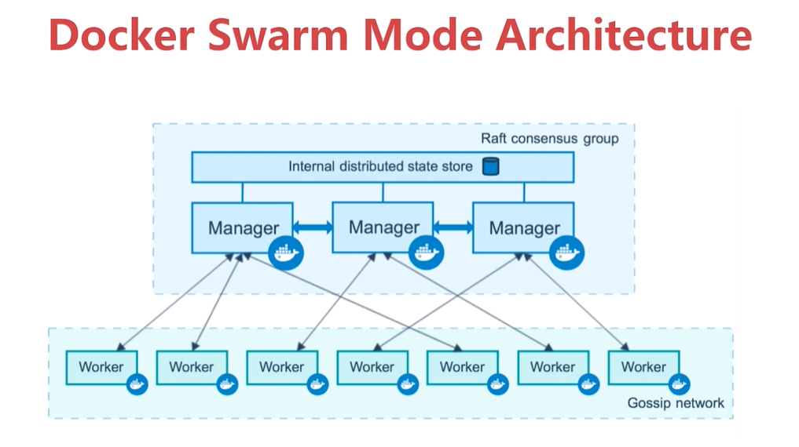
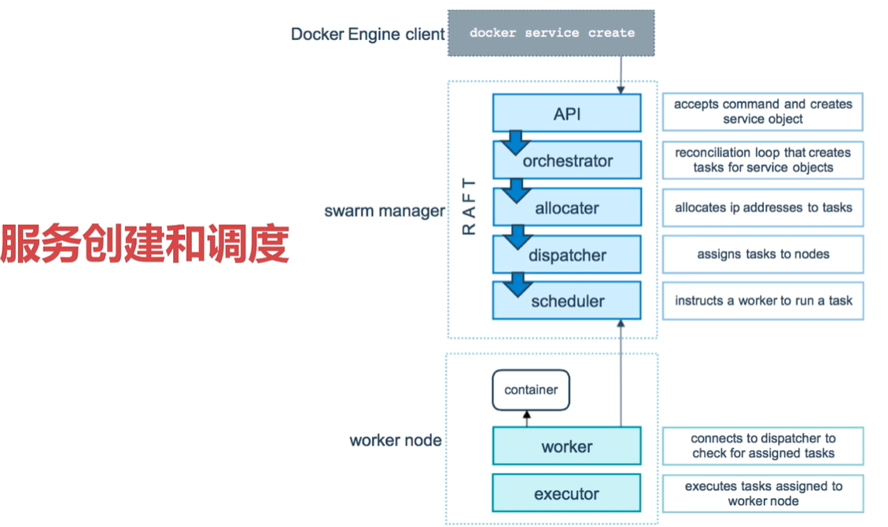

# 容器编排Docker Swarm

## 7.1 Docker Swarm介绍

### 使用容器的麻烦之处
+ 怎么去管理这么多容器
+ 怎么能方便的横向扩展
+ 如何去更新容器而不影响业务
+ 如何去调度追踪这些容器
+ 怎么去调度容器的创建
+ 保护隐私数据

### Swarm的原理图示
> 初学者接触容器编排学到的第一个工具

使用图示如下：

原理图示如下：

以redis部署3个节点为例：

Swarm服务创建与调度过程如下：


## 7.2 创建一个3节点的Swarm集群
> 三台机器的ip分别是192.168.100.116、192.168.100.117、192.168.100.116

### 创建manager节点
> 把192.168.100.116作为manager节点`docker swarm init --advertise-addr=192.168.100.116`
```powershell
[root@localhost ~]#  docker swarm init --advertise-addr=192.168.100.116
Swarm initialized: current node (6rjcjgv4a1znrfjughoow8hdy) is now a manager.

To add a worker to this swarm, run the following command:

    docker swarm join \
    --token SWMTKN-1-0ckgcq7w0bdtwrgwgwelun20p6v4127k3hp433jz89k8uemqfx-75e4xtannco7fu5khddjoh9kx \
    192.168.100.116:2377

To add a manager to this swarm, run 'docker swarm join-token manager' and follow the instructions.
```
### 把117和118加入到swarm集群成为worker节点
```powershell
[root@localhost ~]#   docker swarm join \
>     --token SWMTKN-1-0ckgcq7w0bdtwrgwgwelun20p6v4127k3hp433jz89k8uemqfx-75e4xtannco7fu5khddjoh9kx \
>     192.168.100.116:2377
This node joined a swarm as a worker.
```

### 在116上查看集群情况
```powershell
[root@localhost ~]# docker node ls
ID                           HOSTNAME  STATUS  AVAILABILITY  MANAGER STATUS
b1afoe8r6hff54s23sp1t9vt4    worker1   Ready   Active
el8xrk78q1149fqhukqt18pwr *  manager   Ready   Active        Leader
kd3k5oop5agp11z8pym3xapzs    worker2   Ready   Active
```

## 7.3 Service的创建维护和水平扩展
### 创建一个服务
> docker service create 创建一个service，类似于在本地执行docker run，但是在cluster环境下都用docker service create
```powershell
[root@localhost ~]# docker service create --name demo busybox sh -c "while true;do sleep 3600;done" // 创建服务，默认一个节点
g0xiw08mld3pcwxb5ivfsldms
[root@localhost ~]# docker ps // 查看创建的容器
CONTAINER ID        IMAGE                                                                             COMMAND                  CREATED             STATUS              PORTS               NAMES
595854511c20        busybox@sha256:6915be4043561d64e0ab0f8f098dc2ac48e077fe23f488ac24b665166898115a   "sh -c 'while true..."   31 seconds ago      Up 30 seconds                           demo.1.o1z63v61a55c1hx6jp6lh5l03
[root@localhost ~]# docker service ps demo // 查看创建的服务
ID            NAME    IMAGE           NODE     DESIRED STATE  CURRENT STATE           ERROR  PORTS
y56n5g6v56kw  demo.1  busybox:latest  manager  Running        Running 48 seconds ago
[root@localhost ~]# docker service ls // 列出所有的服务
ID            NAME  MODE        REPLICAS  IMAGE
g0xiw08mld3p  demo  replicated  1/1       busybox:latest
```

### 服务的扩展
```powershell
[root@localhost ~]# docker service ls
ID            NAME  MODE        REPLICAS  IMAGE
g0xiw08mld3p  demo  replicated  5/5       busybox:latest
[root@manager ~]# docker service scale demo=5 // 服务的容器数扩容到5个
demo scaled to 5
[root@manager ~]# docker service ps demo // 查看此时的服务信息
ID            NAME    IMAGE           NODE     DESIRED STATE  CURRENT STATE           ERROR  PORTS
y56n5g6v56kw  demo.1  busybox:latest  manager  Running        Running 2 minutes ago
l32x8zrwtegc  demo.2  busybox:latest  worker2  Running        Running 10 seconds ago
76j9agmfpg3h  demo.3  busybox:latest  manager  Running        Running 10 seconds ago
w3cn8o04naq9  demo.4  busybox:latest  worker1  Running        Running 10 seconds ago
y6b62xi6w84b  demo.5  busybox:latest  worker2  Running        Running 10 seconds ago
[root@manager ~]# docker service rm demo // 删除demo服务
demo

```
