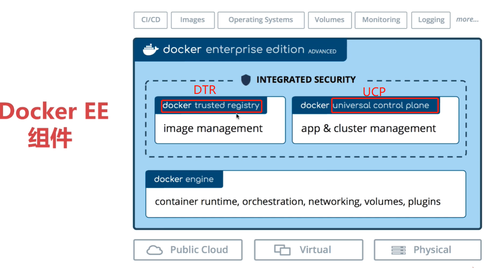

# Docker企业版体验
> 主要是UCP(容器和Swarm集群、Service的管理面板)和DTR

+ [UCP的使用](http://c.biancheng.net/view/3251.html)
+ [DTR的使用](http://c.biancheng.net/view/3263.html)

更多的docker相关的教程见[Docker教程：Docker入门实践（精讲版）](http://c.biancheng.net/docker/)

