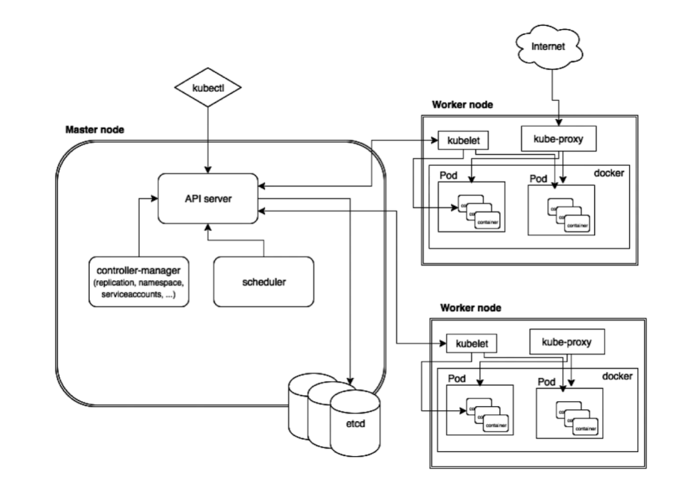
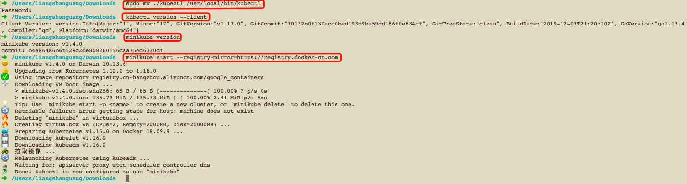

# 第9章 Kubernetes 学习

## 9.1 K8s简介

### 9.1.1 基本架构：Master+多个Node


### 9.1.2 Master节点详解


+ **APIServer**：APIServer组件负责响应用户的管理请求、进行指挥协调工作
+ **scheduler**：scheduler组件是将待调度的pod按照一定的调度算法绑定到合适的工作节点上
+ **controller manager**：是一组控制器的合集，负责控制控制管理对应的资源，如副本（replication）和工作节点（node）等
+ **etcd**：etcd负责保存Kubernetes Cluster的配置信息和各种资源的状态信息。当数据发生变化时，etcd会快速地通知Kubernetes相关组件。

### 9.1.3 Node节点详解

> Pod:具有相同namespace的一组容器的组合，一般是一组功能依赖的容器


+ **kubelet**：管理维护pod运行的agent
+ **kube-proxy**：将service的流量转发到对应endpoint
+ **flannel网络**：维持各个节点上pod之间的通信
+ ****

### 9.1.4 Master和Node节点的协作过程


## 9.2 Linux上Minikube快速搭建K8S单节点环境

### 安装kubectl
> ，如果下载不下来可以在百度网盘的`2.软件/kubectl`里面找，下载下来后放到linux上，并在存放目录执行如下命令
```shell
cp kubectl /usr/local/bin/
chmod +x /usr/local/bin/kubectl
kubectl version # 返回版本号表示kubectl安装成功
```

### 安装minekube
> [minikube](https://github.com/kubernetes/minikube)

为了方便国内用户使用minikube，阿里对minikube进行了二次编译和适配，不用翻墙，直接用下面的命令就能安装minukube

```shell
 curl -Lo minikube http://kubernetes.oss-cn-hangzhou.aliyuncs.com/minikube/releases/v1.2.0/minikube-linux-amd64 && chmod +x minikube && sudo mv minikube /usr/local/bin/
```

用`minikube version`查看版本，返回版本号说明minikube安装成功，
下面启动minikube
```shell
minikube start --vm-driver=none --registry-mirror=https://registry.docker-cn.com
```

使用linux本机作为运行环境所以vm-driver为none，同时镜像下载使用docker国内源。

检验minikube是否能用
```shell
kubectl run hello-minikube --image=k8s.gcr.io/echoserver:1.4 --port=8080
kubectl get pod
```
看到容器信息，说明运行起来了。

### minukube使用
+ `minicube version`可以查看版本号
+ `minikube start`:启动minikube
+ `minikube ssh`:连接minikube虚拟机(运行在virtulbox中)
+ `minikube dashboard`:查看k8s的dashboard

### kubectl使用
+ `kubectl config`:查看k8s节点配置
+ `kubectl config view`:查看节点配置
+ `kubectl config get-contexts`:获取上下文信息
+ `kubectl cluster-info`:获取集群节点信息

```shell
➜  /Users/liangshanguang/Downloads   kubectl config view
apiVersion: v1
clusters:
- cluster:
    certificate-authority: /Users/liangshanguang/.minikube/ca.crt
    server: https://192.168.99.100:8443
  name: minikube
contexts:
- context:
    cluster: minikube
    user: minikube
  name: minikube
current-context: minikube
kind: Config
preferences: {}
users:
- name: minikube
  user:
    client-certificate: /Users/liangshanguang/.minikube/client.crt
    client-key: /Users/liangshanguang/.minikube/client.key
➜  /Users/liangshanguang/Downloads   kubectl config get-contexts
CURRENT   NAME       CLUSTER    AUTHINFO   NAMESPACE
*         minikube   minikube   minikube   
➜  /Users/liangshanguang/Downloads   kubectl cluster-info       
Kubernetes master is running at https://192.168.99.100:8443
KubeDNS is running at https://192.168.99.100:8443/api/v1/namespaces/kube-system/services/kube-dns:dns/proxy

To further debug and diagnose cluster problems, use 'kubectl cluster-info dump'.
```

## 9.2 Mac上的Minikube安装
### 安装Kubectl

## 安装virtualbox
从百度网盘下载并安装，见**2.软件/1.代码开发/VirtualBox/virtualbox6012.dmg**

### 安装kubectl
下载地址： https://storage.googleapis.com/kubernetes-release/release/v1.17.0/bin/darwin/amd64/kubectl

安装
```shell
chmod +x ./kubectl
sudo mv ./kubectl /usr/local/bin/kubectl
kubectl version --client
```

### 安装minikube
```shell
curl -Lo minikube http://kubernetes.oss-cn-hangzhou.aliyuncs.com/minikube/releases/v1.4.0/minikube-darwin-amd64 && chmod +x minikube && sudo mv minikube /usr/local/bin/
```

### 启动minikube
```shell
minikube start --registry-mirror=https://registry.docker-cn.com
```

### 安装完后的样子如下：
```shell
➜  /Users/liangshanguang/Downloads   sudo mv ./kubectl /usr/local/bin/kubectl
Password:
➜  /Users/liangshanguang/Downloads   kubectl version --client
Client Version: version.Info{Major:"1", Minor:"17", GitVersion:"v1.17.0", GitCommit:"70132b0f130acc0bed193d9ba59dd186f0e634cf", GitTreeState:"clean", BuildDate:"2019-12-07T21:20:10Z", GoVersion:"go1.13.4", Compiler:"gc", Platform:"darwin/amd64"}
➜  /Users/liangshanguang/Downloads   minikube version
minikube version: v1.4.0
commit: b4e86486b6f529c2de808260556caa75ec6330cf
➜  /Users/liangshanguang/Downloads   minikube start --registry-mirror=https://registry.docker-cn.com
😄  minikube v1.4.0 on Darwin 10.13.6
👍  Upgrading from Kubernetes 1.10.0 to 1.16.0
✅  Using image repository registry.cn-hangzhou.aliyuncs.com/google_containers
💿  Downloading VM boot image ...
    > minikube-v1.4.0.iso.sha256: 65 B / 65 B [--------------] 100.00% ? p/s 0s
    > minikube-v1.4.0.iso: 135.73 MiB / 135.73 MiB [-] 100.00% 2.44 MiB p/s 56s
💡  Tip: Use 'minikube start -p <name>' to create a new cluster, or 'minikube delete' to delete this one.
🔄  Retriable failure: Error getting state for host: machine does not exist
🔥  Deleting "minikube" in virtualbox ...
🔥  Creating virtualbox VM (CPUs=2, Memory=2000MB, Disk=20000MB) ...
🐳  Preparing Kubernetes v1.16.0 on Docker 18.09.9 ...
💾  Downloading kubelet v1.16.0
💾  Downloading kubeadm v1.16.0
🚜  拉取镜像 ...
🔄  Relaunching Kubernetes using kubeadm ... 
⌛  Waiting for: apiserver proxy etcd scheduler controller dns
🏄  Done! kubectl is now configured to use "minikube"
```


## 9.3 K8S最小调度单元Pod

> Pod:具有相同namespace的一组容器的组合，一般是一组功能依赖的容器，Pod的图示如下，


```shell
kubectl create -f pod.yml # 创建pod
kubectl delete -f pod.yml # 删除pod
kubectl get pods # 查看当前的Pod列表
kubectl get pods -o wide # 查看pod的详细信息
kubectl exec -it nginx sh # 默认连接第一个容器，可以使用 -c 指定连接哪个容器
kubectl describe pods nginx # 查看pods详情
kubectl port-forward nginx 8080（本地端口）:80（容器中端口）#  端口转发 ，临时 退出后失效
```

## 9.4 ReplicaSet和ReplicationController

Kubernetes Replication Controller：
ReplicationController（简称RC）是确保用户定义的Pod副本数保持不变。
在用户定义范围内，如果pod增多，则ReplicationController会终止额外的pod，如果减少，RC会创建新的pod，始终保持在定义范围。
ReplicationController会替换由于某些原因而被删除或终止的pod，例如在节点故障或中断节点维护（例如内核升级）的情况下。
即使应用只需要一个pod，我们也建议使用ReplicationController。
RC跨多个Node节点监视多个pod。

删除ReplicationController及其Pods：
使用kubectl delete命令删除ReplicationController及其所有pod。
只删除 ReplicationController：
在删除ReplicationController时，可以不影响任何pod。
使用kubectl，为kubectl delete指定- cascade = false选项。
ReplicationController隔离pod：
通过更改标签来从ReplicationController的目标集中删除Pod。

RC常用方式：
Rescheduling（重新规划）
扩展
滚动更新
多版本跟踪
使用ReplicationControllers与关联的Services

API对象：
Replication controller是Kubernetes REST API中的顶级资源。
RC 替代方法：
ReplicaSet：
ReplicaSet是支持新的set-based选择器要求的下一代ReplicationController 。
主要用作Deployment协调pod创建、删除和更新。请注意，除非需要自定义更新编排或根本不需要更新，否则建议使用Deployment而不是直接使用ReplicaSets。
Deployment（推荐）：
Deployment是一个高级的API对象，以类似的方式更新其底层的副本集和它们的Pods kubectl rolling-update。
Bare Pods：
与用户直接创建pod的情况不同，ReplicationController会替换由于某些原因而被删除或终止的pod，例如在节点故障或中断节点维护（例如内核升级）的情况下。
即使应用只需要一个pod，我们也建议使用ReplicationController。

Kubernetes Replica Sets：
ReplicaSet（RS）是Replication Controller（RC）的升级版本。
ReplicaSet 和  Replication Controller之间的唯一区别是对选择器的支持。
ReplicaSet支持labels user guide中描述的set-based选择器要求
Replication Controller仅支持equality-based的选择器要求。


大多数kubectl 支持Replication Controller 命令的也支持ReplicaSets。
ReplicaSets可以独立使用，但它主要被 Deployments用作pod 机制的创建、删除和更新。
使用Deployment时，你不必担心创建pod的ReplicaSets，因为可以通过Deployment实现管理ReplicaSets。
ReplicaSet能确保运行指定数量的pod。
Deployment 是一个更高层次的概念，它能管理ReplicaSets，并提供对pod的更新等功能。
建议使用Deployment来管理ReplicaSets，除非你需要自定义更新编排。

ReplicaSet as an Horizontal Pod Autoscaler target：
ReplicaSet也可以作为 Horizontal Pod Autoscalers (HPA)的目标 。
一个ReplicaSet可以由一个HPA来自动伸缩。

## 9.5 Deployment

> Deployment—**更加方便**的管理Pod和Replica Set

参考博文 [ReplicationController,Replica Set,Deployment区别](https://www.cnadn.net/post/2335.htm)

### 9.6 多节点集群，采用[kubeadm](https://github.com/kubernetes/kubeadm)

### 在cloud上安装k8s集群，用[kops](https://github.com/kubernetes/kops)
