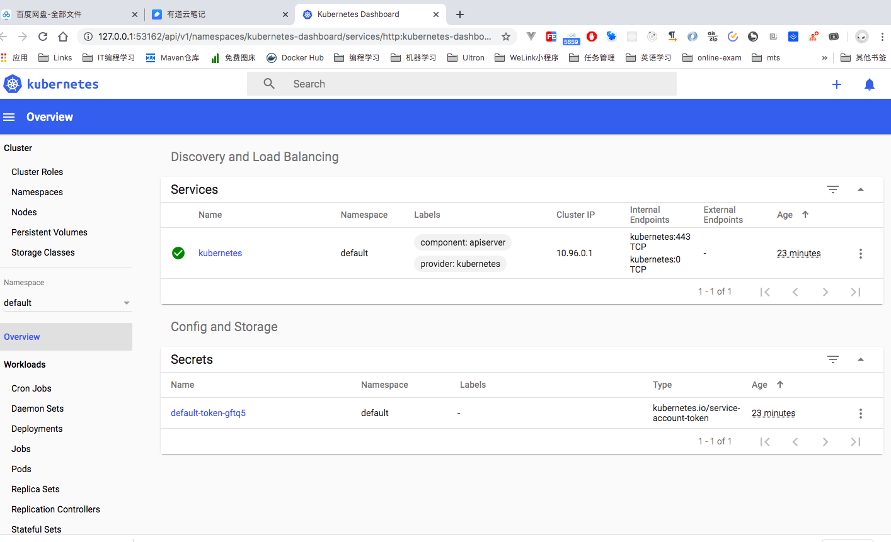
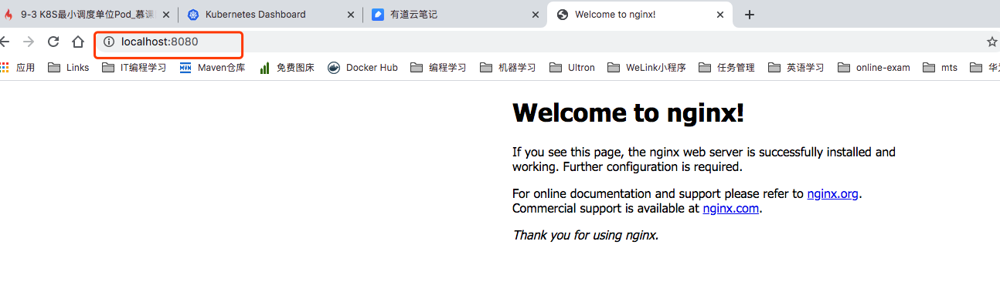
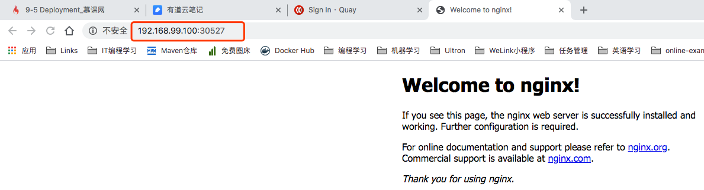
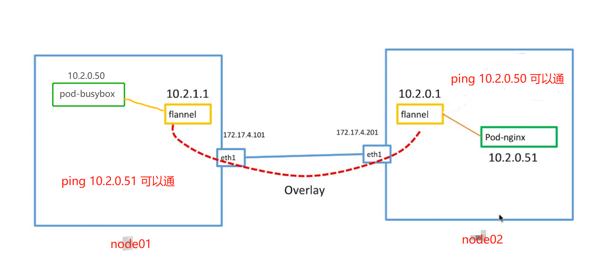

# 第9章 Kubernetes 学习

## 9.1 K8s简介

### 9.1.1 基本架构：Master+多个Node


### 9.1.2 Master节点详解


+ **APIServer**：APIServer组件负责响应用户的管理请求、进行指挥协调工作
+ **scheduler**：scheduler组件是将待调度的pod按照一定的调度算法绑定到合适的工作节点上
+ **controller manager**：是一组控制器的合集，负责控制控制管理对应的资源，如副本（replication）和工作节点（node）等
+ **etcd**：etcd负责保存Kubernetes Cluster的配置信息和各种资源的状态信息。当数据发生变化时，etcd会快速地通知Kubernetes相关组件。

### 9.1.3 Node节点详解

> Pod:具有相同namespace的一组容器的组合，一般是一组功能依赖的容器


+ **kubelet**：管理维护pod运行的agent
+ **kube-proxy**：将service的流量转发到对应endpoint
+ **flannel网络**：维持各个节点上pod之间的通信
+ ****

### 9.1.4 Master和Node节点的协作过程


## 9.2 Linux上Minikube快速搭建K8S单节点环境

> 下面73行还有Mac上的minikube安装，更靠谱些，linux上安装minukube太麻烦而且没成功

### 安装kubectl

> [官网教程](https://kubernetes.io/docs/tasks/tools/install-kubectl/)，如果下载不下来可以在百度网盘的`2.软件/kubectl`里面找，下载下来后放到linux上，并在存放目录执行如下命令

```shell
cp kubectl /usr/local/bin/
chmod +x /usr/local/bin/kubectl
kubectl version # 返回版本号表示kubectl安装成功
```

### 安装minekube

> [minikube](https://github.com/kubernetes/minikube)

为了方便国内用户使用minikube，阿里对minikube进行了二次编译和适配，不用翻墙，直接用下面的命令就能安装minukube

```shell
 curl -Lo minikube http://kubernetes.oss-cn-hangzhou.aliyuncs.com/minikube/releases/v1.2.0/minikube-linux-amd64 && chmod +x minikube && sudo mv minikube /usr/local/bin/
```

用`minikube version`查看版本，返回版本号说明minikube安装成功，
下面启动minikube

```shell
minikube start --vm-driver=none --registry-mirror=https://registry.docker-cn.com
```

使用linux本机作为运行环境所以vm-driver为none，同时镜像下载使用docker国内源。

检验minikube是否能用

```shell
kubectl run hello-minikube --image=k8s.gcr.io/echoserver:1.4 --port=8080
kubectl get pod
```

看到容器信息，说明运行起来了。

## 9.2 Mac上的Minikube安装

### 安装Kubectl

## 安装virtualbox

从百度网盘下载并安装，见**2.软件/1.代码开发/VirtualBox/virtualbox6012.dmg**

### 安装kubectl

下载地址： https://storage.googleapis.com/kubernetes-release/release/v1.17.0/bin/darwin/amd64/kubectl

安装

```shell
chmod +x ./kubectl
sudo mv ./kubectl /usr/local/bin/kubectl
kubectl version --client
```

### 安装minikube

```shell
curl -Lo minikube http://kubernetes.oss-cn-hangzhou.aliyuncs.com/minikube/releases/v1.4.0/minikube-darwin-amd64 && chmod +x minikube && sudo mv minikube /usr/local/bin/
```

### 启动minikube

```shell
minikube start --registry-mirror=https://registry.docker-cn.com
```

### 安装完后的样子如下：

```shell
➜  /Users/liangshanguang/Downloads   sudo mv ./kubectl /usr/local/bin/kubectl
Password:
➜  /Users/liangshanguang/Downloads   kubectl version --client
Client Version: version.Info{Major:"1", Minor:"17", GitVersion:"v1.17.0", GitCommit:"70132b0f130acc0bed193d9ba59dd186f0e634cf", GitTreeState:"clean", BuildDate:"2019-12-07T21:20:10Z", GoVersion:"go1.13.4", Compiler:"gc", Platform:"darwin/amd64"}
➜  /Users/liangshanguang/Downloads   minikube version
minikube version: v1.4.0
commit: b4e86486b6f529c2de808260556caa75ec6330cf
➜  /Users/liangshanguang/Downloads   minikube start --registry-mirror=https://registry.docker-cn.com
😄  minikube v1.4.0 on Darwin 10.13.6
👍  Upgrading from Kubernetes 1.10.0 to 1.16.0
✅  Using image repository registry.cn-hangzhou.aliyuncs.com/google_containers
💿  Downloading VM boot image ...
    > minikube-v1.4.0.iso.sha256: 65 B / 65 B [--------------] 100.00% ? p/s 0s
    > minikube-v1.4.0.iso: 135.73 MiB / 135.73 MiB [-] 100.00% 2.44 MiB p/s 56s
💡  Tip: Use 'minikube start -p <name>' to create a new cluster, or 'minikube delete' to delete this one.
🔄  Retriable failure: Error getting state for host: machine does not exist
🔥  Deleting "minikube" in virtualbox ...
🔥  Creating virtualbox VM (CPUs=2, Memory=2000MB, Disk=20000MB) ...
🐳  Preparing Kubernetes v1.16.0 on Docker 18.09.9 ...
💾  Downloading kubelet v1.16.0
💾  Downloading kubeadm v1.16.0
🚜  拉取镜像 ...
🔄  Relaunching Kubernetes using kubeadm ... 
⌛  Waiting for: apiserver proxy etcd scheduler controller dns
🏄  Done! kubectl is now configured to use "minikube"
```


### minukube使用

+ `minicube version`可以查看版本号
+ `minikube start`:启动minikube
+ `minikube ssh`:连接minikube虚拟机(运行在virtulbox中)
+ `minikube dashboard`:查看k8s的dashboard

```shell
➜  /Users/liangshanguang/Downloads   minikube ssh
                         _             _            
            _         _ ( )           ( )           
  ___ ___  (_)  ___  (_)| |/')  _   _ | |_      __  
/' _ ` _ `\| |/' _ `\| || , <  ( ) ( )| '_`\  /'__`\
| ( ) ( ) || || ( ) || || |\`\ | (_) || |_) )(  ___/
(_) (_) (_)(_)(_) (_)(_)(_) (_)`\___/'(_,__/'`\____)
$ 
$ 
$ 
$ exit
logout
$ ➜  /Users/liangshanguang/Downloads   minikube version
minikube version: v1.4.0
commit: b4e86486b6f529c2de808260556caa75ec6330cf
➜  /Users/liangshanguang/Downloads   minikube dashboard
🔌  Enabling dashboard ...
🤔  Verifying dashboard health ...
🚀  Launching proxy ...
🤔  Verifying proxy health ...
🎉  Opening http://127.0.0.1:53162/api/v1/namespaces/kubernetes-dashboard/services/http:kubernetes-dashboard:/proxy/ in your default browser...
```



### kubectl使用

+ `kubectl config`:查看k8s节点配置
+ `kubectl config view`:查看节点配置
+ `kubectl config get-contexts`:获取上下文信息
+ `kubectl cluster-info`:获取集群节点信息

```shell
➜  /Users/liangshanguang/Downloads   kubectl config view
apiVersion: v1
clusters:
- cluster:
    certificate-authority: /Users/liangshanguang/.minikube/ca.crt
    server: https://192.168.99.100:8443
  name: minikube
contexts:
- context:
    cluster: minikube
    user: minikube
  name: minikube
current-context: minikube
kind: Config
preferences: {}
users:
- name: minikube
  user:
    client-certificate: /Users/liangshanguang/.minikube/client.crt
    client-key: /Users/liangshanguang/.minikube/client.key
➜  /Users/liangshanguang/Downloads   kubectl config get-contexts
CURRENT   NAME       CLUSTER    AUTHINFO   NAMESPACE
*         minikube   minikube   minikube   
➜  /Users/liangshanguang/Downloads   kubectl cluster-info       
Kubernetes master is running at https://192.168.99.100:8443
KubeDNS is running at https://192.168.99.100:8443/api/v1/namespaces/kube-system/services/kube-dns:dns/proxy

To further debug and diagnose cluster problems, use 'kubectl cluster-info dump'.
```

## 9.3 K8S最小调度单元Pod

> Pod:具有相同namespace的一组容器的组合，一般是一组功能依赖的容器.k8s里不会针对单独的容器进行操作，只会针对pod进行操作。Pod的图示如下，


```shell
kubectl create -f pod.yml # 创建pod
kubectl delete -f pod.yml # 删除pod
kubectl get pods # 查看当前的Pod列表
kubectl get pods -o wide # 查看pod的详细信息
kubectl exec -it nginx sh # 默认连接第一个容器，可以使用 -c 指定连接哪个容器。也可以先minikube ssh进入虚拟机，然后docker exec -it 进入容器.Pod内多个容器用-c指定
kubectl describe pods nginx # 查看pods详情
kubectl port-forward nginx 8080（本地端口）:80（容器中端口）#  端口转发 ，临时 退出后失效
```

### 实战如下

```shell
➜ 第9章 Kubernetes/labs/pod-basic git:(master) ✗   kubectl create -f pod_nginx.yml
pod/nginx created
➜ 第9章 Kubernetes/labs/pod-basic git:(master)   kubectl get pods
NAME    READY   STATUS    RESTARTS   AGE
nginx   1/1     Running   0          4m13s
➜ 第9章 Kubernetes/labs/pod-basic git:(master)   kubectl get pods -o wide
NAME    READY   STATUS    RESTARTS   AGE     IP           NODE       NOMINATED NODE   READINESS GATES
nginx   1/1     Running   0          5m10s   172.17.0.6   minikube   <none>           <none>
➜ 第9章 Kubernetes/labs/pod-basic git:(master)   kube exec -it nginx sh
zsh: command not found: kube
➜ 第9章 Kubernetes/labs/pod-basic git:(master) ✗   kubectl exec -it nginx sh
# exit
➜ 第9章 Kubernetes/labs/pod-basic git:(master) ✗   kubectl describe pods nginx
Name:         nginx
Namespace:    default
Priority:     0
Node:         minikube/10.0.2.15
Start Time:   Fri, 21 Feb 2020 23:23:30 +0800
Labels:       app=nginx
Annotations:  <none>
Status:       Running
IP:           172.17.0.6
IPs:
  IP:  172.17.0.6
Containers:
  nginx:
    Container ID:   docker://31a158cb9a0177af854cedfe160c3a73adc07a052cc394f71e9bf58038cfa5b6
    Image:          hub.c.163.com/library/nginx
    Image ID:       docker-pullable://hub.c.163.com/library/nginx@sha256:f84932f738583e0169f94af9b2d5201be2dbacc1578de73b09a6dfaaa07801d6
    Port:           80/TCP
    Host Port:      0/TCP
    State:          Running
      Started:      Fri, 21 Feb 2020 23:23:36 +0800
    Ready:          True
    Restart Count:  0
    Environment:    <none>
    Mounts:
      /var/run/secrets/kubernetes.io/serviceaccount from default-token-gftq5 (ro)
Conditions:
  Type              Status
  Initialized       True 
  Ready             True 
  ContainersReady   True 
  PodScheduled      True 
Volumes:
  default-token-gftq5:
    Type:        Secret (a volume populated by a Secret)
    SecretName:  default-token-gftq5
    Optional:    false
QoS Class:       BestEffort
Node-Selectors:  <none>
Tolerations:     node.kubernetes.io/not-ready:NoExecute for 300s
                 node.kubernetes.io/unreachable:NoExecute for 300s
Events:
  Type    Reason     Age        From               Message
  ----    ------     ----       ----               -------
  Normal  Scheduled  <unknown>  default-scheduler  Successfully assigned default/nginx to minikube
  Normal  Pulling    25m        kubelet, minikube  Pulling image "hub.c.163.com/library/nginx"
  Normal  Pulled     25m        kubelet, minikube  Successfully pulled image "hub.c.163.com/library/nginx"
  Normal  Created    25m        kubelet, minikube  Created container nginx
  Normal  Started    25m        kubelet, minikube  Started container nginx
➜ 第9章 Kubernetes/labs/pod-basic git:(master) ✗   ping 172.17.0.6
PING 172.17.0.6 (172.17.0.6): 56 data bytes
Request timeout for icmp_seq 0
Request timeout for icmp_seq 1
Request timeout for icmp_seq 2
Request timeout for icmp_seq 3
^C
--- 172.17.0.6 ping statistics ---
5 packets transmitted, 0 packets received, 100.0% packet loss
➜ 第9章 Kubernetes/labs/pod-basic git:(master) ✗   minikube ssh

$ ping 172.17.0.6
PING 172.17.0.6 (172.17.0.6): 56 data bytes
64 bytes from 172.17.0.6: seq=0 ttl=64 time=0.146 ms
64 bytes from 172.17.0.6: seq=1 ttl=64 time=0.084 ms
^C
--- 172.17.0.6 ping statistics ---
2 packets transmitted, 2 packets received, 0% packet loss
round-trip min/avg/max = 0.084/0.115/0.146 ms
$ curl 172.17.0.6
<!DOCTYPE html>
<html>
<head>
<title>Welcome to nginx!</title>
<style>
    body {
        width: 35em;
        margin: 0 auto;
        font-family: Tahoma, Verdana, Arial, sans-serif;
    }
</style>
</head>
<body>
<h1>Welcome to nginx!</h1>
<p>If you see this page, the nginx web server is successfully installed and
working. Further configuration is required.</p>

<p>For online documentation and support please refer to
<a href="http://nginx.org/">nginx.org</a>.<br/>
Commercial support is available at
<a href="http://nginx.com/">nginx.com</a>.</p>

<p><em>Thank you for using nginx.</em></p>
</body>
</html>

$ ip a 
1: lo: <LOOPBACK,UP,LOWER_UP> mtu 65536 qdisc noqueue state UNKNOWN group default qlen 1000
    link/loopback 00:00:00:00:00:00 brd 00:00:00:00:00:00
    inet 127.0.0.1/8 scope host lo
       valid_lft forever preferred_lft forever
    inet6 ::1/128 scope host 
       valid_lft forever preferred_lft forever
2: eth0: <BROADCAST,MULTICAST,UP,LOWER_UP> mtu 1500 qdisc pfifo_fast state UP group default qlen 1000
    link/ether 08:00:27:1d:50:50 brd ff:ff:ff:ff:ff:ff
    inet 10.0.2.15/24 brd 10.0.2.255 scope global dynamic eth0
       valid_lft 68262sec preferred_lft 68262sec
    inet6 fe80::a00:27ff:fe1d:5050/64 scope link 
       valid_lft forever preferred_lft forever
3: eth1: <BROADCAST,MULTICAST,UP,LOWER_UP> mtu 1500 qdisc pfifo_fast state UP group default qlen 1000
    link/ether 08:00:27:ec:5f:e1 brd ff:ff:ff:ff:ff:ff
    inet 192.168.99.100/24 brd 192.168.99.255 scope global dynamic eth1
       valid_lft 1045sec preferred_lft 1045sec
    inet6 fe80::a00:27ff:feec:5fe1/64 scope link 
       valid_lft forever preferred_lft forever
exit
logout

➜ 第9章 Kubernetes/labs/pod-basic git:(master) ✗   kubectl port-forward nginx 8080:80
Forwarding from 127.0.0.1:8080 -> 80
Forwarding from [::1]:8080 -> 80
Handling connection for 8080
^C%    
```

访问：http://localhost:8080 即可看到nginx的显示，一旦退出kubectl port-forward命令转发就失效了


### minikube中直接使用国内的源下载镜像

> 在镜像名前加上`hub.c.163.com/library`即可

```shell
docker pull hub.c.163.com/library/nginx
```

## 9.4 ReplicationController和ReplicaSet

假如我们现在有一个`Pod`正在提供线上的服务，我们来想想一下我们可能会遇到的一些场景：

- 某次运营活动非常成功，网站访问量突然暴增
- 运行当前`Pod`的节点发生故障了，`Pod`不能正常提供服务了

第一种情况，可能比较好应对，一般活动之前我们会大概计算下会有多大的访问量，提前多启动几个`Pod`，活动结束后再把多余的`Pod`杀掉，虽然有点麻烦，但是应该还是能够应对这种情况的。

第二种情况，可能某天夜里收到大量报警说服务挂了，然后起来打开电脑在另外的节点上重新启动一个新的`Pod`，问题也很好的解决了。

如果我们都人工的去解决遇到的这些问题，似乎又回到了以前刀耕火种的时代了是吧，如果有一种工具能够来帮助我们管理`Pod`就好了，`Pod`不够了自动帮我新增一个，`Pod`挂了自动帮我在合适的节点上重新启动一个`Pod`，这样是不是遇到上面的问题我们都不需要手动去解决了。

幸运的是，`Kubernetes`就为我们提供了这样的资源对象：

- Replication Controller：用来部署、升级`Pod`
- Replica Set：下一代的`Replication Controller`
- Deployment：可以更加方便的管理`Pod`和`Replica Set`

### Replication Controller（RC）

`Replication Controller`简称`RC`，`RC`是`Kubernetes`系统中的核心概念之一，简单来说，`RC`可以保证在任意时间运行`Pod`的副本数量，能够保证`Pod`总是可用的。如果实际`Pod`数量比指定的多那就结束掉多余的，如果实际数量比指定的少就新启动一些`Pod`，当`Pod`失败、被删除或者挂掉后，`RC`都会去自动创建新的`Pod`来保证副本数量，所以即使只有一个`Pod`，我们也应该使用`RC`来管理我们的`Pod`。

我们想想如果现在我们遇到上面的问题的话，可能除了第一个不能做到完全自动化，其余的我们是不是都不用担心了，运行`Pod`的节点挂了，`RC`检测到`Pod`失败了，就会去合适的节点重新启动一个`Pod`就行，不需要我们手动去新建一个`Pod`了。如果是第一种情况的话在活动开始之前我们给`Pod`指定10个副本，结束后将副本数量改成2，这样是不是也远比我们手动去启动、手动去关闭要好得多，而且我们后面还会给大家介绍另外一种资源对象`HPA`可以根据资源的使用情况来进行自动扩缩容，这样以后遇到这种情况，我们就真的可以安心的去睡觉了。

现在我们来使用`RC`来管理我们前面使用的`Nginx`的`Pod`，`YAML`文件如下：

```yaml
apiVersion: v1
kind: ReplicationController
metadata:
  name: rc-demo
  labels:
    name: rc
spec:
  replicas: 3
  selector:
    name: rc
  template:
    metadata:
     labels:
       name: rc
    spec:
     containers:
     - name: nginx-demo
       image: nginx
       ports:
       - containerPort: 80
```

上面的`YAML`文件相对于我们之前的`Pod`的格式：

- kind：`ReplicationController`
- spec.replicas: 指定`Pod`副本数量，默认为1
- spec.selector: `RC`通过该属性来筛选要控制的`Pod`
- spec.template: 这里就是我们之前的`Pod`的定义的模块，但是不需要`apiVersion`和`kind`了
- spec.template.metadata.labels: 注意这里的`Pod`的`labels`要和`spec.selector`相同，这样`RC`就可以来控制当前这个`Pod`了。

这个`YAML`文件中的意思就是定义了一个`RC`资源对象，它的名字叫`rc-demo`，保证一直会有3个`Pod`运行，`Pod`的镜像是`nginx`镜像。

> 注意`spec.selector`和`spec.template.metadata.labels`这两个字段必须相同，否则会创建失败的，当然我们也可以不写`spec.selector`，这样就默认与`Pod`模板中的`metadata.labels`相同了。所以为了避免不必要的错误的话，不写为好。

然后我们来创建上面的`RC`对象(保存为 rc-demo.yaml):

```bash
$ kubectl create -f rc-demo.yaml
```

查看`RC`：

```bash
$ kubectl get rc
```

查看具体信息：

```bash
$ kubectl describe rc rc-demo
```

然后我们通过`RC`来修改下`Pod`的副本数量为2：

```bash
$ kubectl apply -f rc-demo.yaml
```

或者

```bash
$ kubectl edit rc rc-demo
```

而且我们还可以用`RC`来进行滚动升级，比如我们将镜像地址更改为`nginx:1.7.9`:

```bash
$ kubectl rolling-update rc-demo --image=nginx:1.7.9
```

但是如果我们的`Pod`中多个容器的话，就需要通过修改`YAML`文件来进行修改了:

```bash
$ kubectl rolling-update rc-demo -f rc-demo.yaml
```

如果升级完成后出现了新的问题，想要一键回滚到上一个版本的话，使用`RC`只能用同样的方法把镜像地址替换成之前的，然后重新滚动升级。

### Replication Set（RS）

`Replication Set`简称`RS`，随着`Kubernetes`的高速发展，官方已经推荐我们使用`RS`和`Deployment`来代替`RC`了，实际上`RS`和`RC`的功能基本一致，目前唯一的一个区别就是`RC`只支持基于等式的`selector`（env=dev或environment!=qa），但`RS`还支持基于集合的`selector`（version in (v1.0, v2.0)），这对复杂的运维管理就非常方便了。

`kubectl`命令行工具中关于`RC`的大部分命令同样适用于我们的`RS`资源对象。不过我们也很少会去单独使用`RS`，它主要被`Deployment`这个更加高层的资源对象使用，除非用户需要自定义升级功能或根本不需要升级`Pod`，在一般情况下，我们推荐使用`Deployment`而不直接使用`Replica Set`。

最后我们总结下关于`RC`/`RS`的一些特性和作用吧：

- 大部分情况下，我们可以通过定义一个`RC`实现的`Pod`的创建和副本数量的控制
- `RC`中包含一个完整的`Pod`定义模块（不包含`apiversion`和`kind`）
- `RC`是通过`label selector`机制来实现对`Pod`副本的控制的
- 通过改变`RC`里面的`Pod`副本数量，可以实现`Pod`的扩缩容功能
- 通过改变`RC`里面的`Pod`模板中镜像版本，可以实现`Pod`的滚动升级功能（但是不支持一键回滚，需要用相同的方法去修改镜像地址）

RS的配置文件参考[rs_nginx.yml](labs/replicas-set/rs_nginx.yml),和Replication Controller配置文件[rc_nginx.yml](labs/replicas-set/rc_nginx.yml)主要不同是下面两个地方

```yml
apiVersion: apps/v1
kind: ReplicaSet
```

好，这节课我们就给大家介绍了使用`RC`或者`RS`来管理我们的`Pod`，我们下节课来给大家介绍另外一种更加高级也是现在推荐使用的一个资源对象`Deployment`。

### Replication Controller实战

```powershell
➜  第9章 Kubernetes/labs/replicas-set git:(master) ✗   kubectl create -f rc_nginx.yml # 创建Replication Controller
replicationcontroller/nginx created
➜  第9章 Kubernetes/labs/replicas-set git:(master) ✗   kubectl get rc # 查看Replication Controller详情
NAME    DESIRED   CURRENT   READY   AGE
nginx   3         3         3       4m38s
➜  第9章 Kubernetes/labs/replicas-set git:(master) ✗   kubectl get pods # 查看pod详情
NAME          READY   STATUS    RESTARTS   AGE
nginx-7vwch   1/1     Running   0          4m56s
nginx-cxp4z   1/1     Running   0          4m56s
nginx-zscqg   1/1     Running   0          4m56s
➜  第9章 Kubernetes/labs/replicas-set git:(master) ✗   kubectl delete pods nginx-cxp4z # 按照name删除指定的pod
pod "nginx-cxp4z" deleted
➜  第9章 Kubernetes/labs/replicas-set git:(master) ✗   kubectl get pods
NAME          READY   STATUS    RESTARTS   AGE
nginx-2n44p   1/1     Running   0          18s
nginx-7vwch   1/1     Running   0          9m44s
nginx-zscqg   1/1     Running   0          9m44s
➜  第9章 Kubernetes/labs/replicas-set git:(master) ✗   kubectl scale rc nginx --replicas=4 # Replication Controller扩容
replicationcontroller/nginx scaled
➜  第9章 Kubernetes/labs/replicas-set git:(master) ✗   kubectl get pods
NAME          READY   STATUS    RESTARTS   AGE
nginx-2n44p   1/1     Running   0          3m9s
nginx-7vwch   1/1     Running   0          12m
nginx-qgjkv   1/1     Running   0          10s
nginx-zscqg   1/1     Running   0          12m
➜  第9章 Kubernetes/labs/replicas-set git:(master) ✗   kubectl scale rc nginx --replicas=2 # Replication Controller缩容
replicationcontroller/nginx scaled
➜  第9章 Kubernetes/labs/replicas-set git:(master) ✗   kubectl get pods
NAME          READY   STATUS    RESTARTS   AGE
nginx-7vwch   1/1     Running   0          13m
nginx-zscqg   1/1     Running   0          13m
➜  第9章 Kubernetes/labs/replicas-set git:(master) ✗   kubectl get rc  
NAME    DESIRED   CURRENT   READY   AGE
nginx   2         2         2       13m
➜  第9章 Kubernetes/labs/replicas-set git:(master) ✗   kubectl get pods -o wide # 获取pod详细信息
NAME          READY   STATUS    RESTARTS   AGE   IP           NODE       NOMINATED NODE   READINESS GATES
nginx-7vwch   1/1     Running   0          13m   172.17.0.6   minikube   <none>           <none>
nginx-zscqg   1/1     Running   0          13m   172.17.0.7   minikube   <none>           <none>
➜  第9章 Kubernetes/labs/replicas-set git:(master) ✗   kubectl scale rc nginx --replicas=4 # Replication Controller扩容
replicationcontroller/nginx scaled
➜  第9章 Kubernetes/labs/replicas-set git:(master) ✗   kubectl get rc
NAME    DESIRED   CURRENT   READY   AGE
nginx   4         4         4       14m
➜  第9章 Kubernetes/labs/replicas-set git:(master) ✗   kubectl delete -f rc_nginx.yml # 删除# Replication Controller扩容
replicationcontroller "nginx" deleted
➜  第9章 Kubernetes/labs/replicas-set git:(master) ✗   kubectl get rc
No resources found in default namespace.
➜  第9章 Kubernetes/labs/replicas-set git:(master) ✗   kubectl get pods
No resources found in default namespace.
```

## 9.5 Deployment

> Deployment—**更加方便**的管理Pod和Replica Set、Replication COntroller，本节的实战文件件[deployment_nginx.yml](labs/deployment/deployment_nginx.yml)

### 简介

见当前目录的[deployment的详细使用.md](deployment的详细使用.md)

### 实战

```shell
➜ 第9章 Kubernetes/labs/deployment git:(master) ✗   kubectl create -f deployment_nginx.yml
deployment.apps/nginx-deployment created
➜ 第9章 Kubernetes/labs/deployment git:(master) ✗   kubectl get deployment 
NAME               READY   UP-TO-DATE   AVAILABLE   AGE
nginx-deployment   3/3     3            3           131m
➜ 第9章 Kubernetes/labs/deployment git:(master) ✗   kubectl get rs        
NAME                          DESIRED   CURRENT   READY   AGE
nginx-deployment-6564df5fbd   3         3         3       131m
➜ 第9章 Kubernetes/labs/deployment git:(master) ✗   kubectl get pods
NAME                                READY   STATUS    RESTARTS   AGE
nginx-deployment-6564df5fbd-ddbpw   1/1     Running   0          132m
nginx-deployment-6564df5fbd-q8nsr   1/1     Running   0          132m
nginx-deployment-6564df5fbd-tmsgt   1/1     Running   0          132m
➜ 第9章 Kubernetes/labs/deployment git:(master) ✗   kubectl get deployment -o wide
NAME               READY   UP-TO-DATE   AVAILABLE   AGE    CONTAINERS   IMAGES                     SELECTOR
nginx-deployment   3/3     3            3           132m   nginx        daocloud.io/nginx:1.12.2   app=nginx
➜ 第9章 Kubernetes/labs/deployment git:(master) ✗   kubectl set image deployment nginx-deployment nginx=daocloud.io/nginx:1.13  
deployment.apps/nginx-deployment image updated
➜ 第9章 Kubernetes/labs/deployment git:(master) ✗   kubectl get deployment -o wideNAME               READY   UP-TO-DATE   AVAILABLE   AGE    CONTAINERS   IMAGES                   SELECTOR
nginx-deployment   3/3     1            3           135m   nginx        daocloud.io/nginx:1.13   app=nginx
➜ 第9章 Kubernetes/labs/deployment git:(master) ✗   kubectl get deployment -o wideNAME               READY   UP-TO-DATE   AVAILABLE   AGE    CONTAINERS   IMAGES                   SELECTOR
nginx-deployment   3/3     3            3           137m   nginx        daocloud.io/nginx:1.13   app=nginx
➜ 第9章 Kubernetes/labs/deployment git:(master) ✗   kubectl get pods              NAME                                READY   STATUS    RESTARTS   AGE
nginx-deployment-69cbd94c99-6l9rp   1/1     Running   0          80s
nginx-deployment-69cbd94c99-m4dv2   1/1     Running   0          77s
nginx-deployment-69cbd94c99-r5p9z   1/1     Running   0          2m36s
➜ 第9章 Kubernetes/labs/deployment git:(master) ✗   kubectl get rs
NAME                          DESIRED   CURRENT   READY   AGE
nginx-deployment-6564df5fbd   0         0         0       138m
nginx-deployment-69cbd94c99   3         3         3       2m59s
➜ 第9章 Kubernetes/labs/deployment git:(master) ✗   kubectl rollout history deployment nginx-deploy
ment
deployment.apps/nginx-deployment 
REVISION  CHANGE-CAUSE
1         <none>
2         <none>

➜ 第9章 Kubernetes/labs/deployment git:(master) ✗   kubectl rollout undo deployment nginx-deployment
deployment.apps/nginx-deployment rolled back
➜ 第9章 Kubernetes/labs/deployment git:(master) ✗   kubectl get deployment -o wide
NAME               READY   UP-TO-DATE   AVAILABLE   AGE    CONTAINERS   IMAGES                     SELECTOR
nginx-deployment   3/3     3            3           140m   nginx        daocloud.io/nginx:1.12.2   app=nginx
➜ 第9章 Kubernetes/labs/deployment git:(master) ✗   kubectl rollout history deployment nginx-deployment
deployment.apps/nginx-deployment 
REVISION  CHANGE-CAUSE
2         <none>
3         <none>
```

### 如果想对外暴露自己的服务，可以用expose服务

> 下面以nginx-deployment为例

```shell
➜ 第9章 Kubernetes/labs/deployment git:(master) ✗   kubectl expose deployment nginx-deployment --type=NodePort
service/nginx-deployment exposed
➜ 第9章 Kubernetes/labs/deployment git:(master) ✗   kubectl get svc
NAME               TYPE        CLUSTER-IP    EXTERNAL-IP   PORT(S)        AGE
kubernetes         ClusterIP   10.96.0.1     <none>        443/TCP        38h
nginx-deployment   NodePort    10.97.64.51   <none>        80:30527/TCP   46s
```

通过上面的命令可知我们对外暴露了虚拟机的30527端口，虚拟机的ip可以通过ssh登录后用`ip a`查询得到，这里minikube虚拟机的ip查询到如下：

```shell
➜ 第9章 Kubernetes/labs/deployment git:(master) ✗   minikube ssh

$ ip a
1: lo: <LOOPBACK,UP,LOWER_UP> mtu 65536 qdisc noqueue state UNKNOWN group default qlen 1000
    link/loopback 00:00:00:00:00:00 brd 00:00:00:00:00:00
    inet 127.0.0.1/8 scope host lo
       valid_lft forever preferred_lft forever
    inet6 ::1/128 scope host 
       valid_lft forever preferred_lft forever
2: eth0: <BROADCAST,MULTICAST,UP,LOWER_UP> mtu 1500 qdisc pfifo_fast state UP group default qlen 1000
    link/ether 08:00:27:1d:50:50 brd ff:ff:ff:ff:ff:ff
    inet 10.0.2.15/24 brd 10.0.2.255 scope global dynamic eth0
       valid_lft 58968sec preferred_lft 58968sec
    inet6 fe80::a00:27ff:fe1d:5050/64 scope link 
       valid_lft forever preferred_lft forever
3: eth1: <BROADCAST,MULTICAST,UP,LOWER_UP> mtu 1500 qdisc pfifo_fast state UP group default qlen 1000
    link/ether 08:00:27:ec:5f:e1 brd ff:ff:ff:ff:ff:ff
    inet 192.168.99.100/24 brd 192.168.99.255 scope global dynamic eth1
       valid_lft 746sec preferred_lft 746sec
    inet6 fe80::a00:27ff:feec:5fe1/64 scope link 
       valid_lft forever preferred_lft forever
......
```

可以看到虚拟机ip是192.168.99.100，所以访问 http://192.168.99.100:30527/ 即可看到nginx的网页


## 9.6 多节点集群，采用[kubeadm](https://github.com/kubernetes/kubeadm)

> tectonic的sandbox现在好像已经不提供下载了，直接见第10章的k8s集群部署就行~

## 9.7 k8s基础网络Cluster Network
### 在集群内的任何一个节点上ping任何一个pod的ip都是可以ping通的
```shell
[root@k8s-master services]# kubectl apply -f pod_nginx.yml
pod "nginx-pod" created
[root@k8s-master services]# kubectl get pod
NAME          READY   STATUS    RESTARTS   AGE
busybox-pod   0/1     Pending   0          4m20s
nginx-pod     1/1     Running   0          3m34s
[root@k8s-master services]# kubectl get pod
NAME        READY   STATUS    RESTARTS   AGE
nginx-pod   1/1     Running   0          3m50s
[root@k8s-master services]# kubectl get pod -o wide
NAME        READY   STATUS    RESTARTS   AGE     IP                                               NODE     NOMINATED NODE   READINESS GATES
nginx-pod   1/1     Running   0          6m11s   10.244.2.17 #这个ip在k8s的所有节点都可以ping通   k8s-node02   <none>           <none>
[root@k8s-master services]# kubectl get nodes -o wide
NAME         STATUS   ROLES    AGE   VERSION   INTERNAL-IP       EXTERNAL-IP   OS-IMAGE                KERNEL-VERSION          CONTAINER-RUNTIME
k8s-master   Ready    master   20h   v1.17.3   192.168.100.120   <none>        CentOS Linux 7 (Core)   3.10.0-693.el7.x86_64   docker://1.13.1
k8s-node01   Ready    worker   19h   v1.17.3   192.168.100.121   <none>        CentOS Linux 7 (Core)   3.10.0-693.el7.x86_64   docker://1.13.1
k8s-node02   Ready    worker   19h   v1.17.3   192.168.100.122   <none>        CentOS Linux 7 (Core)   3.10.0-693.el7.x86_64   docker://1.13.1
[root@k8s-master services]# ping 10.244.2.17 // 在master节点上ping自己创建的pod
PING 10.244.2.17 (10.244.2.17) 56(84) bytes of data.
64 bytes from 10.244.2.17: icmp_seq=1 ttl=63 time=0.278 ms
64 bytes from 10.244.2.17: icmp_seq=2 ttl=63 time=0.248 ms
^C
--- 10.244.2.17 ping statistics ---
2 packets transmitted, 2 received, 0% packet loss, time 1000ms
rtt min/avg/max/mdev = 0.248/0.263/0.278/0.015 ms

[root@k8s-node01 ~]# ping 10.244.2.17 // 在node01节点上ping自己创建的pod
PING 10.244.2.17 (10.244.2.17) 56(84) bytes of data.
64 bytes from 10.244.2.17: icmp_seq=1 ttl=63 time=0.355 ms
^C
--- 10.244.2.17 ping statistics ---
1 packets transmitted, 1 received, 0% packet loss, time 0ms
rtt min/avg/max/mdev = 0.355/0.355/0.355/0.000 ms

[root@k8s-node02 ~]# ping 10.244.2.17 // 在node02节点上ping自己创建的pod
PING 10.244.2.17 (10.244.2.17) 56(84) bytes of data.
64 bytes from 10.244.2.17: icmp_seq=1 ttl=64 time=0.036 ms
^C
--- 10.244.2.17 ping statistics ---
1 packets transmitted, 1 received, 0% packet loss, time 0ms
rtt min/avg/max/mdev = 0.036/0.036/0.036/0.000 ms
```

实现原理如下图：

可以看到`k8s集群内的pod在集群内任何一台机器都可以ping通`是通过flannel网络实现地

### 原理解析：k8s的网络模型
k8s对Pods之间如何进行组网通信提出了要求，k8s对集群的网络有以下要求，所有实现了下面3点要求的插件都可以对接k8s，比如上面用到的flannel：

+ 所有的Pods之间可以在不使用NAT网络地址转换的情况下相互通信(k8s集群内的pod的IP在集群内任何一台机器都可以ping通)
+ 所有的Nodes之间可以在不使用NAT网络地址转换的情况下相互通信(`kubectl get nodes -o wide`得到节点可以直接互相ping通)
+ 每个Pod自己看到的自己的ip和其他Pod看到的一致(`kubectl get pod -o wide`里面的`IP`字段是啥，k8s集群其他节点访问这个pod就用啥ip)

### pod与service的网络异同

#### 一、网络模型概述

k8s的网络中主要存在四种类型的通信：同一pod内的容器间通信、各pod彼此之间的通信、pod与service间的通信、以及集群外部的流量同service之间的通信。

k8s为pod和service资源对象分别使用了各自的专用网络，`pod网络由k8s的网络插件配置实现`，而`service的网络则由k8s集群予以指定`。

k8s的网络模型需要借助于外部插件实现，它要求任何实现机制都必须满足以下需求：

+ 1、所有pod间均可不经NAT机制直接通信；
+ 2、所有节点均可不经NAT机制而直接与所有容器通信。
+ 3、容器自己使用的IP也是其他容器或节点直接看到的地址，即，所有pod对象都位于同一平面网络中，而且可以使用pod自身的地址直接通信。

k8s使用的网络插件需要为每个pod配置至少一个特定的地址，即podIP(`kubectl get pod -o wide`里面的`IP`字段)。

`podIP地址实际存在于某个网卡`（可以是虚拟设备）上，而`service地址却是一个虚拟IP地址`，没有任何网络接口配置此地址，它由kube-proxy借助iptables规则或ipvs规则重新定向到本地端口，再将其调度至后端pod对象。service的IP地址是集群提供服务的接口，也称为clusterIP。

pod网络及其IP由k8s的网络插件负责配置和管理，具体使用的网络地址可在管理配置网络插件时指定，如10.96.0.0/16网络。而cluster网络和IP则是由k8s集群负责配置和管理，如10.96.0.0/12网络。

总结起来，k8s集群至少应该包含三个网络，
+ 一个是各主机（master、node、etcd等）自身所属的网络，其地址配置于主机的网络接口，用于各主机之间的通信；
+ 第二个是k8s集群上专用于pod资源对象的网络，它是一个虚拟网络，用于为各pod对象设定IP地址等网络参数，其地址配置于pod中容器的网络接口之上。pod网络为各pod对象设定IP地址等网络参数，其地址配置于pod中容器的网络接口之上。pod网络需要借助kubenet插件或CNI插件实现，该插件独立部署于k8s集群之外，也可托关于k8s之上；
+ 第三个时专用于service资源对象的网络，它也是一个虚拟网络，用于为k8s集群之中的service配置IP地址，但此地址并不配置于任何主机或容器的网络接口之上，而是通过node之上的kube-proxy配置为iptables或ipvs规则，从而将发往此地址的所有流量调度至其后端的各pod对象之上。service网络再k8s集群创建时予以指定，而各service的地址则在用户创建service时予以动态配置。

#### 二、集群上的网络通信

k8s集群的客户端大体分为两类：apiserver客户端和应用程序（运行为pod中的容器）客户端。apiserver客户端通常包含人类用户和pod对象两种，它们通过apiserver访问k8s集群完成管理任务，应用程序客户端一般也包含人类用户和pod对象两种，它们的访问目标时pod上运行于容器中的应用程序提供的各种具体的服务，如redis或nginx等。不过，这些访问请求通常要经由service或ingress资源对象进行。另外，应用程序客户端的访问目标对象的操作要经由apiserver客户端创建和配置完成后才能进行。

名词解释：

CNI：容器网络接口（Container Network Interface），由CNCF(Cloud Native Computing Foundation)维护的项目，其由一系列的用于编写配置容器网络插件的规范和库接口组成，支持众多插件项目。

