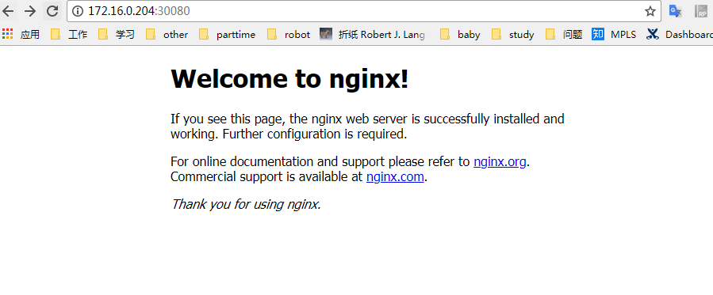

# k8s之Deployment使用

Deployment管理Pods和ReplicaSets，提供声明式更新。和老的ReplicationController（命令式管理）对应，发展趋势是取代老的，所以后面也不会起文章单独讨论ReplicationController了。

> 但由Deployment-controller管理的Pods和ReplicaSets最好自始至终都由Deployment-controller管理，最好不要手动去管理，以免发生冲突。


如下一个Deployment的配置（nginx-deployment.yaml），创建一个ReplicaSet包含3个nginx Pods

```yaml
apiVersion: apps/v1
kind: Deployment
metadata:
  name: nginx-deployment
  labels:
    app: nginx
spec:
  replicas: 3
  selector:
    matchLabels:
      app: nginx
  template:
    metadata:
      labels:
        app: nginx
    spec:
      containers:
      - name: nginx
        image: nginx:1.7.9
        ports:
        - containerPort: 80
```

- apiVersion这里为apps/v1，如果是1.9之前的版本为extensions/v1beta1
- replicas:3 起3个replicated Pods
- selector指明哪个pod被管理，这里我们指定了label（app:nginx）
- template: spec 指明了运行一个容器nginx（以nginx:1.7.9为镜像）
- 开放80端口给container，以使container之间能发送和接收流量

> 注意这里定义name 或 label 时不要和其他的重复，k8s不会检查这个，需要人工自己确认

要创建此部署，执行下面的命令（在这之前我们提前下好nginx相关的镜像，docker pull nginx:1.7.9）

```shell
[root@master yaml]# kubectl create -f nginx-deployment.yaml --record
deployment "nginx-deployment" created
```

- --record会记录操作历史，以便于后面回滚操作

查看deployments

```
[root@master yaml]# kubectl get deployments
NAME               DESIRED   CURRENT   UP-TO-DATE   AVAILABLE   AGE
nginx-deployment   3         0         0            0           1s
```

- NAME：在集群中的部署名称
- DESIRED：显示配置里定义的副本数量，这是应该达到的副本数量
- CURRENT：当前正在运行的副本数量
- UP-TO-DATE：更新到当前所需状态的副本数量
- AVAILABLE：可供使用的副本数量
- AEG：显示app存活的时间

通过下面语句可查追踪部署情况

```shell
[root@master ~]# kubectl rollout status deployment/nginx-deployment
deployment "nginx-deployment" successfully rolled out
# 这是部署完成的状态

# 未完成的会显示当前部署哪一步了
[root@master ~]# kubectl rollout status deployment/nginx-deployment
Waiting for rollout to finish: 2 out of 3 new replicas have been updated...
deployment "nginx-deployment" successfully rolled out
```

过一会我们再查看，就全

```shell
[root@master ~]# kubectl get deployments
NAME               DESIRED   CURRENT   UP-TO-DATE   AVAILABLE   AGE
nginx-deployment   3         3         3            3           51s
```

这里注意如果定义了.spec.minReadySeconds，那么必须经过定义的时间才会达到AVAILABLE 状态

通过下面的命令查看Deployment创建的ReplicaSet（rs）

```shell
[root@master ~]# kubectl get rs
NAME                          DESIRED   CURRENT   READY     AGE
nginx-deployment-6c54bd5869   3         3         3         56m
```

注意ReplicaSet的名称格式为[DEPLOYMENT-NAME]-[POD-TEMPLATE-HASH-VALUE]，后面的hash值是由Deployment自动创建的

查看Pods

```shell
[root@master ~]# kubectl get pods --show-labels
NAME                                READY     STATUS    RESTARTS   AGE       LABELS
nginx-deployment-6c54bd5869-9brqp   1/1       Running   0          58m       app=nginx,pod-template-hash=2710681425
nginx-deployment-6c54bd5869-dkmgh   1/1       Running   0          58m       app=nginx,pod-template-hash=2710681425
nginx-deployment-6c54bd5869-vzsht   1/1       Running   0          58m       app=nginx,pod-template-hash=2710681425
```

创建的ReplicaSet 会确保时刻有3个nginx Pods的副本在运行

 


假设我们想把nginx从1.7.9更新到1.9.1，有以下3种方式

1. 直接set命令设置变更的部分

```shell
$ kubectl set image deployment/nginx-deployment nginx=nginx:1.9.1
deployment "nginx-deployment" image updated
```

以上命令会自动回滚更改Pods，即停止一定量的老的，新建新的，直到来的终止完，新的启动完

通过describe即可查看所有的细节

```shell
[root@master yaml]# kubectl describe deployment/nginx-deployment
Name:                   nginx-deployment
Namespace:              default
CreationTimestamp:      Thu, 15 Mar 2018 02:51:06 -0400
Labels:                 app=nginx
Annotations:            deployment.kubernetes.io/revision=2
                        kubernetes.io/change-cause=kubectl set image deployment/nginx-deployment nginx=nginx:1.9.1
Selector:               app=nginx
Replicas:               3 desired | 3 updated | 3 total | 3 available | 0 unavailable
StrategyType:           RollingUpdate
MinReadySeconds:        0
RollingUpdateStrategy:  25% max unavailable, 25% max surge
Pod Template:
  Labels:  app=nginx
  Containers:
   nginx:
    Image:        nginx:1.9.1
    Port:         80/TCP
    Environment:  <none>
    Mounts:       <none>
  Volumes:        <none>
Conditions:
  Type           Status  Reason
  ----           ------  ------
  Available      True    MinimumReplicasAvailable
  Progressing    True    NewReplicaSetAvailable
OldReplicaSets:  <none>
NewReplicaSet:   nginx-deployment-5964dfd755 (3/3 replicas created)
Events:
  Type    Reason             Age   From                   Message
  ----    ------             ----  ----                   -------
  Normal  ScalingReplicaSet  2m    deployment-controller  Scaled up replica set nginx-deployment-5964dfd755 to 1
  Normal  ScalingReplicaSet  2m    deployment-controller  Scaled down replica set nginx-deployment-6c54bd5869 to 2
  Normal  ScalingReplicaSet  2m    deployment-controller  Scaled up replica set nginx-deployment-5964dfd755 to 2
  Normal  ScalingReplicaSet  2m    deployment-controller  Scaled down replica set nginx-deployment-6c54bd5869 to 1
  Normal  ScalingReplicaSet  2m    deployment-controller  Scaled up replica set nginx-deployment-5964dfd755 to 3
  Normal  ScalingReplicaSet  2m    deployment-controller  Scaled down replica set nginx-deployment-6c54bd5869 to 0
```

- 可见image已经变了
- 另外Events可查看滚动更新的过程
- 另外上面的说的停止和新建的比例在这里体现RollingUpdateStrategy:  25% max unavailable, 25% max surge，25% max unavailable确保在更新时只有部分会关闭（这里是pod数的25%会关闭）。25% max surge确保创建新的pod也在一定比例上（这里默认也是25%）

2. 通过直接修改线上的配置也可直接修改

```shell
kubectl edit deployment/nginx-deployment
```

会打开一个编辑器，修改指定的部分即可，这里是.spec.template.spec.containers[0].image

3. 修改yaml文件，通过apply重新部署

```shell
[root@master yaml]# kubectl apply -f nginx-deployment.yaml 
Warning: kubectl apply should be used on resource created by either kubectl create --save-config or kubectl apply
deployment "nginx-deployment" configured
```

但这里有个警告: 也就是apply方式更新的资源应该是由kubectl create 加--save-config参数创建的 或 由apply创建的 （apply当资源不存在时会创建）

这时我们查看rs，会显示新起了一个rs并将副本扩到3个，旧的rs都缩减为0

```shell
[root@master yaml]# kubectl get rs
NAME                          DESIRED   CURRENT   READY     AGE
nginx-deployment-5964dfd755   3         3         3         21m
nginx-deployment-6c54bd5869   0         0         0         1h
```

 


有时需要回滚的操作，比如更新错误，手误等一系列问题

比如上面的操作更新到1.9.1时，写错了，写成1.91了

```shell
[root@master yaml]# kubectl set image deployment/nginx-deployment nginx=nginx:1.91
deployment "nginx-deployment" image updated
```

追踪状态

```shell
[root@master yaml]# kubectl rollout status deployments nginx-deployment
Waiting for rollout to finish: 1 out of 3 new replicas have been updated...
```

可见卡住不动了， Ctrl+C终止，查看rs如下

```shell
[root@master yaml]# kubectl get rs
NAME                          DESIRED   CURRENT   READY     AGE
nginx-deployment-5964dfd755   3         3         3         40m
nginx-deployment-5d5cfdbd5f   1         1         0         1m
nginx-deployment-6c54bd5869   0         0         0         2h
```

新的rs只启动了Pod但没有处于READY状态

查看Pods

```shell
[root@master yaml]# kubectl get pods
NAME                                READY     STATUS             RESTARTS   AGE
nginx-deployment-5964dfd755-8z8b7   1/1       Running            0          27m
nginx-deployment-5964dfd755-bnznj   1/1       Running            0          27m
nginx-deployment-5964dfd755-pt54q   1/1       Running            0          27m
nginx-deployment-5d5cfdbd5f-srdcc   0/1       ImagePullBackOff   0          2m
```

可发现ImagePullBackOff，实际就是镜像不存在

要修复这个，我们就需要rollback到前一个ok的版本

查看操作历史

```shell
[root@master yaml]# kubectl rollout history deployment/nginx-deployment
deployments "nginx-deployment"
REVISION    CHANGE-CAUSE
1           kubectl create -f docs/user-guide/nginx-deployment.yaml --record
2           kubectl set image deployment/nginx-deployment nginx=nginx:1.9.1
3           kubectl set image deployment/nginx-deployment nginx=nginx:1.91
```

要查看每个版本的详细情况，指定--revision

```shell
[root@master yaml]# kubectl rollout history deployment/nginx-deployment --revision=2
deployments "nginx-deployment" with revision #2
Pod Template:
  Labels:       app=nginx
        pod-template-hash=2710681425
  Annotations:  kubernetes.io/change-cause=kubectl edit deployment/nginx-deployment
  Containers:
   nginx:
    Image:      nginx:1.9.1
    Port:       80/TCP
    Environment:        <none>
    Mounts:     <none>
  Volumes:      <none>
```

接下来进行回滚的操作

不指定版本，默认回滚到上一个版本

```shell
[root@master yaml]# kubectl rollout undo deployment/nginx-deployment
deployment "nginx-deployment" rolled back
```

指定版本，通过--to-revision指定

```shell
[root@master yaml]# kubectl rollout undo deployment/nginx-deployment --to-revision=2
deployment "nginx-deployment" rolled back
```

查看

```shell
kubectl describe deployment/nginx-deployment

....略

Events:
  FirstSeen LastSeen    Count   From                    SubobjectPath   Type        Reason              Message
  --------- --------    -----   ----                    -------------   --------    ------              -------
  30m       30m         1       {deployment-controller }                Normal      ScalingReplicaSet   Scaled up replica set nginx-deployment-2035384211 to 3
  29m       29m         1       {deployment-controller }                Normal      ScalingReplicaSet   Scaled up replica set nginx-deployment-1564180365 to 1
  29m       29m         1       {deployment-controller }                Normal      ScalingReplicaSet   Scaled down replica set nginx-deployment-2035384211 to 2
  29m       29m         1       {deployment-controller }                Normal      ScalingReplicaSet   Scaled up replica set nginx-deployment-1564180365 to 2
  29m       29m         1       {deployment-controller }                Normal      ScalingReplicaSet   Scaled down replica set nginx-deployment-2035384211 to 0
  29m       29m         1       {deployment-controller }                Normal      ScalingReplicaSet   Scaled up replica set nginx-deployment-3066724191 to 2
  29m       29m         1       {deployment-controller }                Normal      ScalingReplicaSet   Scaled up replica set nginx-deployment-3066724191 to 1
  29m       29m         1       {deployment-controller }                Normal      ScalingReplicaSet   Scaled down replica set nginx-deployment-1564180365 to 2
  2m        2m          1       {deployment-controller }                Normal      ScalingReplicaSet   Scaled down replica set nginx-deployment-3066724191 to 0
  2m        2m          1       {deployment-controller }                Normal      DeploymentRollback  Rolled back deployment "nginx-deployment" to revision 2
  29m       2m          2       {deployment-controller }                Normal      ScalingReplicaSet   Scaled up replica set nginx-deployment-1564180365 to 3
```

可看到有DeploymentRollback  Reason的事件

可通过如下的命令进行扩展

```shell
[root@master yaml]# kubectl scale deployment nginx-deployment --replicas=5
deployment "nginx-deployment" scaled
```

查看Pods

```
[root@master yaml]# kubectl get pods
NAME                                READY     STATUS    RESTARTS   AGE
nginx-deployment-5964dfd755-8z8b7   1/1       Running   0          41m
nginx-deployment-5964dfd755-bhm2s   1/1       Running   0          1m
nginx-deployment-5964dfd755-bnznj   1/1       Running   0          41m
nginx-deployment-5964dfd755-cftfj   1/1       Running   0          6s
nginx-deployment-5964dfd755-pt54q   1/1       Running   0          41m
```

可见已扩展到5个

使用autoscale还可设置自动水平扩展（[hpa](https://kubernetes.io/docs/tasks/run-application/horizontal-pod-autoscale-walkthrough/)），可根据机器负载之类的信息自动扩展或缩减，这个后面细讲

```shell
$ kubectl autoscale deployment nginx-deployment --min=10 --max=15 --cpu-percent=80
deployment "nginx-deployment" autoscaled
```

 

有时需要修改多个部分，而不是上面的只修改image，这样的话每次改完都自动部署，显然不好，通过pause即可暂停Deployment，更改完了，通过resume即可恢复部署

暂停

```shell
[root@master yaml]# kubectl rollout pause deployment/nginx-deployment
deployment "nginx-deployment" paused
```

修改

```shell
[root@master yaml]# kubectl set image deploy/nginx-deployment nginx=nginx:1.7.9
deployment "nginx-deployment" image updated
```

查看Pods

```shell
[root@master yaml]# kubectl get pods
NAME                                READY     STATUS    RESTARTS   AGE
nginx-deployment-5964dfd755-8z8b7   1/1       Running   0          57m
nginx-deployment-5964dfd755-bhm2s   1/1       Running   0          17m
nginx-deployment-5964dfd755-bnznj   1/1       Running   0          57m
nginx-deployment-5964dfd755-cftfj   1/1       Running   0          16m
nginx-deployment-5964dfd755-pt54q   1/1       Running   0          57m
```

注意后面的AGE还是之前的Pod，这里就不会自动更新了

恢复

```shell
[root@master yaml]# kubectl rollout resume deploy/nginx-deployment
deployment "nginx-deployment" resumed
```

这时再查看Pods

```shell
[root@master yaml]# kubectl get pods
NAME                                READY     STATUS    RESTARTS   AGE
nginx-deployment-6c54bd5869-htjxz   1/1       Running   0          25s
nginx-deployment-6c54bd5869-lj288   1/1       Running   0          30s
nginx-deployment-6c54bd5869-nt8lt   1/1       Running   0          30s
nginx-deployment-6c54bd5869-svqz6   1/1       Running   0          29s
nginx-deployment-6c54bd5869-zq8tl   1/1       Running   0          25s
```

可见已经更新部署了

内部Deployment部分大概就讲完了，下面把nginx服务暴露到外面


```shell
[root@master yaml]# kubectl delete -f nginx-deployment.yaml 
deployment "nginx-deployment" deleted
```


服务的暴露需要Service，它是Pod的抽象代理（具体机制见[这里](https://www.jianshu.com/p/bbb673e79c3e)）。见nginx-service.yaml

```yaml
apiVersion: v1
kind: Service
metadata:
  name: nginx-service
spec:
  type: NodePort
  sessionAffinity: ClientIP
  selector:
    app: nginx
  ports:
    - port: 80
      nodePort: 30080
```

- kind：Service代表是一个服务
- type：NodePort k8s将会在每个Node上打开一个端口并且每个Node的端口都是一样的，通过<NodeIP>:NodePort的方式Kubernetes集群外部的程序可以访问Service。
- selector：哪个服务需要暴露
- port：service暴露的端口
- TargetPort：pod的端口
- nodePort：对外暴露的端口，不设置会默认分配，范围：30000－32767
- 转发逻辑是：
  <NodeIP>:<nodeport> => <ServiceVIP>:<port>=> <PodIP>:<targetport>

部署service服务：

```shell
[root@master yaml]# kubectl create -f nginx-service.yaml 
service "nginx-service" created
```

可看到启动了一个svc

```shell
NAME                TYPE        CLUSTER-IP      EXTERNAL-IP   PORT(S)        AGE
svc/kubernetes      ClusterIP   10.96.0.1       <none>        443/TCP        1d
svc/nginx-service   NodePort    10.101.86.235   <none>        80:30080/TCP   4m
```

浏览器测试



over！